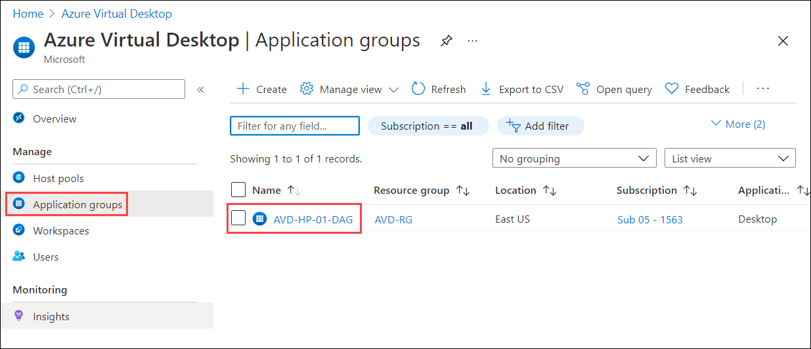
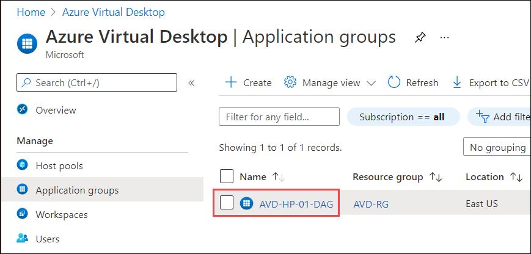
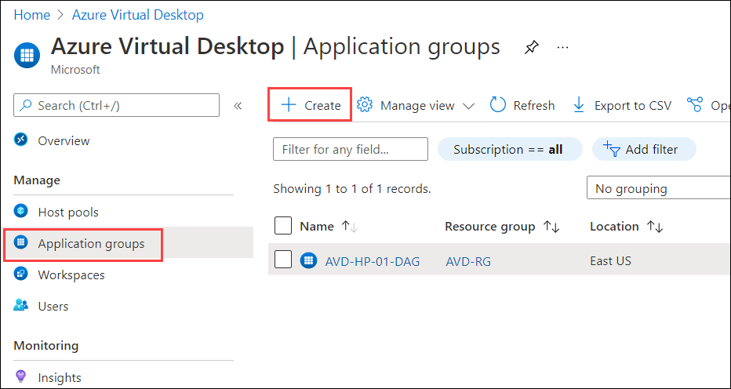
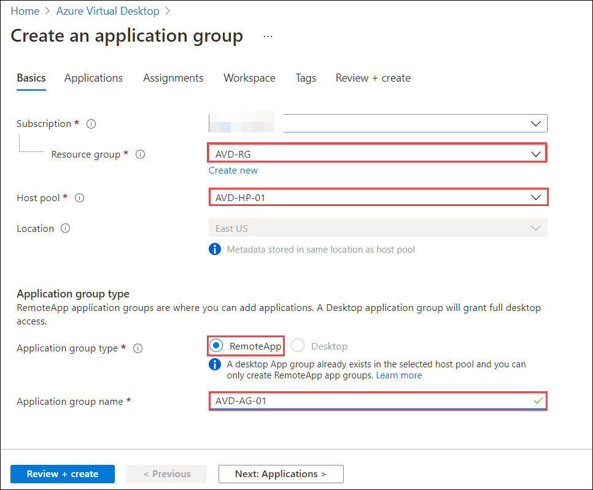
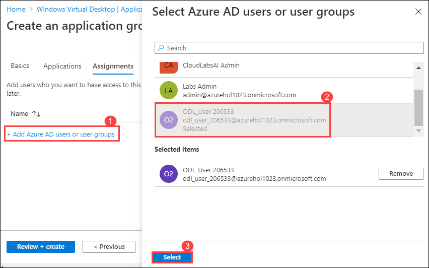

# Exercise 2: Create Application Groups and assign to users

As explained in the General Hierarchy section, Application Group is a logical grouping of applications installed on session hosts in the host pool. They are of two types: 

1. RemoteApp 
2. Desktop 

### **Task 1: Create Application Group**

An application group of type ‘Desktop’ was created automatically while creating the Session Host in previous exercise. In this task, we will create a new application group of type ‘*RemoteApp*’ and publish two applications in it. Also, we will assign users to both the application groups.

1. Navigate to Azure portal, then search for *Azure Virtual Desktop* in search bar and select **Azure Virtual Desktop** from the suggestions.

   

2. You will be directed towards the Azure Virtual Desktop management window.  

   

3. Click on the **Application Groups** tab and you will see the default Application Group there. 

   
   
4. Click on **AVD-HP-01-DAG** application group.

   
      
5. Under **Manage** blade, open **Assignments** and then click on **+ Add**. 

      
 
6. Now in the search bar, copy and paste your username **<inject key="AzureAdUserEmail" />**. Then under the search bar, click on your username to select it.

   
   
7. At last, click on **Select** button. 
 
    
 
8. We will now create a new Application Group of type ‘RemoteApp’. To do this, navigate back to the **Application groups** and click on the **+ Create** button. 

   

9. In the *Basics* tab, do the following configuration: 

  i.  Leave the following parameters to default:
   
   - *Subscription*
   - *Location*
         
  ii.  Fill the remaining parameters as mentioned below:  
   
   - Resource Group: *Select* **AVD-RG** *from the dropdown*.
   - Host Pool: *Select* **AVD-HP-01** *Host pool from the dropdown*.
   - Application Group Type: **RemoteApp** 
   - Application Group Name: **AVD-AG-01**
   - Click on **Next:Applications**

   

10. On the *Applications* tab, click on **Add Applications** to add applications to this application group.

   

11. In this window, choose the parameters as mentioned below: 

   - Application Source: **Start Menu** *(choose from the dropdown)*  
   - Application: **Excel** *(choose from the dropdown)* 
   - Leave rest of the parameters to default and click on **Save**.
   
  
 
12. Click on **Add Applications** again. 

   

13. Choose the parameters as mentioned below: 

   - Application Source: **Start Menu** *(choose from the dropdown)*   
   - Application: **Word** *(choose from the dropdown)*    
   - Leave rest of the parameters to default and click on **Save**.  
   
   

14. Click on **Next: Assignments**.

   

15. Click on the **+Add Azure AD users or user groups**, then copy and paste your username **<inject key="AzureAdUserEmail" />** in the search bar. When your username appears under the search bar, select it and then click on **Select** button. This will give you the access to application group.
 
   

16. Click on **Next: Workspaces**.

   

17. In the *Workspace* tab, choose the parameters as mentioned below:  

   - Register Application Group: **Yes**
   - Register Application Group: _Select_ **AVD-WS-01** _workspace from the dropdown(the default ‘Desktop’ type application group on the same Session Host *(AVD-HP01-SH-01)* is registered to this workspace.)_

   

18. Click on **Review + Create**.

   

19. The last window helps us to verify if the parameters we filled are correct. Wait for validation to pass, then click on **Create** to initiate the deployment. 

   

> **Note:** The deployment will take about a minute to succeed.

20. Once the deployment is complete, open notifications and click on **Go to Resource**. 

   

21. Now in the Application Group Window that comes up, click on **Applications** present under **Manage** and you will see that the applications are published in the application Group. 

   

22. Click on the **Next** button present in the bottom-right corner of this lab guide. 
