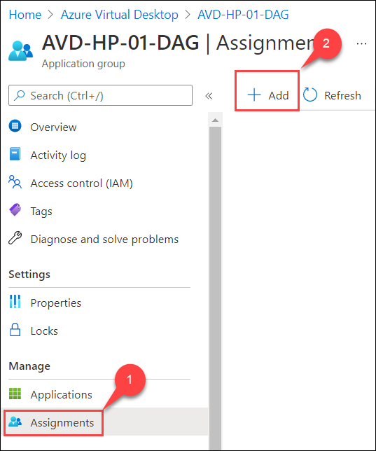
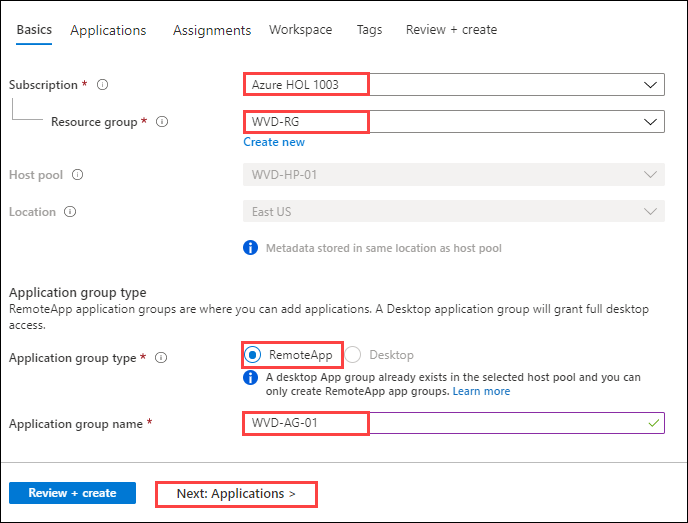
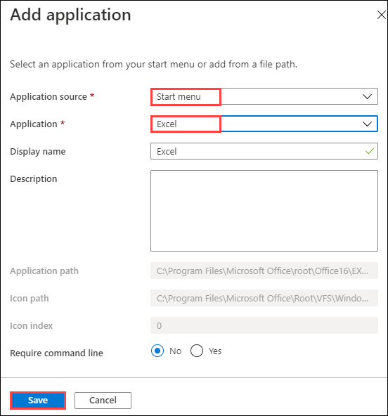
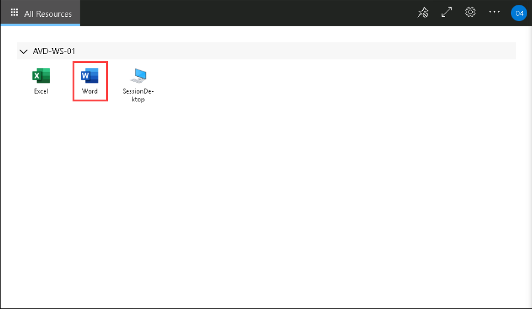
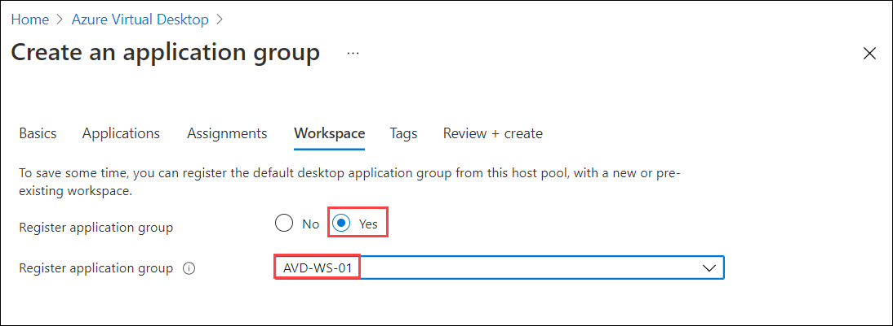
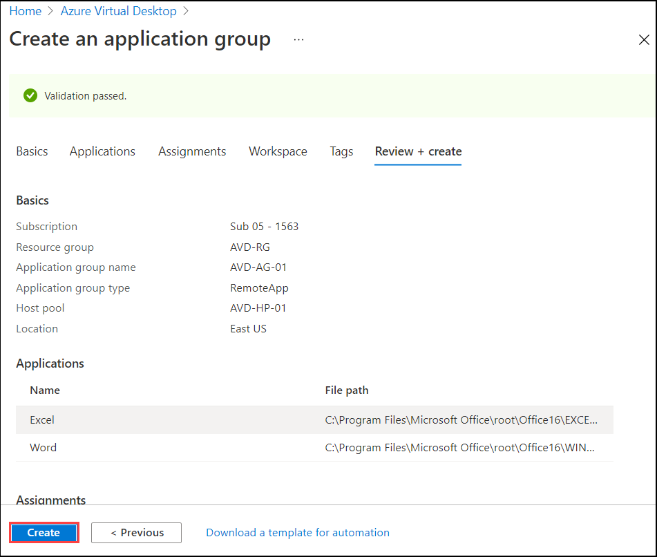
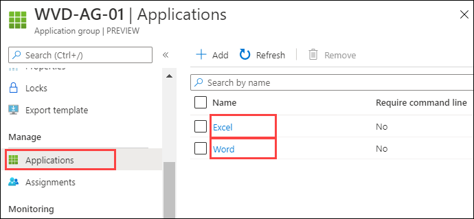
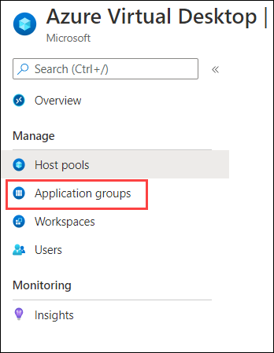
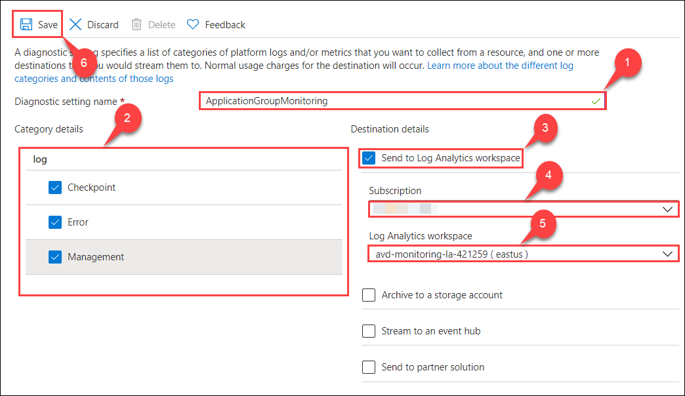

# **Exercise 2: Create Application Groups and assign to users** 

As explained in the General Hierarchy section, Application Group is a logical grouping of applications installed on session hosts in the host pool. They are of two types: 

1. RemoteApp
2. Desktop

## **Task 1: Create Application Group**

An application group of type ‘Desktop’ was created automatically while creating the Session Host in previous exercise. In this task, we will create a new application group of type ‘*RemoteApp*’ and publish two applications in it. Also, we will assign users to both the application groups.

1. Navigate to Azure portal, then search for *Windows Virtual Desktop* in search bar and select **Windows Virtual Desktop** from the suggestions.

   

1. You will be directed towards the Windows Virtual Desktop management window.  

   

1. Click on the **Application Groups** tab and you will see the default Application Group there. 

   

1. Click on **WVD-HP-01-DAG** application group.

   

1. Under **Manage** blade, open **Assignments** and then click on **+ Add**. 

      

1. Now in the search bar, copy and paste your username **<inject key="AzureAdUserEmail" />**. Then under the search bar, click on your username to select it.

   
  
1. At last, click on **Select** button. 
 
    
 
1. We will now create a new Application Group of type ‘RemoteApp’. To do this, navigate back to the **Application groups** and click on the **+ Add** button. 

   

1. In the *Basics* tab, do the following configuration: 

  i.  Leave the following parameters to default:
   
   - *Subscription*
   - *Host Pool*
   - *Location*
         
  ii.  Fill the remaining parameters as mentioned below and then click on **Next:Applications**:  
   
   - Resource Group: *Select **WVD-RG** from the dropdown*.
   - Application Group Type: **RemoteApp** 
   - Application Group Name: **WVD-AG-01**

   

1. On the *Applications* tab, click on **Add Applications** to add applications to this application group.

   

1. In this window, choose the parameters as mentioned below: 

   - Application Source: **Start Menu** *(choose from the dropdown)*  
   - Application: **Excel** *(choose from the dropdown)* 
   - Leave rest of the parameters to default and click on **Save**.
   
  
 
1. Click on **Add Applications** again. 

   

1. Choose the parameters as mentioned below: 

   - Application Source: **Start Menu** *(choose from the dropdown)*   
   - Application: **Word** *(choose from the dropdown)*    
   - Leave rest of the parameters to default and click on **Save**.  
   
   

1. Click on **Next: Assignments**.

   

1. Click on the **+Add Azure AD users or user groups**, then copy and paste your username **<inject key="AzureAdUserEmail" />** in the search bar. When your username appears under the search bar, select it and then click on **Select** button. This will give you the access to application group.
 
   

1. Click on **Next: Workspaces**.

   

1. In the *Workspace* tab, choose the parameters as mentioned below:  

   - Register Application Group: **Yes**
   - **WVD-WS-01** workspace will be selected by default, since the default ‘Desktop’ type application group on the same Session Host *(WVD-HP01-SH-01)* is registered to this workspace.

   

1. Click on **Review + Create**.

   

1. The last window helps us to verify if the parameters we filled are correct. Wait for validation to pass, then click on **Create** to initiate the deployment. 

   

> **Note:** The deployment will take about a minute to succeed.

1. Once the deployment is complete, open notifications and click on **Go to Resource**. 

   

1. Now in the Application Group Window that comes up, click on **Applications** present under **Manage** and you will see that the applications are published in the application Group. 

   

## **Task 2: Enable diagnostics for Application Groups**

In this task we will configure diagnostics for the Application Groups we have configured in the previous task

1. Navigate back to Windows Virtual Desktop and open **Application groups**.

   
   
1. Click on **WVD-HP-01-DAG**. Then select **Diagnostic settings** present under *Monitoring* blade and click on **+Add diagnostic setting**.

    
   
1. Add the following configurations:

  - Diagnostic settings name: **ApplicationGroupMonitoring**
  - Category details: *Check all the boxes present under logs i.e.,* **Checkpoint, Error and Management.** 
  - Destination details: *Check the box for* **Send to Log Analytics**
  - Subscription: *Choose the default subscription.*
  - Log Analytics Workspace: *Select the log analytics workpsace from the drop down, that we just created.*
  - At last, click on **Save**.

   

1. Once saved, it will look similar to the image shown below.

   
   
1. Navigate back to **Application groups** and click on **WVD-AG-01**.

   

1. Add the following configurations:

  - Diagnostic settings name: **ApplicationGroupMonitoring1**
  - Category details: *Check all the boxes present under logs i.e.,* **Checkpoint, Error and Management.** 
  - Destination details: *Check the box for* **Send to Log Analytics**
  - Subscription: *Choose the default subscription.*
  - Log Analytics Workspace: *Select the log analytics workpsace from the drop down, that we just created.*
  - At last, click on **Save**.

   

1. Once saved, it will look similar to the image shown below.

   

### **Task 3: Enable diagnostics for Session Hosts**
In this task we will configure diagnostics for the session hosts

1. from the Main page of Azure portal, navigate to **Virtual Machines**. (use the bar on the top if the icon is not visible)

   
  
1. Open **WVD-HP01-SH-1** virtual machine. Click on **Insights** under *Monitoring* blade, and click on **Enable** button.

   

1. Add the following configurations:

   - Workspace Subscription: *Choose the default subscription.*
   - Choose a Log Analytics Workspace: *Select the log analytics workpsace from the drop down, that we just created.*
   - At last, click on **Enable**. This will enable diagnostic settings in this Session Host.

   

1. Return to virtual machines. Open **WVD-HP01-SH-0** virtual machine, click on **Insights** under *Monitoring* blade, and click on **Enable** button.

   

1. Add the following configurations:

   - Workspace Subscription: *Choose the default subscription.*
   - Choose a Log Analytics Workspace: *Select the log analytics workspace from the drop down, that we just created.*
   - At last, click on **Enable**. This will enable diagnostic settings in this Session Host.

   

> **Note:** Deployment can take 5-10 minutes to complete. Once complete, you will see the following items configured on the VM:
> - New VM Extensions Added
> - New Monitoring Agents Installed
> - Monitoring Agent Configured for Log Analytics 

1. Click on the **Next** button present in the bottom-right corner of this lab guide.
