# Exercise 5: Setup FSLogix

The Windows Virtual Desktop service recommends FSLogix profile containers as a user profile solution. FSLogix is designed to roam profiles in remote computing environments, such as Windows Virtual Desktop. It stores a complete user profile in a single container. At sign-in, this container is dynamically attached to the computing environment using natively supported Virtual Hard Disk (VHD) and Hyper-V Virtual Hard disk (VHDX). The user profile is immediately available and appears in the system exactly like a native user profile. This article describes how FSLogix profile containers used with Azure Files function in Windows Virtual Desktop.

### **Task 1: Create Storage account and file share**

In the following task, we will be creating a storage account with a file share which will be used to store user profiles for FSlogix.

1. Navigate to Azure portal, search for *storage accounts* in the search bar and select **Storage accounts** from the suggestions.

   
   
2. Click on **+ Add** to create a new storage account.

   

3. Use the following configuration for the storage account.
   
   - Subscription: *Select the default subscription*. 
   
   - Resource Group: *Select **WVD-RG** from the drop down*. 
   
   - Storage account name: *Go to Lab Environment tab, copy the* **Storage Account Name** *and paste it here in Storage account name box.*   
   
   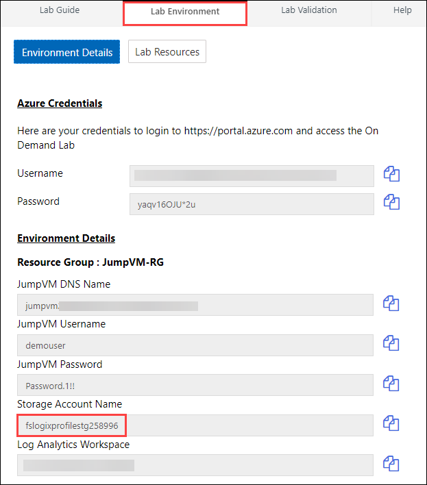
   
   - Location: **East US**, *this should be same as the location of your resource group*.  
   
   - Performance: **Standard**   
   
   - Account kind: **StorageV2(general purpose v2)**
   
   - Replication: **Read-access-geo-redundant storage (RA-GRS)**
   
   - Then click on **Next: Networking**
   
   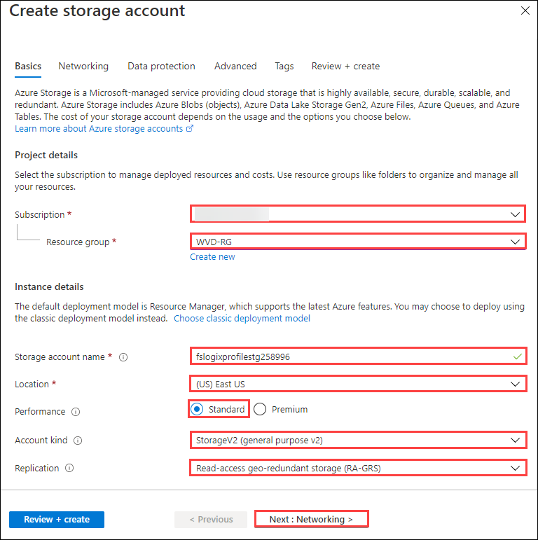
   
4. Under *Networking* tab use following configuration.
    
  - Connectivity method: **Public endpoint(selected networks)**
     
  >**Note:** This will make sure that your storage account is not accessible from public network making it more secure.
    
  - Virtual network subscription: *Select the default subscription*.
  
  - Virtual Network: **aadds-vnet**
  
  - Subnets: **sessionhost-subnet (10.0.1.0/24)**
  
  - Leave the rest to default settings.
  
  - Click on **Review + Create**.
     
   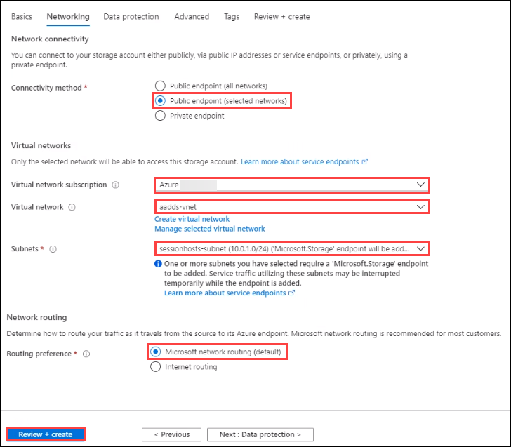
     
5. Click on **Create**.

   

6. After deployment completes click on the notification icon on your azure portal, then click on **Go to resource**.

   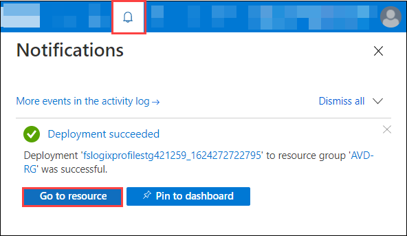
   
7. In the storage account, click on **Configuration** present under **Settings** blade. Then scroll down and find the option **Active Directory Domain Services (Azure AD DS)**. Select **Enabled** for it.

   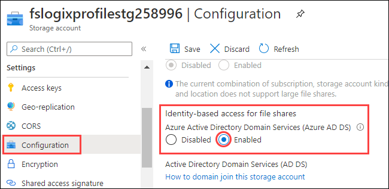
    
> **Note:** Setting this property implicitly ***domain joins*** the storage account with the associated Azure AD DS deployment. Azure AD DS authentication over SMB is then enabled for all new and existing file shares in the storage account.
    
    
8. Then click on **Save**.
     
   
 
9. Now click on **Overview** to return back to storage account page, then click on **File shares**.

   
 
10. Click on **+ File share**.

   
    
    
11. Enter the following name for your file share.
    
    - Name: **userprofile**    
    - Click on **Create**. This will create the file share.
    
    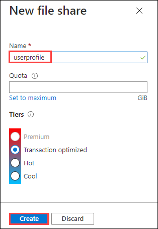

    
### **Task 2: Configure File share**

In this task we will give *Storage File Data SMB Share Contributor* permissions to **<inject key="AzureAdUserEmail" />** so that their profiles can be stored in the fileshare.
   
1. Open on the file share we created earlier.

   
     
         
2. Click on **Access Control (IAM)**, then click on **Add** and select **Add role assignment**.

   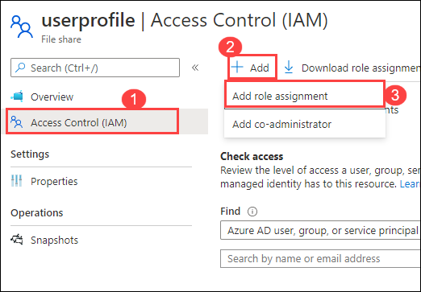
   
3. Select following configuration for role assignment:  
   
   - Role: **Storage File Data SMB Share Contributor**
   
> **Note:** There are three Azure built-in roles for granting share-level permissions to users:
> - *Storage File Data SMB Share Reader* allows read access in Azure Storage file shares over SMB.
> - *Storage File Data SMB Share Contributor* allows read, write, and delete access in Azure Storage file shares over SMB.
> - *Storage File Data SMB Share Elevated Contributor* allows read, write, delete, and modify Windows ACLs in Azure Storage file shares over SMB.
   
   - Under **Select** search paste your username **<inject key="AzureAdUserEmail" />** and select it.
   - Then click on **Save**.
   
   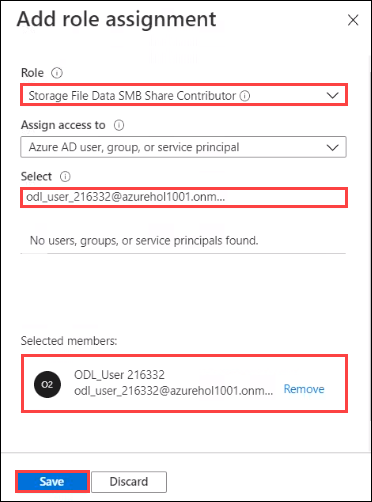
   


### **Task 3: Configure Session Hosts**


In this task we will install and configure FSLogix in the **WVD-HP01-SH-0** session host using a Powershell script.

1. In your Azure portal search for *Virtual machines* in the search bar and click on **Virtual Machines** from the suggestions.

   
      
   
2. Click on **WVD-HP01-SH-0**.

   
      
   
3. Then click on **Run command** under **Operations** tab .

   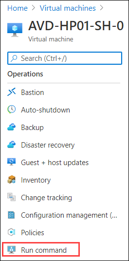
  
4. Now select **RunPowerShellScript**.

   
   
   
5. A similar window as that of the below image will appear.

   
   
      

6. **Copy** the script given below and paste it by pressing **Ctrl + V** in the Powershell window. Do not run the script right away.


```
 #Variables
$storageAccountName = "NameofStorageAccount" 

#Create Directories
$LabFilesDirectory = "C:\LabFiles"

if(!(Test-path -Path "$LabFilesDirectory")){
New-Item -Path $LabFilesDirectory -ItemType Directory |Out-Null
}
if(!(Test-path -Path "$LabFilesDirectory\FSLogix")){
New-Item -Path "$LabFilesDirectory\FSLogix" -ItemType Directory |Out-Null
}

 #Download FSLogix Installation bundle

 if(!(Test-path -Path "$LabFilesDirectory\FSLogix_Apps_Installation.zip")){
       Invoke-WebRequest -Uri "https://experienceazure.blob.core.windows.net/templates/wvd/FSLogix_Apps_Installation.zip" -OutFile     "$LabFilesDirectory\FSLogix_Apps_Installation.zip"

 #Extract the downloaded FSLogix bundle
 function Expand-ZIPFile($file, $destination){
     $shell = new-object -com shell.application
     $zip = $shell.NameSpace($file)
     foreach($item in $zip.items()){
     $shell.Namespace($destination).copyhere($item)
     }
 }

 Expand-ZIPFile -File "$LabFilesDirectory\FSLogix_Apps_Installation.zip" -Destination "$LabFilesDirectory\FSLogix"

}
   #Install FSLogix
   if(!(Get-WmiObject -Class Win32_Product | where vendor -eq "FSLogix, Inc." | select Name, Version)){
       $pathvargs = {C:\LabFiles\FSLogix\x64\Release\FSLogixAppsSetup.exe /quiet /install }
       Invoke-Command -ScriptBlock $pathvargs
   }
   #Create registry key 'Profiles' under 'HKLM:\SOFTWARE\FSLogix'
   $registryPath = "HKLM:\SOFTWARE\FSLogix\Profiles"
   if(!(Test-path $registryPath)){
       New-Item -Path $registryPath -Force | Out-Null
   }

   #Add registry values to enable FSLogix profiles, add VHD Locations, Delete local profile and FlipFlop Directory name
   New-ItemProperty -Path $registryPath -Name "VHDLocations" -Value "\\$storageAccountName.file.core.windows.net\userprofile" -PropertyType String -Force | Out-Null
   New-ItemProperty -Path $registryPath -Name "Enabled" -Value 1 -PropertyType DWord -Force | Out-Null
   New-ItemProperty -Path $registryPath -Name "DeleteLocalProfileWhenVHDShouldApply" -Value 1 -PropertyType DWord -Force | Out-Null
   New-ItemProperty -Path $registryPath -Name "FlipFlopProfileDirectoryName" -Value 1 -PropertyType DWord -Force | Out-Null

   #Display script completion in console
   Write-Host "Script Executed successfully"
```
 
   
   
    
> **Note:** The above script will :
>
> i) Install FSLogix Profile Container application
> 
> ii) Configure the required registries
> 
> iii) Set the profile container location to the Azure file share location we created.
 


7. In line 2, we have to replace the name of storage account with the **"NameofStorageAccount"** block.

   


8. Go to **Lab Environment** tab and copy the **Storage Account Name**. In the script, replace **{NameofStorageAccount}** with the name you just copied. Make sure to remove the curly braces, then click on **Run** to execute the script.

   


9. Wait for some time for the script to execute. Once done, it will show an output saying **Script Executed successfully**.

   
   
> **Note:** It will take around five minutes for the script to execute.
   
10. Navigate to virtual machines and click on **WVD-HP01-SH-1**.

    


11. Select **RunPowerShellScript**.

    
    
    
12. **Copy** the script given below and paste it by pressing **Ctrl + V** in the Powershell window. Do not run the script right away.

```
 #Variables
$storageAccountName = "NameofStorageAccount" 

#Create Directories
$LabFilesDirectory = "C:\LabFiles"

if(!(Test-path -Path "$LabFilesDirectory")){
New-Item -Path $LabFilesDirectory -ItemType Directory |Out-Null
}
if(!(Test-path -Path "$LabFilesDirectory\FSLogix")){
New-Item -Path "$LabFilesDirectory\FSLogix" -ItemType Directory |Out-Null
}

 #Download FSLogix Installation bundle

 if(!(Test-path -Path "$LabFilesDirectory\FSLogix_Apps_Installation.zip")){
       Invoke-WebRequest -Uri "https://experienceazure.blob.core.windows.net/templates/wvd/FSLogix_Apps_Installation.zip" -OutFile     "$LabFilesDirectory\FSLogix_Apps_Installation.zip"

 #Extract the downloaded FSLogix bundle
 function Expand-ZIPFile($file, $destination){
     $shell = new-object -com shell.application
     $zip = $shell.NameSpace($file)
     foreach($item in $zip.items()){
     $shell.Namespace($destination).copyhere($item)
     }
 }

 Expand-ZIPFile -File "$LabFilesDirectory\FSLogix_Apps_Installation.zip" -Destination "$LabFilesDirectory\FSLogix"

}
   #Install FSLogix
   if(!(Get-WmiObject -Class Win32_Product | where vendor -eq "FSLogix, Inc." | select Name, Version)){
       $pathvargs = {C:\LabFiles\FSLogix\x64\Release\FSLogixAppsSetup.exe /quiet /install }
       Invoke-Command -ScriptBlock $pathvargs
   }
   #Create registry key 'Profiles' under 'HKLM:\SOFTWARE\FSLogix'
   $registryPath = "HKLM:\SOFTWARE\FSLogix\Profiles"
   if(!(Test-path $registryPath)){
       New-Item -Path $registryPath -Force | Out-Null
   }

   #Add registry values to enable FSLogix profiles, add VHD Locations, Delete local profile and FlipFlop Directory name
   New-ItemProperty -Path $registryPath -Name "VHDLocations" -Value "\\$storageAccountName.file.core.windows.net\userprofile" -PropertyType String -Force | Out-Null
   New-ItemProperty -Path $registryPath -Name "Enabled" -Value 1 -PropertyType DWord -Force | Out-Null
   New-ItemProperty -Path $registryPath -Name "DeleteLocalProfileWhenVHDShouldApply" -Value 1 -PropertyType DWord -Force | Out-Null
   New-ItemProperty -Path $registryPath -Name "FlipFlopProfileDirectoryName" -Value 1 -PropertyType DWord -Force | Out-Null

   #Display script completion in console
   Write-Host "Script Executed successfully"
```

   
   
    
> **Note:** The above script will :
>
> i) Install FSLogix Profile Container application
> 
> ii) Configure the required registries
> 
> iii) Set the profile container location to the Azure file share location we created.
 

13. In line 2, we have to replace the name of storage account with the **"NameofStorageAccount"** block.

   

14. Go to **Lab Environment** tab and copy the **Storage Account Name**. In the script, replace **{NameofStorageAccount}** with the name you just copied. Make sure to remove the curly braces, then click on **Run** to execute the script.

   
      
 
15. Wait for some time for the script to execute.  Once done, it will show an output saying **Script Executed successfully**.

   

   
> **Note:** It will take around five minutes for the script to execute.
  
16. Now search for *Windows virtual desktop* in the search bar and select **Windows Virtual Desktop** from the suggestions.

    
   
   
17. Click on **Users**, then in the search bar paste your username **<inject key="AzureAdUserEmail" />** and then click on your user.

    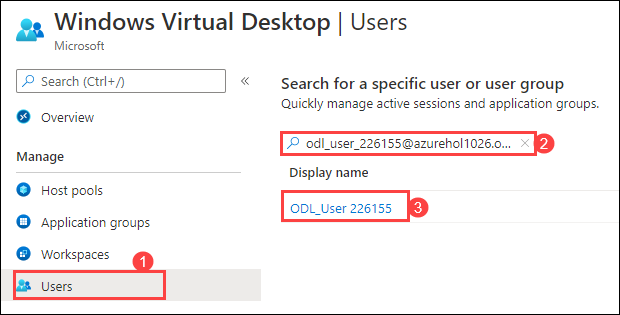
    
18. Switch to **Sessions** tab, then select both *Host Pools* and click on **Log off**.

    
    
19. Click on **OK** to *Log off user from VMs*.

    

> **Note:** This will logoff the user **<inject key="AzureAdUserEmail" />** from both the session hosts, so that when the user sign in again to the session hosts, FSLogix will start functioning.
    
    
20. Now paste this link ```aka.ms/wvdarmweb``` in your browser in the JumpVM, and enter your **credentials** to login. 

    - Username: Paste username **<inject key="AzureAdUserEmail" />**, then click on **Next**.
   
    

    - Password: Paste password **<inject key="AzureAdUserPassword" />** and click on **Sign in**.

    

> **Note:** If there's a dialog box saying ***Help us protect your account***, then select **Skip for now** option.
>
>    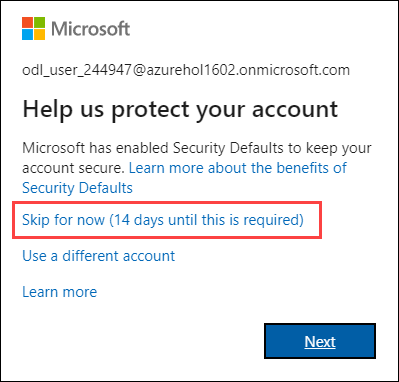
>

21. Click on the **Session Desktop** Desktop to launch it.

    

22. Select Allow on the prompt asking permission to Access local resources.

    

23. Enter your **Credentials** to access the desktop.

   - Username: **<inject key="AzureAdUserEmail" />**
   - Password: **<inject key="AzureAdUserPassword" />**

   
        
24. The desktop will display looking similar to the screenshot below, showing ***Please wait for the FSLogix Apps Services***.

    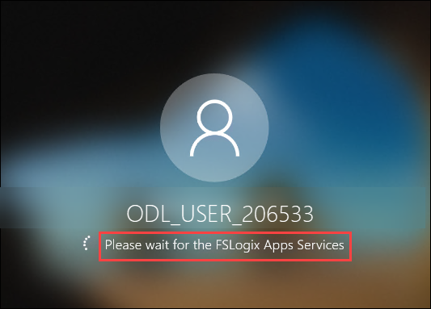
    
> **Note:** This means that user profile is being managed by FSLogix.

25. The virtual desktop will launch and look similar to the screenshot below.

    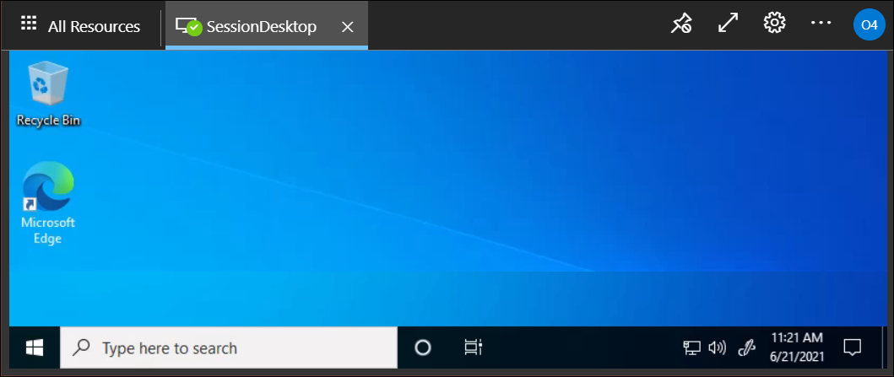

26. At last, click on **User Account** and click on **Sign Out**.

   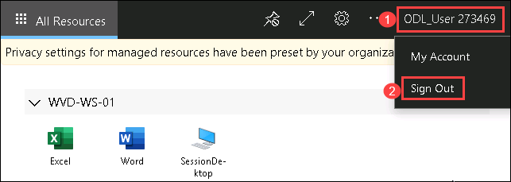
   
### **Task 4: Verifying the User profiles stored in File share**

In this task, we will be accessing the file share to verify the user profiles stored in *.vhd* format.

1. Return to the Azure Portal, search for *storage accounts* in the search bar and click on **Storage Accounts** from the suggestions.

   
    
2. Click on the storage account we created in **Task 1 step 3**, then under settings blade click on  **Networking**.

   
   
3. Under **Allow access from** select **All networks** and click on **save icon**.

   
    
> **Note:** This will enable access of your storage account on public network so that you can see the user profiles stored in the fileshare.
    
4. Open the storage account we created earlier, then click on **Overview** and open **Fileshare**.

   
    
    
5. Click on the **userprofile** fileshare.

   

6. You will see the user folder created in the file share, click on the folder.

    

7. Now you will be able to see the user profiles data stored in the fileshares in a ***.vhd*** format.

   

> **Note:** It might take sometime for the User Profile folder to appear in the fileshare. If you do not see the folder now, please continue with the next task and check back later.

8. Click on the **Next** button present in the bottom-right corner of this lab guide.

