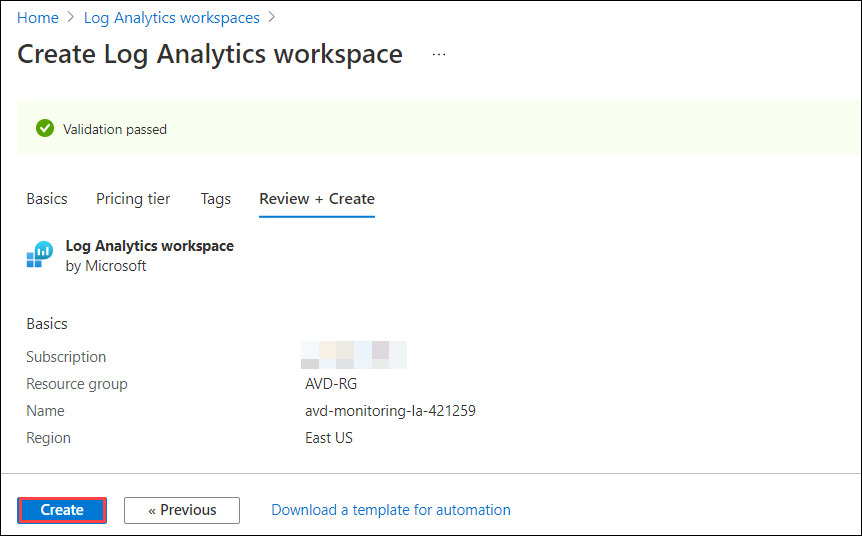
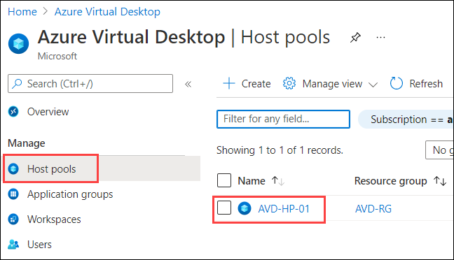
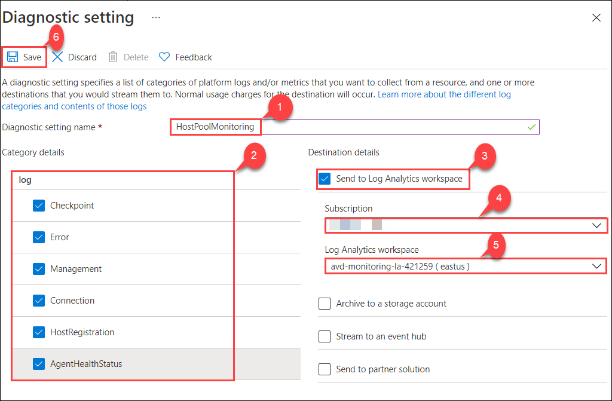
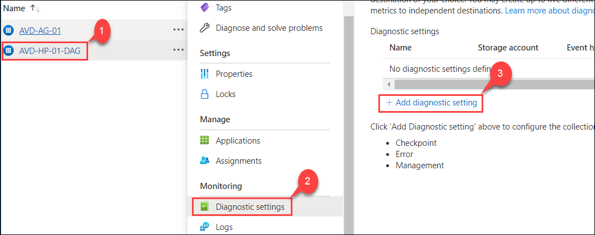
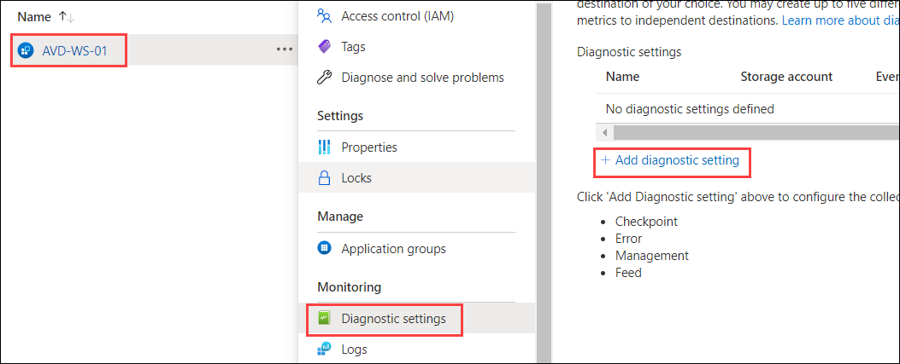
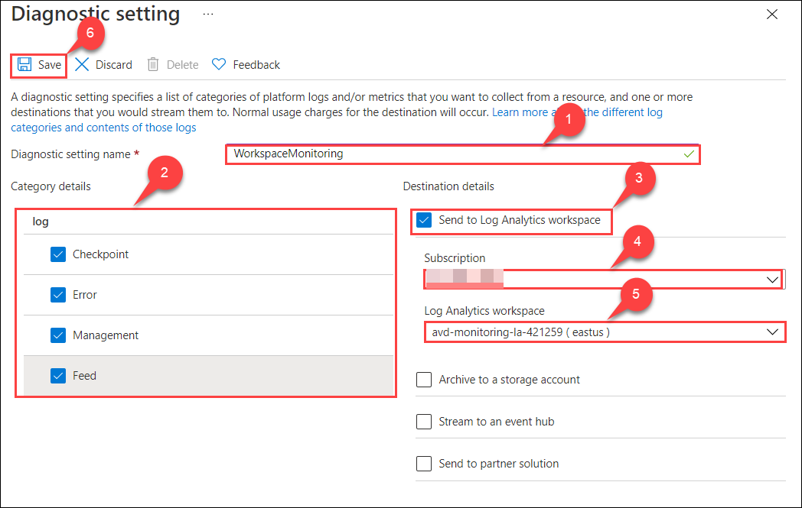
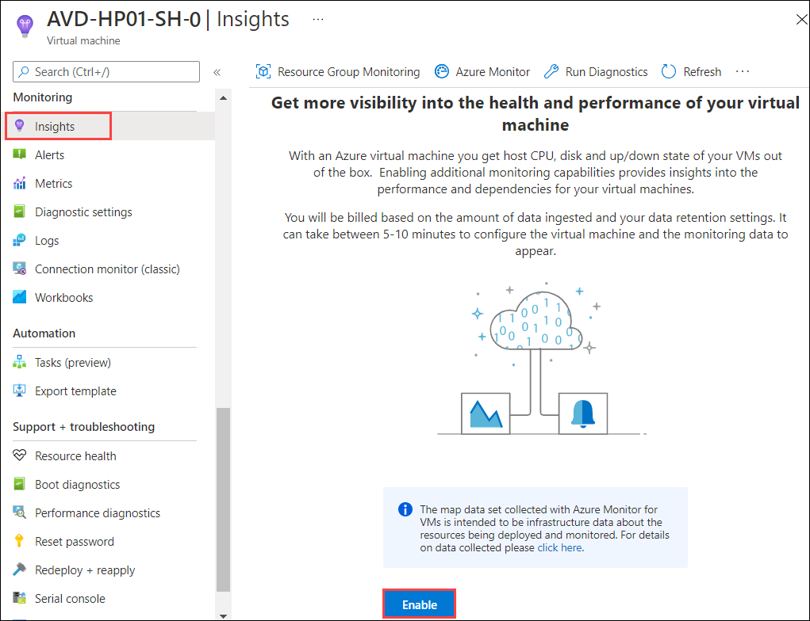

# Exercise 6: Monitoring using Log Analytics

> **Note:** This section doesn’t cover the Azure Monitor for Azure Virtual Desktop announcement from today. 

Azure Virtual Desktop uses Azure Monitor for monitoring and alerts like many other Azure services. This lets admins identify issues through a single interface. The service creates activity logs for both user and administrative actions.


### **Task 1: Create Log Analytics**

1. On the Azure portal, click on **Create a resource** given under *Azure services*.

   

2. Type *Log Analytics Workspace* in the search bar and click on **Log Analytics Workspace** from the suggestions.

   

3. On the Log Analytics Workspace page, click on **Create**.

   

4. Now add the following configurations:

  - Subscription: *Choose the default subscription.*
  
  - Resource group: *Select **AVD-RG** from the drop down.*
  
  - Name: **<inject key="Log Analytics Workspace Name	" />**
  
  - Region: **East US**, *basically this should be same as the region of your resource group.*
  
  - Click on **Review + Create**

   

5. The last window helps us to verify if the parameters we filled are correct. Wait for validation to pass, then click on **Create** to initiate the deployment.

   

6. Once the deployment gets succeeded, it will look similar to the image shown below.

   

### **Task 2: Enable diagnostics for Host Pool**

1. Navigate to **Azure Virtual Desktop**. 

   

2. Open **Host Pools** and then click on **AVD-HP-01**.

   

3. Now click on **Diagnostic settings** present under *Monitoring* blade, then click on **+Add diagnostic setting**.

   


> **Note:** Due to a technical issue in Azure portal, you may find diagnostic settings pre-created in ***Host Pool, Application Group and Workspace***. For now, we will
> delete it using following steps: 
>
> i) In diagnostics settings, locate the pre-created diagnostics setting and click on **Edit setting**.
>    
>    
>
> ii) Click on **Delete** button and then for the dialog box saying *Are you sure you want to delete?* click on **Yes**.
>    
>    
>
> iii) Once deleted, you can follow the steps to add a new diagnostic setting.
>

4. Add the following configurations:

  - Diagnostic settings name: **HostPoolMonitoring**
  - Category details: *Check all the boxes present under logs i.e.,* **Checkpoint, Error, Management, Connection, HostRegistration and AgentHealthStatus.** 
  - Destination details: *Check the box for* **Send to Log Analytics**
  - Subscription: *Choose the default subscription.*
  - Log Analytics Workspace: *Select the log analytics workpsace from the drop down, that we just created.*
  - At last, click on **Save**.

   

5. Once saved, it will look similar to the image shown below.

   

### **Task 3: Enable diagnostics for Application Groups**

1. Navigate back to Azure Virtual Desktop and open **Application groups**.

   
   
2. Click on **AVD-HP-01-DAG**. Then select **Diagnostic settings** present under *Monitoring* blade and click on **+Add diagnostic setting**.

    
   
3. Add the following configurations:

  - Diagnostic settings name: **ApplicationGroupMonitoring**
  - Category details: *Check all the boxes present under logs i.e.,* **Checkpoint, Error and Management.** 
  - Destination details: *Check the box for* **Send to Log Analytics**
  - Subscription: *Choose the default subscription.*
  - Log Analytics Workspace: *Select the log analytics workpsace from the drop down, that we just created.*
  - At last, click on **Save**.

   

4. Once saved, it will look similar to the image shown below.

   
   
5. Navigate back to **Application groups** and click on **AVD-AG-01**.

   

6. Add the following configurations:

  - Diagnostic settings name: **ApplicationGroupMonitoring1**
  - Category details: *Check all the boxes present under logs i.e.,* **Checkpoint, Error and Management.** 
  - Destination details: *Check the box for* **Send to Log Analytics**
  - Subscription: *Choose the default subscription.*
  - Log Analytics Workspace: *Select the log analytics workpsace from the drop down, that we just created.*
  - At last, click on **Save**.

   

7. Once saved, it will look similar to the image shown below.

   


### **Task 4: Enable diagnostics for Workspace**
 
1. Navigate back to Azure Virtual Desktop and open **Workspaces**.

   
   
2. Click on **AVD-WS-01**. Then select **Diagnostic settings** present under *Monitoring* blade and click on **+Add diagnostic setting**.    
   
   
 
3. Add the following configurations:

  - Diagnostic settings name: **WorkspaceMonitoring**
  - Category details: *Check all the boxes present under logs i.e.,* **Checkpoint, Error, Management and Feed.** 
  - Destination details: *Check the box for* **Send to Log Analytics**
  - Subscription: *Choose the default subscription.*
  - Log Analytics Workspace: *Select the log analytics workpsace from the drop down, that we just created.*
  - At last, click on **Save**.  
   
   

4. Once saved, it will look similar to the image shown below.

   


### **Task 5: Enable diagnostics for Session Hosts**   

1. Navigate to **Virtual Machines**.

   
  
2. Open **AVD-HP01-SH-1** virtual machine. Click on **Insights** under *Monitoring* blade, and click on **Enable** button.

   

3. Return to virtual machines. Open **AVD-HP01-SH-0** virtual machine, click on **Insights** under *Monitoring* blade, and click on **Enable** button.

   


> **Note:** Deployment can take 5-10 minutes to complete. Once complete, you will see the following items configured on the VM:
> - New VM Extensions Added
> - New Monitoring Agents Installed
> - Monitoring Agent Configured for Log Analytics 

   
   


### **Task 6 : Run queries in Log Analytics Workspace**

1. Now navigate to *Log Analytics Workspace* and open your workpsace, then select **Logs** under *General* blade. 

   

2. Click on **Get Started** button and then close the *Example queries* window by clicking on **X** button.

   

3. You will see Query editor which will look similar to the screenshot given below. You can use this to run queries.

   


> **[Optional]**
>
> **Note:** The logs from AVD might take upto 24 hours to get populated in Log Analytics Workspace, hence it is impossible for you to replicate the below steps at this point. We are providing these steps as a reference for your understanding, you do not need to execute them.
>
> i. In the *Query Editor*, paste the following query and click on **Run** button.
>
>   ```
>   WVDConnections 
>   |sort by TimeGenerated asc, CorrelationId
>  |summarize Connectcount = dcount(CorrelationId) by bin(TimeGenerated, 1d),UserName = toupper(trim_end("@.*",UserName))
>  ```
>  
>   
>
>ii. In results, logs will appear similar to one shown below.
>
>  


4. Click on the **Next** button present in the bottom-right corner of this lab guide.
