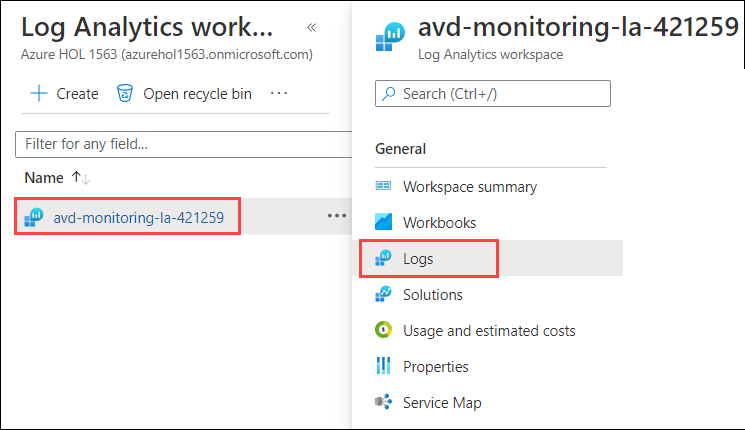
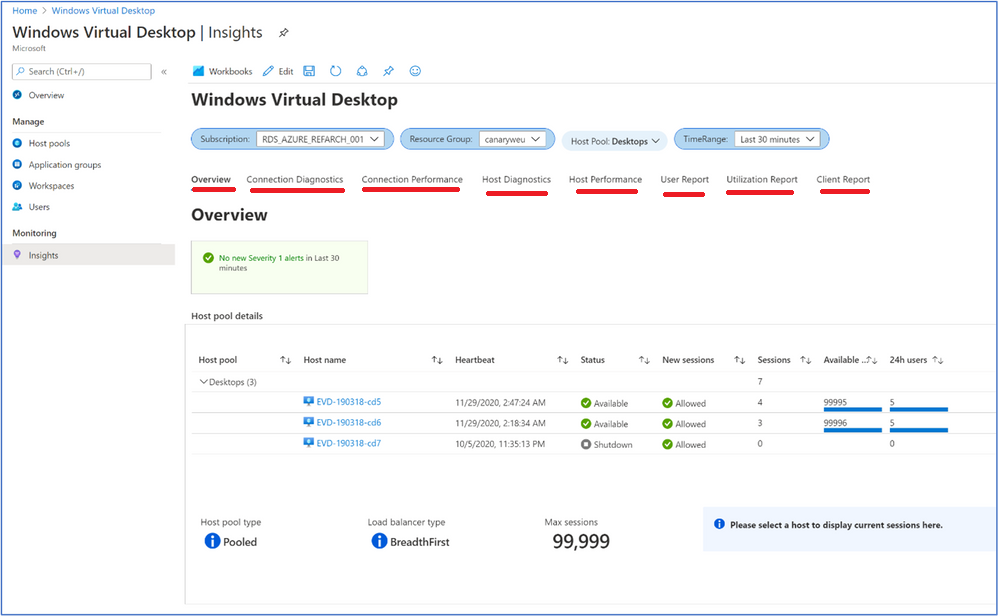

# Exercise 5: Monitoring using Azure Monitor (Log Analytics)

Azure Virtual Desktop uses Azure Monitor for monitoring and alerts like many other Azure services. This lets admins identify issues through a single interface. The service creates activity logs for both user and administrative actions.

## **Task 1 : Run queries in Log Analytics Workspace**

1. From the Main page of Azure portal, navigate to *Log Analytics Workspaces* (use the bar on the top if the icon is not visible) and open your log workspace, then select **Logs** under *General* blade.

   

1. Click on **Get Started** button and then close the *Example queries* window by clicking on **X** button.

   

1. You will see Query editor which will look similar to the screenshot given below. You can use this to run queries.

   

1. In the *Query Editor*, paste the following query and click on **Run** button.

    ```Kusto
    WVDConnections 
    |sort by TimeGenerated asc, CorrelationId
    |summarize Connectcount = dcount(CorrelationId) by bin(TimeGenerated, 1d),UserName = toupper(trim_end("@.*",UserName))
    ```

   

1. In results, logs will appear similar to one shown below.

  

## **Task 2 : Use Azure Monitor for Azure Virtual Desktop (preview)**

>[!IMPORTANT]
>Azure Monitor for Azure Virtual Desktop is currently in public preview. This preview version is provided without a service level agreement, and we don't recommend using it for production workloads. Certain features might not be supported or might have constrained capabilities. For more information, see [Supplemental Terms of Use for Microsoft Azure Previews](https://azure.microsoft.com/support/legal/preview-supplemental-terms/).

Azure Monitor for Azure Virtual Desktop (preview) is a dashboard built on Azure Monitor Workbooks. This task will walk you through how to use it to monitor the Azure Virtual Desktop environment.

You can open Azure Monitor for Azure Virtual Desktop with one of the following methods:

- Go to [aka.ms/azmonwvdi](https://portal.azure.com/#blade/Microsoft_Azure_WVD/WvdManagerMenuBlade/workbooks).

- Search for and select **Azure Virtual Desktop** from the Azure portal, then select **Insights**.

- Search for and select **Azure Monitor** from the Azure portal. Select **Insights Hub** under **Insights**, and under **Other** select **Azure Virtual Desktop** to open the dashboard in the Azure Monitor page.

Once you have Azure Monitor for Azure Virtual Desktop open, select one or more of the check boxes labeled **Subscription**, **Resource group**, **Host pool**, and **Time range**.

  

Go through the various tabs (underlined in red) to view health on various aspects such as looks top errors, connectivity issues, host diagnostics, performance issues, client information, etc.

Click on the **Next** button present in the bottom-right corner of this lab guide.
