# **Exercise 7: Load Balancing methods** [Optional]

Azure Virtual Desktop supports two load-balancing methods. Each method determines which session host will host a user's session when they connect to a resource in a host pool.
While configuring  a host pool, we can select load balancing methods as per the needs.

The following load-balancing methods are available in Azure Virtual Desktop:

 **1. Breadth-first**: Breadth-first load balancing distributes new user sessions across all available session hosts in the host pool. 

 **2. Depth-first**:  Depth-first load balancing distributes new user sessions to an available session host with the highest number of connections but has not reached its maximum session limit threshold.


## **Task 1: Add new users to Azure Active Directory**

1. In Azure Portal, click on the **Show portals menu** button and select **Azure Active Directory**.

   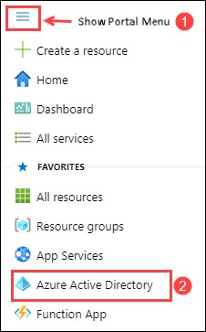

2. Click on **Users** under *Manage* blade.

   

3. Click on **+ New user** to add a new user.

   

4. Add the following configurations and leave rest to default:

   - User name: **AVDUser01**
   - Name: **AVDUser01**
   - Click on **Create**.

   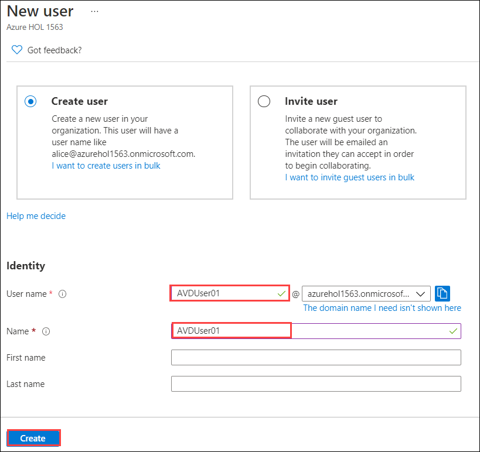

5. Click on **+ New user** to add one more user, then add the following configurations and leave rest to default.

   - User name: **AVDUser02**
   - Name: **AVDUser02**
   - Click on **Create**
   
   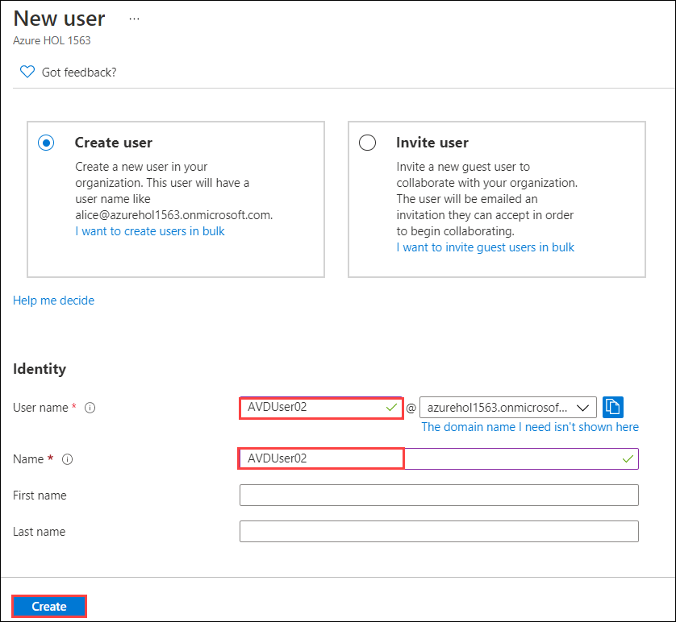

6. Both the newly created users will show up similarly as shown below. Copy the **user principal name** of both users and paste in a text editor so that we can use it further.

   

7. Click on **AVDUser01** to open it. Then click on **Groups** under *Manage* blade and select **+ Add memberships**.

   

8. Click on the **AAD DC Administrators** group and then click on **Select**.

   

9. Click on **AVDUser02** to open it. Then click on **Groups** under *Manage* blade and select **+ Add memberships**.

   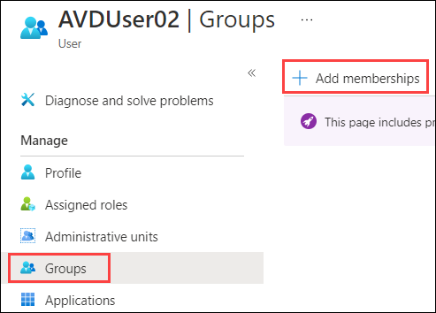

10. Click on the **AAD DC Administrators** group and then click on **Select**.

   

11. Navigate to the host pool *AVD-HP-01* and open **Application groups** present under *Manage* blade. Two application groups will be listed there.

   

12. Open application group **AVD-HP-01-DAG** and click on **Assignments** under *Manage* blade.

   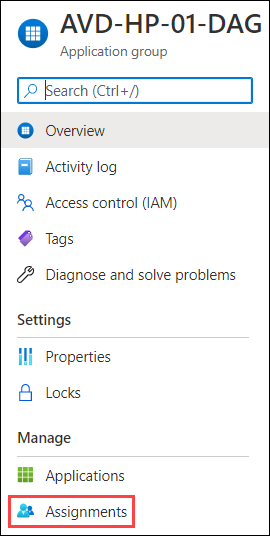
   
13. Click on **+ Add**, then in the search bar, type *AVDUser* and select both **AVDUser01** & **AVDUser02** that we created earlier. At last, click on **Select** button.

   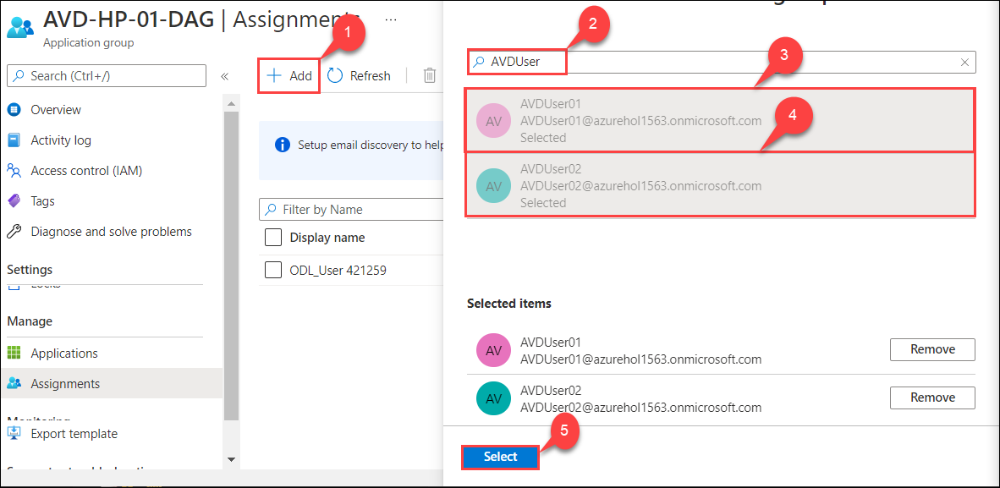

14. Once done, the users assigned to the Application group will look similar to the image given below.

   
   
   
## **Task 2: Update Passwords for the new users**

Here, we will use Azure Cloud Shell to run a script that will change the passwords for the users created, as user needs to reset password after registering to AADDS. 

1. In Azure portal, click on the **Cloud Shell** icon.

   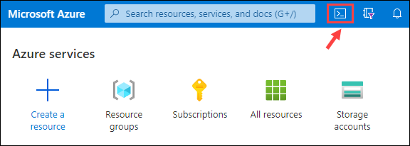
   
2. In the Cloud Shell window that opens at the bottom of your browser window, select **PowerShell**.

   

3. Click on **Show Advanced Settings**.

   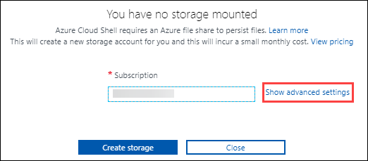

4. Use exisiting resource group - **AVD-RG** from the drop down and for:

    - Storage Account: Select **Create new** and enter **sa{uniqueid}**, where **uniqueid** is the numerical value present in your username. 
    - File Share: Select **Create new** and enter **fs{uniqueid}**, where **uniqueid** is the numerical value present in your username.

> **Note:** **UniqueID** is the numerical value present in your username. 
> For example, if your username is *odl_user_258996@azurehol1004.onmicrosoft.com*, the *UniqueID* will be 258996. 

   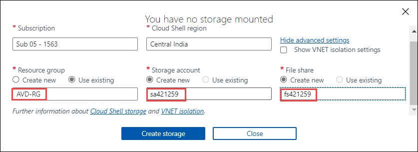

5. After the terminal launches it will look like this.

   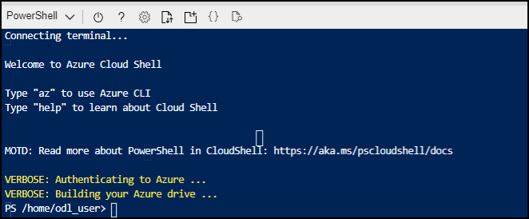

6. Copy and paste the following script and hit **Enter**.

   ```
   $domain = ((Get-AzADUser | where {$_.Type -eq "Member"}).UserPrincipalName.Split('@'))[1]
   $password= ConvertTo-SecureString "Azure1234567" -AsPlainText -Force
   $users = @("AVDUser01@$domain","AVDUser02@$domain")
   $users | foreach{
       Update-AzADUser -UserPrincipalName $_ -Password $password
   }
   ```
 
   
 
7. Output of the script will be similar to the one shown below. The password for both **AVDUser01** and **AVDUser02** is reset to **Azure1234567**.

   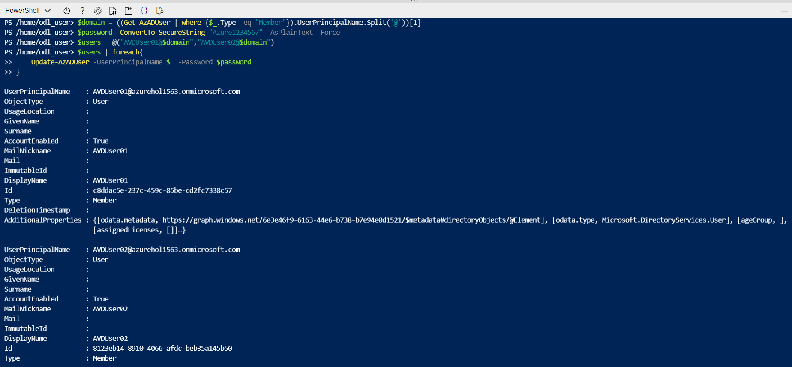

> **Note:** Make sure you have noted down the ***Username*** and ***Password*** for ***AVDUser01*** and ***AVDUser02***.


## **Task 3: Change and experience Load Balancing methods**


**A**. **Breadth-first**
   
While creating AVD-HP-01 host pool, we selected load balancing method as *Breadth-first*.  Now we are going to log in to Desktop App created on AVD-HP-01 with both users simultaneously and see the user distribution.


1. Paste this link ```aka.ms/wvdarmweb``` in your browser in the **JumpVM** and enter your **credentials** to login. 

   - Username: *Paste username* **AVDUser01** *which you copied earlier and then click on **Next**.*
   
   

   - Password: *Paste the password* **Azure1234567** *and click on* **Sign in**.

   

> **Note:** If there's a dialog box saying ***Help us protect your account***, then select **Skip for now** option.
>
>    
>

2. Now in the AVD dashboard, click on the **Default Desktop** to access it. 

   

3. Select **Allow** on the prompt asking permission to *Access local resources*.

   

4. Enter your **credentials** to access the application and click on **Submit**.

   - Username: *Paste username of* **AVDUser01** *which you copied earlier(for example: **AVDUser01@azurehol1055.onmicrosoft.com**)*
   
   - Password: *Paste the password* **Azure1234567**
   
   


6. The virtual Desktop will launch as shown below. 

   
   
7. Navigate to **Your Own PC/computer/workstation**, go to **Start** and search for **Remote desktop** and open the application with the exact icon as shown below.

   
   
8. Click on the *ellipses* and select **Unsubscribe**. Click on **Yes** for any warning.

   

> **Note:** We need to unsubscribe from the feed, because in Exercise 4 we subscribed to AVD feed using a different user.

9. Click on **Subscribe** button.

   

10. Enter the user credentials to access the workspace.

   - Username: *Paste username of* **AVDUser02** *which you copied earlier(for example: **AVDUser02@azurehol1055.onmicrosoft.com**), then click on **Next**.*
   
   - Password: *Paste the password* **Azure1234567**.

   

> **Note:** If there's a dialog box saying ***Help us protect your account***, then select **Skip for now** option.
>
>    
>

11. In AVD client, double click on the **Default Desktop** to access it. 

   

12. Enter your **credentials** to access the application and click on **Submit**.

   - Username: *Paste username of* **AVDUser02** *which you copied earlier(for example: **AVDUser02@azurehol1055.onmicrosoft.com**)*
   - Password: *Paste the* **Azure1234567** *and click on* **OK**.* 
   
   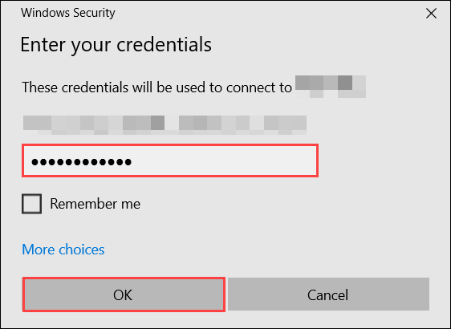
  

13. The virtual Desktop will launch as shown below. 

    


14. Return to the Azure portal in your browser inside the **JumpVM**, search for *host pools* and click on **Host pool** from the suggestion to open it.

   
   
   
15. Now click on **AVD-HP-01** host pool to access it.

   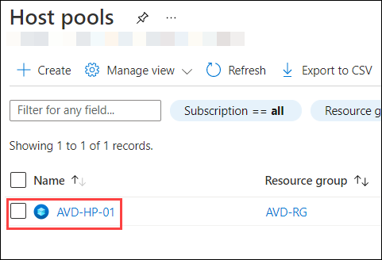
   
   
16. Under Manage blade, click on **Session hosts**.

   
   
   
17. You can see that both session hosts have one Active sessions each.

   
   
> **Note:** This shows how users are distributed among different session hosts under *Breadth-first load balancing method*. The breadth-first method first queries session hosts that allow new connections. The method then selects a session host randomly from half the set of session hosts with the least number of sessions. 
> 
> Please follow [Breadth-first Load-Balancing Method](https://docs.microsoft.com/en-us/azure/virtual-desktop/host-pool-load-balancing#breadth-first-load-balancing-method) to learn more about it.


18. Open **AVD-HP01-SH-0** session host, there you can see the user logged in to that session host. Now click on **Log off all active users** button and select **Yes** to the prompt asking *Do you want to Log off active users of the virtual machine*.

   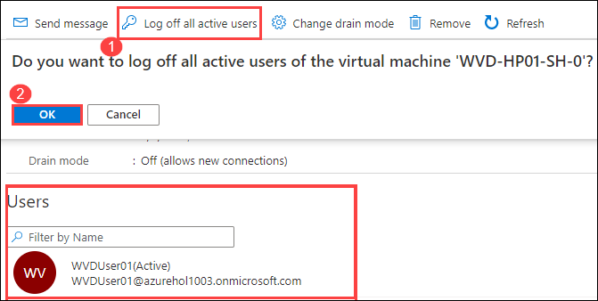

19. Navigate back to *Session hosts* and open **AVD-HP01-SH-1** session host, there you can see the user logged in to that session host. Now click on **Log off all active users** button and select **Yes** to the prompt asking *Do you want to Log off active users of the virtual machine*.

   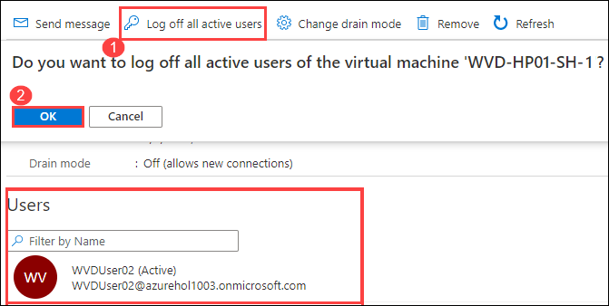

>**Note:** We need to log off the users from session hosts so that when the users login again, connection is made based on the *Depth-first load balancing method*.
   

**B**. **Depth first**

Here we will change the load balancing method of *AVD-HP-01* host pool to *Depth first* and see how user distribution changes in the Host pool.

> **Note:** If previous session is closed, visit to  `aka.ms/wvdarmweb`, then click on *Default Desktop* and login with *AVDUser01* credentials.

1. In *AVD-HP-01* host pool, click on **Properties** under *Settings* blade.

   
   
   
2. Change the load balancing algorithm to **Depth-first** then click on **Save icon**.

   
   
3. Now paste this link ```aka.ms/wvdarmweb``` in your browser inside the **JumpVM**, and enter your **credentials** to login. 

   - Username: *Paste username of* **AVDUser01** *which you copied earlier(for example: **AVDUser01@azurehol1055.onmicrosoft.com**)* and then click on **Next**.
   
   

   - Password: *Paste the password* **Azure1234567** *and click on* **Sign in**.*

   
 
 > **Note:** If there's a dialog box saying ***Help us protect your account***, then select **Skip for now** option.
>
>    
>

4. In the AVD dashboard, click on the **Default Desktop** to access it. 

   

5. Select **Allow** on the prompt asking permission to *Access local resources*.

   

6. Enter your **credentials** to access the application and click on **Submit**.

   - Username: *Paste username of* **AVDUser01** *which you copied earlier(for example: **AVDUser01@azurehol1055.onmicrosoft.com**)*
   
   - Password: *Paste the password* **Azure1234567**
   
   


7. The virtual Desktop will launch as shown below. 

   
   
   
8. In **Your Own PC/computer/workstation**, go to **Start** and search for **Remote desktop** and open the application.

   
   

9. Now in the AVD client double click on the **Default Desktop** to access it. 

   

10. Enter your **credentials** to access the desktop and click on **Submit**.

   - Username: *Paste username of* **AVDUser02** *which you copied earlier(for example: **AVDUser02@azurehol1055.onmicrosoft.com**).*
   - Password: *Paste the password* **Azure1234567**
   

   
   

11. The virtual Desktop will launch as shown below. 

    


12. Return back to the Azure portal in the **JumpVM**, navigate to **AVD-HP-01** host pool and open **Session Hosts** present under *Manage* blade.

   
   
   
13. Here one of the session hosts, either *AVD-HP01-SH-0* or *AVD-HP01-SH-1* will have 2 Active sessions. Click on that session host to open it.

   
   
> **Note:** The depth-first method first queries session hosts that allow new connections and haven't gone over their maximum session limit. The method then selects the session host with highest number of sessions. If there's a tie, the method selects the first session host in the query.
>
> Please follow [Depth-first Load-Balancing Method](https://docs.microsoft.com/en-us/azure/virtual-desktop/host-pool-load-balancing#depth-first-load-balancing-method) to learn more about it.
   
14. Verify that both users have been assigned to the particular session host. 

   


> **[Optional]**
>
> **Scale session hosts using Azure Automation**
>
> Here, you will learn about the scaling tool built with the Azure Automation account and Azure Logic App that automatically scales session host VMs in your Azure Virtual Desktop environment. 
>
> Please follow the link given below to learn more about this feature. 
>
> ```https://docs.microsoft.com/en-us/azure/virtual-desktop/set-up-scaling-script```
>

Click on the **Next** button present in the bottom-right corner of this lab guide.

