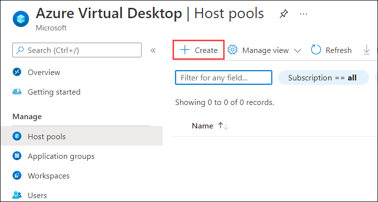
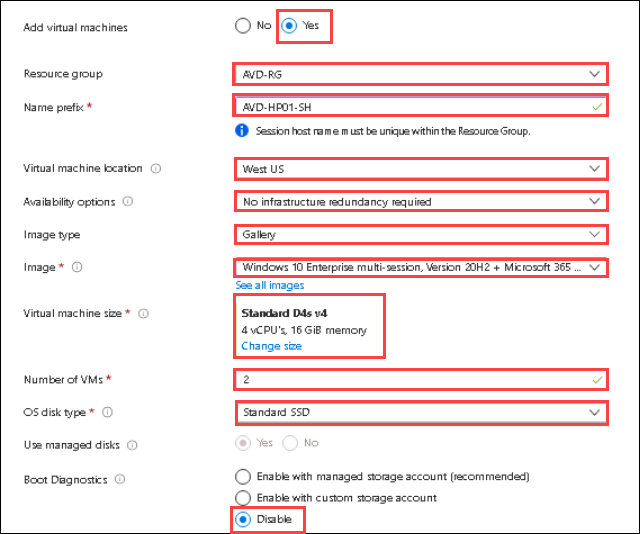
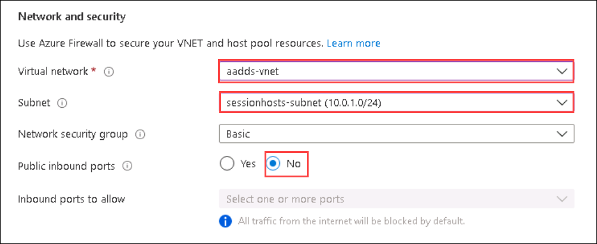
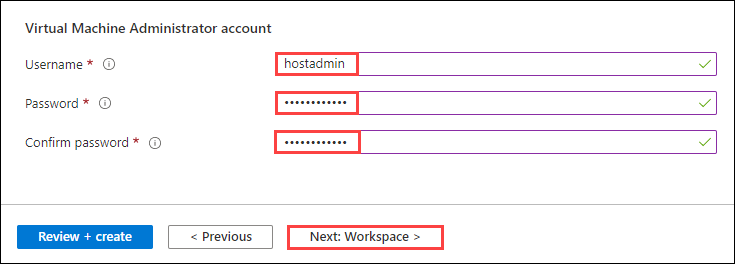
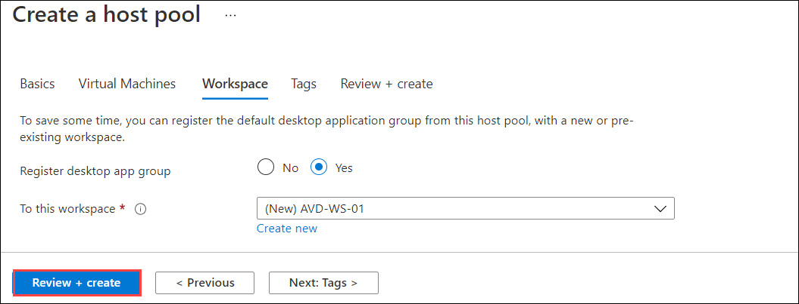
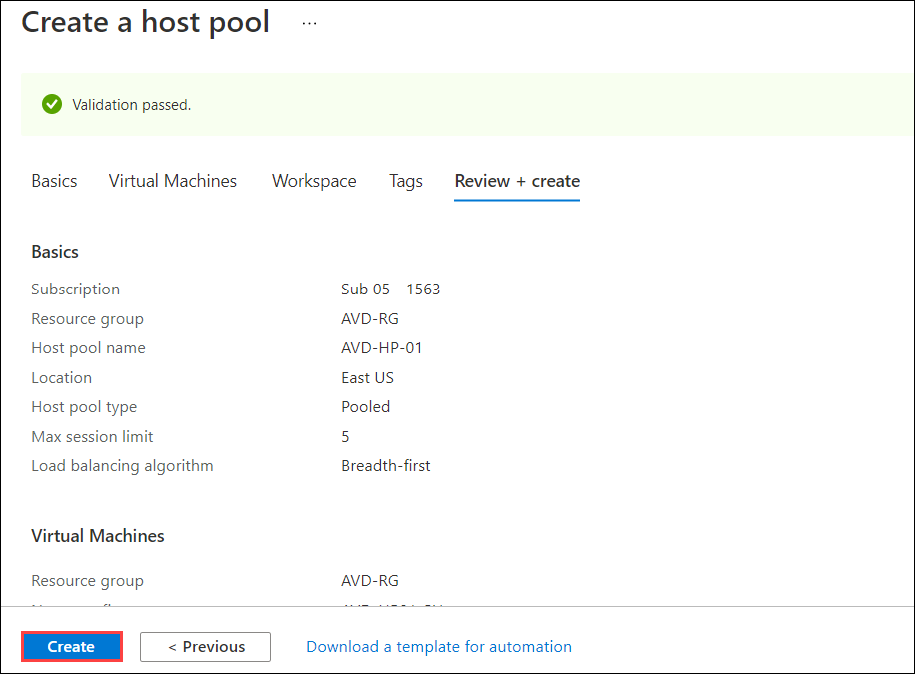
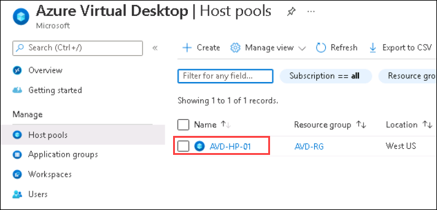
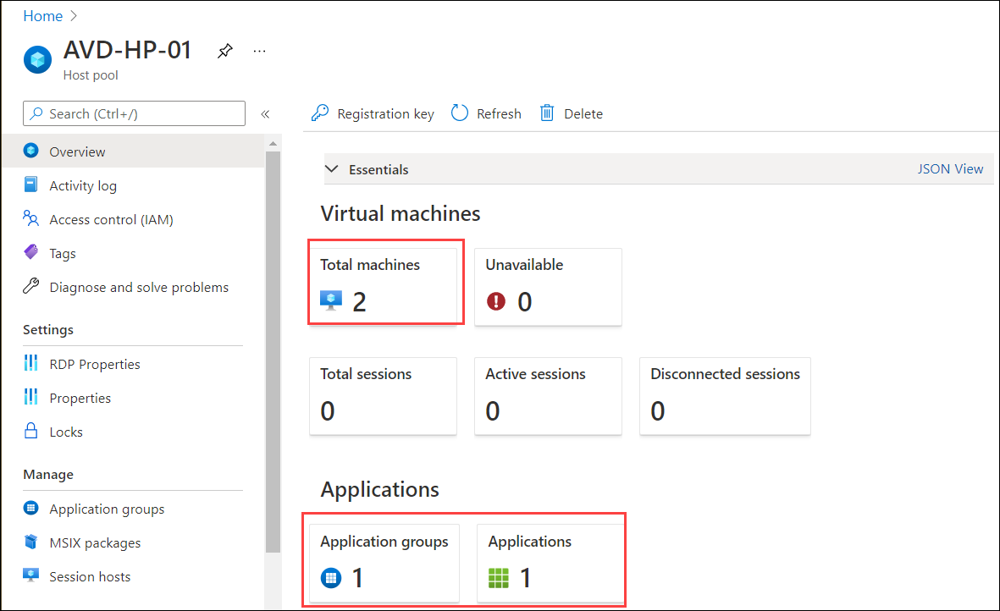
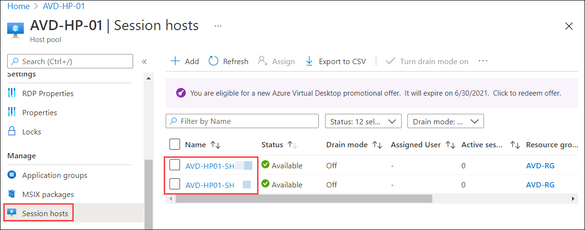

# Lab 1: Create Host Pool from Azure Portal

 A Host Pool is a collection of Azure virtual machines that register to Azure Virtual Desktop as session hosts when you run the Azure Virtual Desktop agent. All session host virtual machines in a host pool should be sourced from the same image for a consistent user experience. To start with, we will login to the Azure portal. 
 
## Getting Started with Lab	

1. Once you launch the lab, a virtual machine (JumpVM) on the left and lab guide on the right will get loaded in your browser. Use this virtual machine throughout the workshop to perform the lab.	

   	

2. To get lab environment details, click on the **Environment Details** tab located next to the *Lab Guide* tab. 	

   	

## Exercise 1: Log in to Azure Portal

1. In the JumpVM, double click on the **Azure portal shortcut** on the desktop.

     

2. Login to Azure with the username **<inject key="AzureAdUserEmail" />** and click on **Next**.

   

3. Enter password **<inject key="AzureAdUserPassword" />** and click on **Sign in**.

   

   >**Note:** If there's a popup entitled **Stay signed in?** with buttons for **No** and **Yes** - Choose **No**.
   
   
     
   >**Note:** If there's another popup entitled **Welcome to Microsoft Azure** with buttons for **Start Tour** and **Maybe Later** - Choose **Maybe Later**.
   
    
   
   >**Note:** If there's another popup entitled **Help us protect your account** click **Skip for now (14 days intil this is required)**
   
   
    
4. **Close** the recomendation page by clicking on the X mark.

   

4. Now in the Azure portal, click on **Resource Groups** present under *Navigate*.

   

5. You will see a list of resource groups as show in the image below. Click on **AVD-RG** to open it.

   
   
   >**Note:** You will be using ***AVD-RG*** throughout the lab. Other two resource groups listed in the portal are not to be used in the lab.

## Exercise 2: Create Host Pool

In this exercise, we will create a Host Pool named *AVD-HP-01* of pooled type, then add two session hosts (virtual machines) i.e. *AVD-HP01-SH-0* and *AVD-HP01-SH-1*  and register the default desktop application group from this hostpool to a new workspace named *AVD-WS-01*.

1. On **Azure portal** search for **Azure Virtual Desktop** in the search bar (1) and select **Azure Virtual Desktop** (2) from the suggestions.

    

2. You will get directed towards the Azure Virtual Desktop (here after referred to as AVD) management window. Select **Host pools** under **Manage** blade

   

3. Now, click on **+ Create** to add create new Host Pool.

   

4. In this step, we will provide the details required to create a Host Pool. For your convenience, this step is divided into two sections as follows:

   **A**. Project Details Defines the Host Pool environment 

   - Subscription: *Choose the default subscription*.
   - Resource Group: *Select **AVD-RG** from the drop down*.
   - Host Pool Name: **AVD-HP-01**
   - Location: **East US**, *basically this should be same as the region of your resource group*.      
   - Validation environmet: **No**
      
   >**Note:** Validation host pools let you monitor service updates before rolling them out to your production environment.
            
   **B**. Host Pool Type Defines the type of host pool. 

   - Host pool type: **Pooled** 
        
   > **Note:** Host Pools are of 2 types: Pooled and Personal.  
   > - **Pooled**, where session hosts can accept connections from any user authorized to an app group within the host pool.
   > - **Personal**, where each session host is assigned to individual users.
     
   - Load Balancing Algorithm: **Breadth First**
   
   > **Note:** Load Balancing Algorithm is of two types: *Breadth-first* and *Depth-first*. 
   > - **Breadth-first** load balancing allows you to evenly distribute user sessions across the session hosts in a host pool. 
   > - **Depth-first** load balancing allows you to saturate a session host with user sessions in a host pool. 

   - Max session Limit: **5**   
      
   > **Note:** Max session Limit limits the simultaneous number of users on the same session host.
   
   - Then click on **Next:Virtual Machines**.
   
     
   
5. In the Virtual machines tab, select **Yes** against **Add virtual machines**. By doing this, we are stepping towards adding Virtual machines to the host pool. 

   

6. In this step, we will provide the details of the VMs to be created as session Hosts. For your convenience, this step is divided into three sections as follows:

   **A**. Session Host Specifications:     

   - Resource Group: *Select **AVD-RG** from the drop down*.
   - Name prefix: **AVD-HP01-SH** 
   - Virtual machine location: **East US**, *location should be same as location of your resource group*.
   - Availability options: _Select_ **No infrastructure redundancy required** _from the drop down_.
   - Image type: **Gallery**
   - Image: **Windows 10 Enterprise multi-session, version 20H2 + Microsoft 365 Apps (GEN2)** *(choose from dropdown)*
   - Virtual machine size: **Standard D4s v4**. *Click on **Change Size**, then select **D4s_v3** and click on **Select** as shown below*
   
   

   - Number of VMs: **2**
   - OS disk type: **Standard SSD**
   - Use managed disks: *Leave to default*
   - Boot Diagnostics: **Disable**
   
   
    
   **B**. Network and Security:
    
   Leave all values to default, except:
    
   - Virtual network: **aadds-vnet** *(choose from dropdown)*
   - Subnet: **sessionhosts-subnet(10.0.1.0/24)** *(choose from dropdown)*
   - Network Security Group: **Basic**
   - Public inbound ports: **No**
 
   
 
   **C**. Domain Administrator Account:
  
   - Select which directory you would like to join: Choose **Azure Directory** from dropdown
   - AD domain join UPN: *Paste your username* **<inject key="AzureAdUserEmail" />**
   - Password: *Paste the password* **<inject key="AzureAdUserPassword" />**
   - Specify Domain or Unit: **No**
   
   

   > **Note:** This Administrator Account details will be used for domain joining the virtual machines to the Windows AD domain we created using AADDS.

   **D**. Virtual Machine Administrator Account:
  
   - Username: **hostadmin**
   - Password: *Paste the password* **<inject key="AzureAdUserPassword" />**
   - Confirm Password: *Paste the password* **<inject key="AzureAdUserPassword" />** *again.*
   - Click on **Next: Workspace** to proceed. 
   
   
   
7. In the Workspace section, we need to specify if we need to register the default application group to a workspace. 

   - Register desktop app group: *Choose* **Yes** 
   - To this workspace: *Click on* **Create new**

   
   
8. Once you click on **Create new**, a small window pops up, where you can specify the Workspace name you are going to create.  

   - Workspace name: **AVD-WS-01** 
   - Click on **OK**
     
    

9. Now click on **Review + create** on the bottom left corner. 

   

10. The last window helps us to verify if the parameters we filled are correct. Wait for validation to pass, then click on **Create** to initiate the deployment. 

    

    > **Note:** The deployment will take about 15 minutes to succeed.

11. Once the deployment is succeeded, On **Azure portal** search for *Azure Virtual Desktop* in the search bar (1) and select **Azure Virtual Desktop** (2) from the suggestions.

     

12. You will get directed towards the Azure Virtual Desktop (here after referred to as AVD) management window. Select **Host pools** under **Manage** blade

    
    
13. Select the **AVD-HP-01** host pool which was created in this exercise.

    

14. You will see that the host pool **AVD-HP-01** is created with two session hosts in it and a default application group (of type Desktop).  

    

15. Now click on **Session Hosts** present under **Manage** blade. Here you can view the session hosts created. 

    

15. Click on the **Next** button present in the bottom-right corner of this lab guide.  
