# Lab 10: Security Modules

## **Scenario**

Contoso wants their resources to be secure and protected from any kind of unethical activities. So Contoso wants to enable Multi factor authentication (MFA) for session login. You will guide Contoso to set up MFA for sign-ins.

## **Overview**

In this lab, We'll be enabling Multi-Factor authentication, Multi-factor authentication is a process where a user is prompted during the sign-in process for an additional form of identification, which increases the level of security.

### Exercise 1: Setup Multi-Factor Authentication (MFA)

1. In your JumpVM launch browser and visit `https://AKA.ms/proofup` and if asked to log in then log in using the following credentials:

   - Username: **<inject key="AzureAdUserEmail" />**
   - Password: **<inject key="AzureAdUserPassword" />**
   
2. If there is pop-up entitled **Stay signed in?** with buttons for **No** and **Yes** - Choose **No**.  

    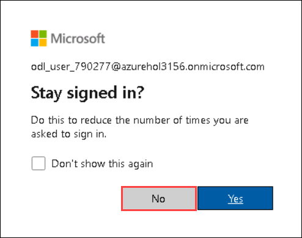
    
3. On a prompt saying "Help us protect your account", click on **Next**.

   

4. Download the **Microsoft Authenticator** app on your Mobile from App Store. After installing the app, select **Next**.

   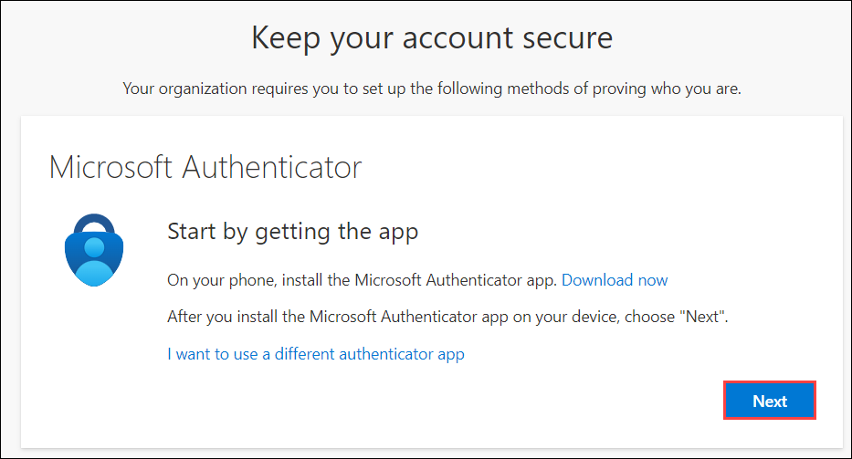
   
5. In the Microsoft Authenticator app, set up your account by adding a work or school account. After adding an account select **Next**.

   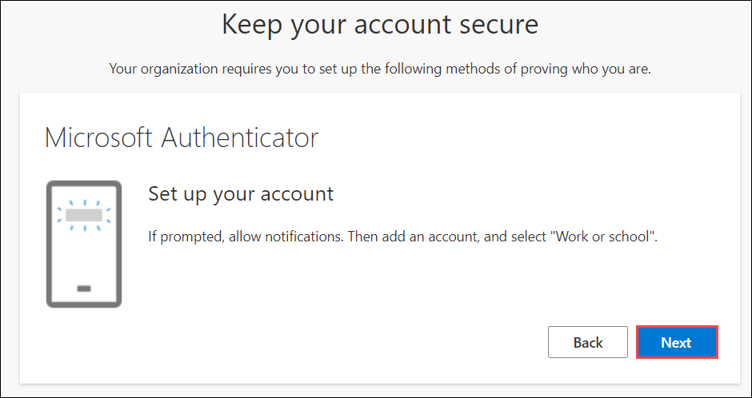
   
6. To connect the Microsoft Authenticator app with your account **(1)**, **Scan the QR code (2)** and select **Next (3)**.

   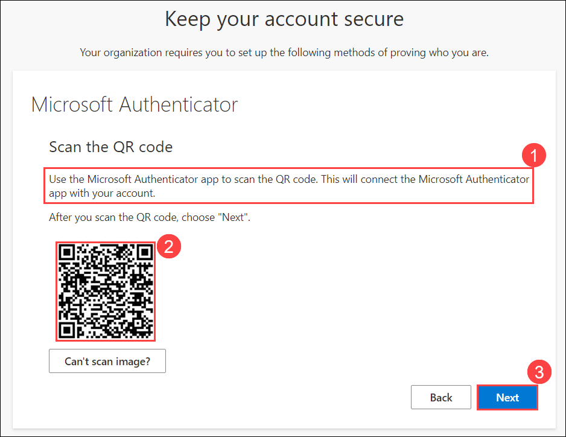
   
7. A Notification to Approve will pop-up on your mobile. Approve that and select **Next**.

   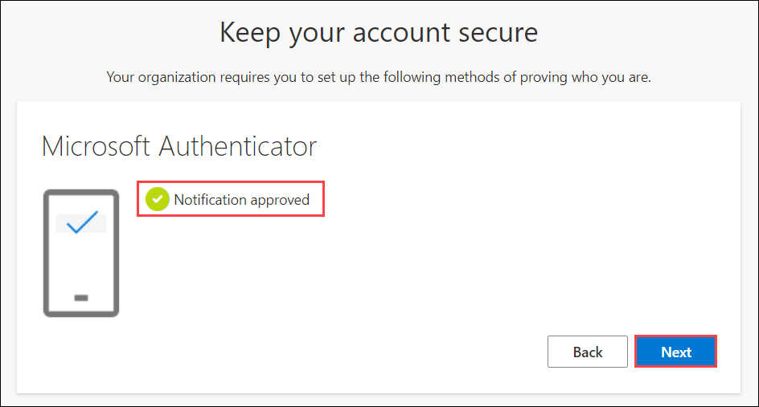
   
8. Once Success! Great job! You have successfully set up your security info. Choose **Done** to continue signing in.

   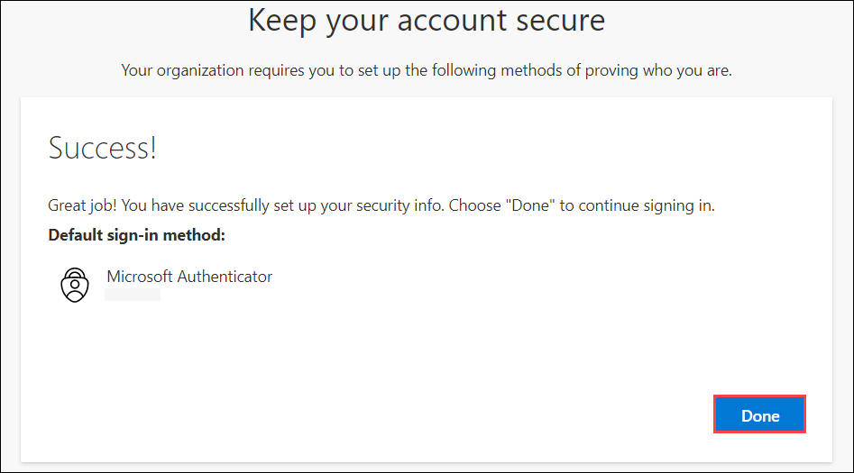
  
### Exercise 2: Creating Conditional Access Policy

1. In Azure Portal search for *Azure Active Directory* **(1)** and click on it from the search result **(2)**.

   

2. From the left-hand side blade, click on **Properties** **(1)** under **Manage** and scroll down to select **Manage Security Defaults** **(2)** at the bottom of the page.

   
   
3. In **Enable Security defaults** pane, for **Enable Security defaults** make sure it is selected to **No**.
 
   > **Note:** Please ignore and proceed further if you find any survey points by Azure below **Enable Security defaults** option
   
   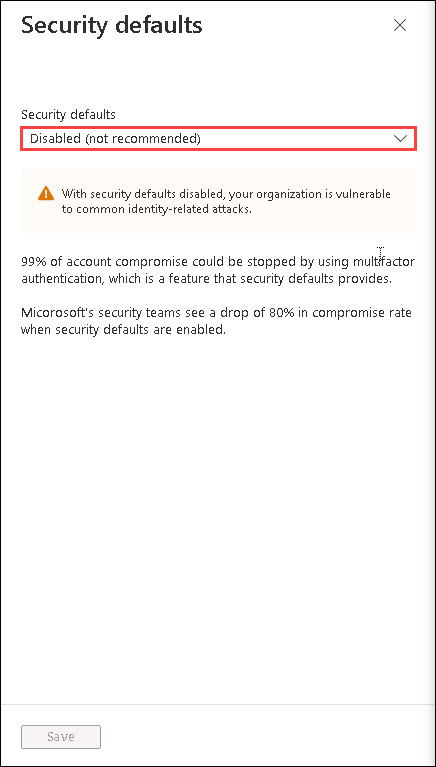

4. From the left-hand side blade, click on **Security** under Manage.

   
  
5. In **Security** page select **Conditional Access** under Protect.

   
  
6. Under the Policies **(1)** page click on **+ New Policy (2)**. Select **Create new policy**.

   

7. Configure the Conditional Access Policy with the following details:

   - Name: **AVD-MFA** **(1)**
   - **Assignments**:
     - Click on **Users** **(2)**
     - A new window will slide in, there click on **Select users and Groups** **(3)** and then select the check box saying **Users and groups** **(4)**
     - Now a *Select* window will open, here search for ODL user and Select it **(5)**
     - Click on **Select** **(6)** button
   
   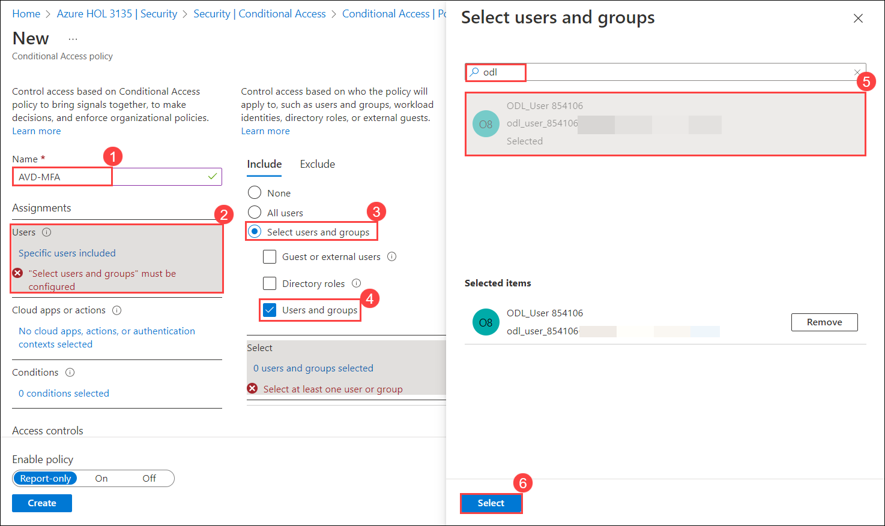
   
   - Click on **Cloud apps or actions** **(1)**
   - Click on **Select apps** **(2)**
   - Click on **Select (3)**
   - Search for **Windows Virtual Desktop** and click on the **check box** of **Azure Virtual Desktop** **(4)** next to the search result
   - Now Click on **Select** **(5)** button.

   
  
   - Click on **Conditions** **(1)**
   - Then select **Client apps** **(2)**
   - Now in the Client Apps blade toggle the *Configure* switch to **Yes** **(3)** and make sure that all the checkboxes below are selected.
   - Then click on **Done** **(4)**

   
  
   - **Access Control**
   - Click on **Grant** **(1)**
   - Select the Check Box saying **Require multi-factor authentication** **(2)** 
   - Then click on **Select** **(3)**

   
   
8. Toggle the **Enable Policy** switch to **On (1)** and click on **Create (2)**.

   
  
9. Now, Open the following URL in a new browser tab in the JumpVM. This URL will lead us to the Remote Desktop Web Client.

   ``` 
   aka.ms/wvdarmweb 
   ``` 

   >**Note:** If you are already logged in through your user, then jump to Exercise 3 else continue with the next step i.e., Step 10.

10. Now to login, enter the lab credentials as mentioned below:

   - Username: *Paste your username* **<inject key="AzureAdUserEmail" />** *and then click on **Next**.*
   
     

   - Password: *Paste the password* **<inject key="AzureAdUserPassword" />** *and click on **Sign in**.*

     
   
11. You'll see a dialog box to authenticate your login which is the indication of MFA implementation. Authenticate the login according to the authentication menthod you have chosen in exercise 1, step 7 to complete the verification.

     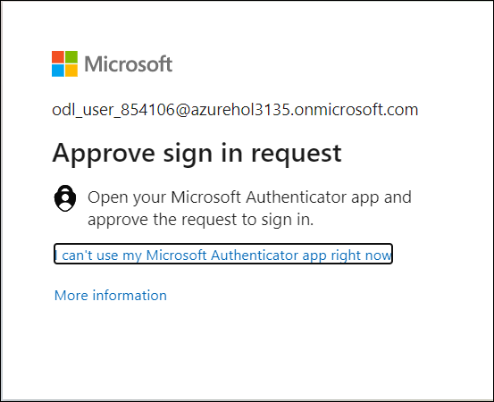

    >**Note:** If there's a dialog box saying ***Help us protect your account***, then select the **Skip for now** option.

     
   
12. The AVD dashboard will be launched. 

     


## Exercise 3 : Screen Capture Protection


1. Return to the Azure portal in your browser inside the **JumpVM**, search for *host pools* and click on **Host pools** from the search result.

   
   
1. Now click on **EB-AVD-HP** host pool to access it.

   
   
1. Under Settings, click on **Properties**.

   
   
1. On the Properties page, select **Yes (1)** for **Validation environment** and click on **Save (2)**.

   
   
1. Navigate to **Your Own PC/computer/workstation**, go to **Start** and search for **Remote desktop** and open the application with the exact icon as shown below.

   
   
1. Click on the *ellipsis* and select **Unsubscribe**. Click on **Yes** if prompted.

    

1. Click on the **Subscribe** button.

    

1. Enter the user credentials to access the workspace.

    - Username: *Paste your username* **<inject key="AzureAdUserEmail" />** *and then click on **Next**.*
   
      

    - Password: *Paste the password* **<inject key="AzureAdUserPassword" />** *and click on **Sign in**.*

      
      
1. Once you enter the credentials, **Approve** the authentication request which has been sent to the registered device through the **Microsoft Authenticator App**.

1. If you get a page saying to *Allow my organization to manage my device*, make sure to **uncheck** and click on **No, sign in to this app only**.

   
   
1. Once you are signed in into the AVD client, double click on the **SessionDesktop**.

   
   
1. A window saying *Connecting to: SessionDesktop* will appear. Wait for a few seconds, then enter your password to access the Desktop.

   - Password: **<inject key="AzureAdUserPassword" />**
   
   
   
   >**Note:** If there's a dialog box saying ***Help us protect your account***, then select the **Skip for now** option.
   
   

1. While the Session Desktop is connecting, we can see a message saying **Starting remote PC**.

   
   
1. From the Session desktop, search for **Microsoft edge (1)** from the search bar and select it **(2)**

   
   
1. Download the **Azure Virtual Desktop policy templates file** (AVDGPTemplate.cab) using below URL.

   ```
   https://aka.ms/avdgpo
   ```
 
1. Navigate to the path **Downloads\AVDGPTemplate** (Double-click on **AVDGPTemplate** Cabinet file to see the zip file) and extract the **AVDGPTemplate** zip file to default path.

   
   
   

1. Now navigate to **Documents** folder, right-click on **AVDGPTemplate** **(1)** zip file and select **Extract All...** **(2)**.

   
   
1. In Select a Destination and Extarct file pane, select **Exract**.

   

1. Navigate to the path **C:\Users\ODL_User628391\Documents\AVDGPTemplate** and copy the **terminalserver-avd.admx** file to **C:\Windows\PolicyDefinitions** folder.

1. If you get any pop-out stating that the **Destination Folder Access Denied**, click on **Continue**.

   
   
1. Navigate back to the path **C:\Users\ODL_User628391\Documents\AVDGPTemplate\en-us** and copy **terminalserver-avd.adml** file to **C:\Windows\PolicyDefinitions\en-us** folder.

1. If you get any pop-out stating that the **Destination Folder Access Denied**, click on **Continue**.

   
   
1. From the Start menu of your Session Desktop, search for **group policy** and select **Edit group policy**.

   
   
1. On the Local group policy editor pane, navigate to the path **Computer Configuration -> Administrative Templates -> Windows Components -> Remote Desktop Services -> Remote Desktop Session Host -> Azure Virtual Desktop**.

1. On the Azure Virtual Desktop tab, right click on the **Enable Screen Capture Protection (1)** and click on **Edit (2)**.

    
    
1. On **Enable Screen Capture Protection** tab, follow the below instructions:
 
    - Select **Enabled (1)**
    - Click on **Apply (2)**
    - Click on **Ok (3)**

     

1. From the Start menu of Session Desktop, search for **Registry Editor** and select it.

    
    
    > **Note :** If you are promted with any pop-up stating **Do you want to allow this app to make any changes to your device?**, click on **Yes**.
    
1. Navigate to the path **Computer\HKEY_LOCAL_MACHINE\SOFTWARE\Policies\Microsoft\Windows NT\Terminal Services**.

1. Right click on the Terminal Services workspace, select **New (1)** and click on **DWORD (32-bit) value (2)**.

    
    
1. Enter the **Value name** as **fEnableScreenCaptureProtection**.

1. Now right click on the newly created register key *fEnableScreenCaptureProtection* and click on **Modify**.

    
    
1. On **Edit DWORD (32-bit) value** dialog box, follow the below instructions:

    - Value data : Enter **1 (1)**
    - Select **Decimal (2)** under **Base**
    - Click on **Ok (3)**

     
     
1. Restore down the session host and take screenshot using Snipping tool from your Local desktop.

    

1. In **Your Own PC/computer/workstation**, go to Start Menu and search for **Snipping tool** then select it from search results.

    

1. Then in the **Snipping tool**, click on drop-down button next to **Mode** and select **Full-Screen Snip**.

    

1. You will get a screenshot with the Session desktop blacked out, the blacked-out screenshot as it is mentioned in the below screenshot.

   
   
   >**Note :** If you are not able to capture the blacked-out screenshot of the session desktop, re-start the session desktop and re-perform the above step
   
1. In your Own PC, open file explorer and navigate to **Pictures/Screenshots** and open the screenshot you took in Step-36
   
1. Now you have successfully enabled the Screen Capture Protection in your Session host.


## Exercise 4 : App Locker

1. Within the same Session Desktop, from the Start menu search for **Services (1)** and select it from search results **(2)**.

   
   
1. On the **Services** tab, right click on **Application Identity (1)** and click on **Start (2)**.

   
   
1. Minimize the Services window and search for **Local Security Policy (1)** from Start menu and select it from search results **(2)**.

    
    
1. Navigate to **Application Control Policy** -> **App Locker**.

1. Right click on **App Locker (1)** and click on **Properties (2)**.

    
    
1. On **App Locker Properties** tab, check the box next to **Configured** for **Executable runs (1)**, **Windows Installer Rules (2)**, **Script Rules (3)**, **Packaged app Rules (4)** and click on **Apply (5)** then select **Ok (6)**.

     
     
1. Navigate to  **Application Control Policy** -> **App Locker** -> **Packaged app Rules** then right click on **Packaged app Rules (1)** under App Locker and select **Create New Rule (2)**.

    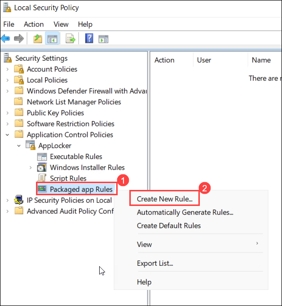
    
1. On **Create New Rules** window, follow the below instructions:

    - Leave everything default under **Before You Begin** and click on **Next**.

      
      
    - On **Permissions (1)** tab, click on **Deny (2)** under Action and select **Next (3)**.

      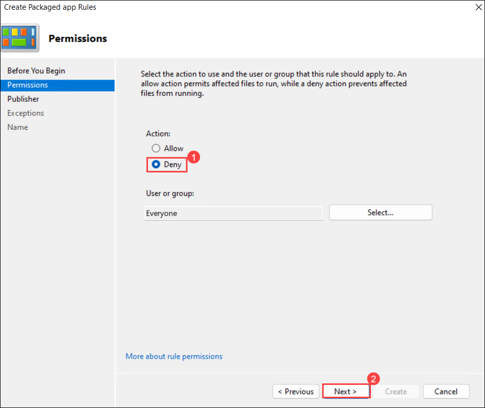
      
    - On **Published (1)** tab, choose **Use an installed packaged app for reference (2)** and click on **Select (3)**.

       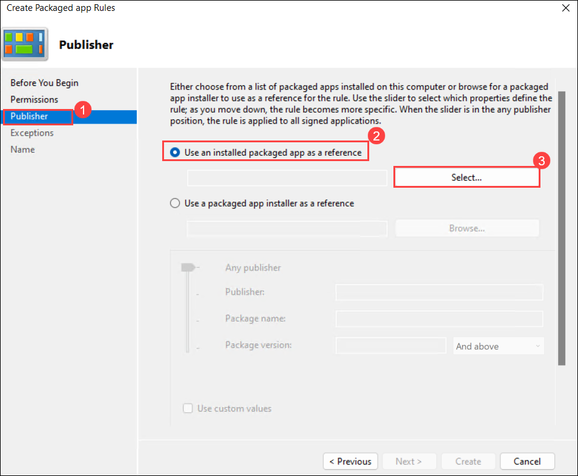
       
    - On **Select applictions** tab, scroll down to **Microsoft Photos (1)** and select it then click on **Ok (2)**.

       
       
    - Click on **Next**.

       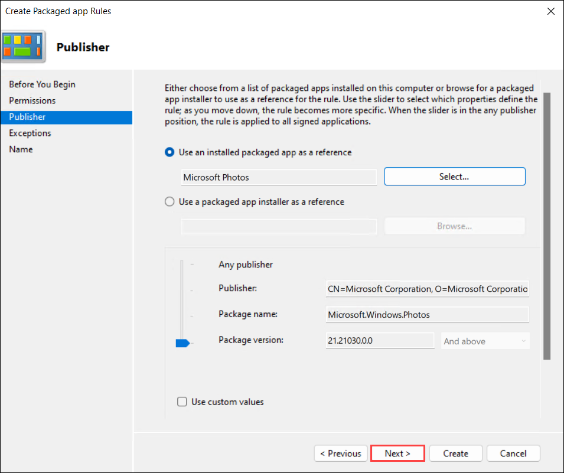
       
       
    - On **Exceptions (1)** tab, leave everything as default and click on **Create (2)**.

      
      
    - If you get any pop-out for **App Locker** permissions, click on **No**.

       
       
1. Within the same Session Desktop, from the Start menu search for **Photos (1)** and select it **(2)**.
      
    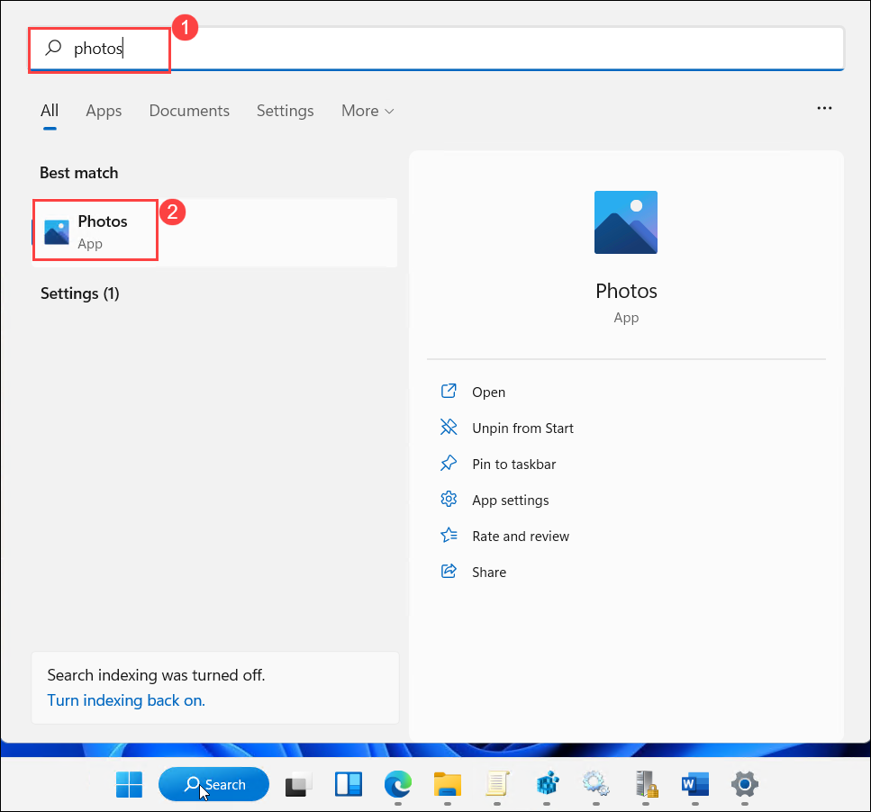
      
3. You will get a pop-out stating that the **App has been blocked** because of the Control Policy.

    

  

    
1. Now you have successfully created App Locker for all Apps in the Session desktop.

    
1. Click on the **Next** button present in the bottom-right corner of this lab guide.
