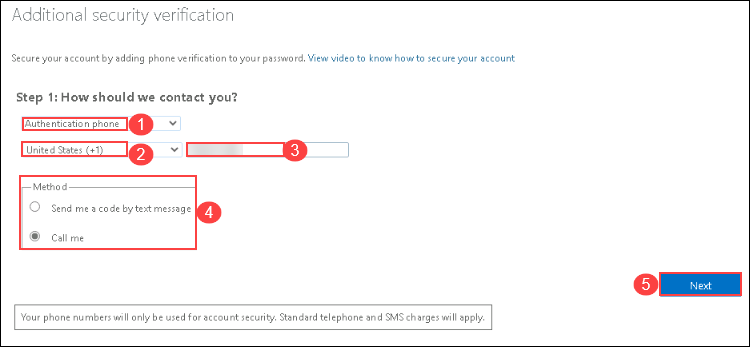
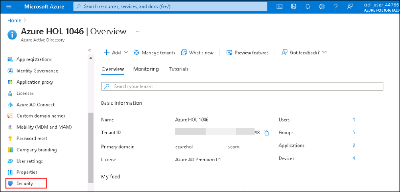
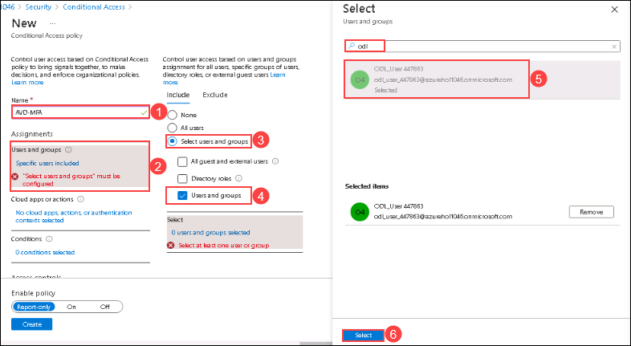
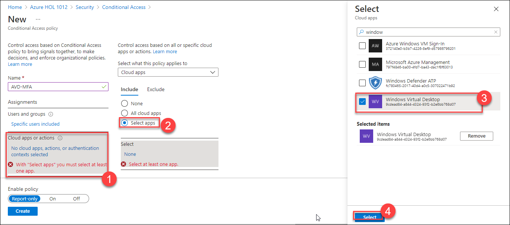
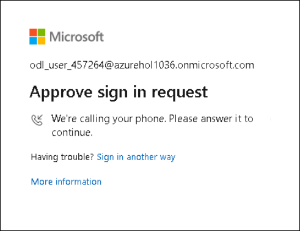
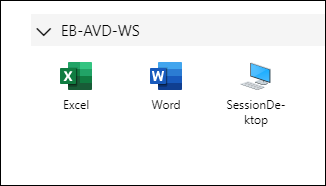

# Lab 9: Use MEM to enforce MFA while using AVD

## **Scenario**

Contoso wants their resources to be secure and protected from any kind of unethical activities. So Contoso wants to enable Multi factor authentication (MFA) for session login. You will guide contoso to set up MFA for sign-ins.

## **Overview**

In this lab, We'll be enabling Multi-Factor authentication, Multi-factor authentication is a process where a user is prompted during the sign-in process for an additional form of identification which increases the level of security.

### Exercise 1: Setup Multi-Factor Authentication (MFA)

1. In your JumpVM launch browser and visit `https://AKA.ms/proofup` and if asked to log in then log in using the following credentials:

   - Username: **<inject key="AzureAdUserEmail" />**
   - Password: **<inject key="AzureAdUserPassword" />**
  
2. On a prompt saying "More Information Required" click on **Next**.

   
  
3. Enter the details required to set up MFA.

   

   - Select the method as: **Authentication phone** *(1)*.
   - Country Code: Select the country code of your mobile number *(2)*.
   - Mobile Number: Enter the number which you want to use for the MFA *(3)*.
   - Method: Select the preferred method of authentication as **Call me** *(4)*.
   - Click on **Next**.

4. Now you will get a verification call on the provided contact details.

   
  
5. After answering the call, you will be asked to press the "**#**" key to complete the verification.

6. Now after a few seconds the status will change to **Verification Successful**, click on **Done** to finish the MFA registration.

   
  
### Exercise 2: Creating Conditional Access Policy

1. In Azure Portal search for *Azure Active Directory* and click on the search result.

   
  
2. From the left-hand side blade, click on **Security** under Manage.

   
  
3. In **Security** page select **Conditional Access** under Protect.

   
  
4. Under the Policies page click on **+ New Policy**.

   

5. Configure the Conditional Access Policy with the following details:

   - Name: **AVD-MFA** *(1)*
   - **Assignments**:
   - Click on **Users and Groups** *(2)*.
   - A new window will slide in, there click on **Select users and Groups** *(3)* and then select the check box saying **Users and groups** *(4)*.
   - Now a *Select* window will open, here search for ODL user and Select it *(5)*.
   - Click on **Select** *(6)* button.
   
   
   
   - Click on **Cloud apps or actions** *(1)*
   - Click on **Select apps** *(2)*
   - Search for **Windows Virtual Desktop** and click on the **check box** *(3)* next to the search reuslt
   - Now Click on **Select** *(4)* button.

   
  
   - Click on **Conditions** *(1)*
   - Then select **Client apps** *(2)*.
   - Now in the Client Apps blade toggle the *Configure* switch to **Yes** *(3)* and make sure that all the checkboxes below are selected.
   - Then click on **Done** *(4)*

   
  
   - **Access Control**
   - Click on **Grant** *(1)*.
   - Select the Check Box saying **Require multi-factor authentication** *(2)*.
   - Then click on **Select** *(3)*

   
   
6. Toggle the **Enable Policy** switch to **On** and click on **Create**.

   
  
7. Now, Open the following URL in a new browser tab in the JumpVM. This URL will lead us to the Remote Desktop Web Client.

   ``` 
   aka.ms/wvdarmweb 
   ``` 

   >**Note:** If you are already logged in through your user, then jump to step 3 else continue with the next step i.e., Step 2.

8. Now to login, enter the lab credentials as mentioned below:

   - Username: *Paste your username* **<inject key="AzureAdUserEmail" />** *and then click on **Next**.*
   
   

   - Password: *Paste the password* **<inject key="AzureAdUserPassword" />** *and click on **Sign in**.*

   
   
9. You'll see a dialog box to authenticate your login which is the indication of MFA implementation. Answer the call, you will be asked to press the "#" key to complete the verification.

   

   >**Note:** If there's a dialog box saying ***Help us protect your account***, then select the **Skip for now** option.

   
   
10. The AVD dashboard will be launched. 

    
    
11. Click on the **Next** button present in the bottom-right corner of this lab guide.
