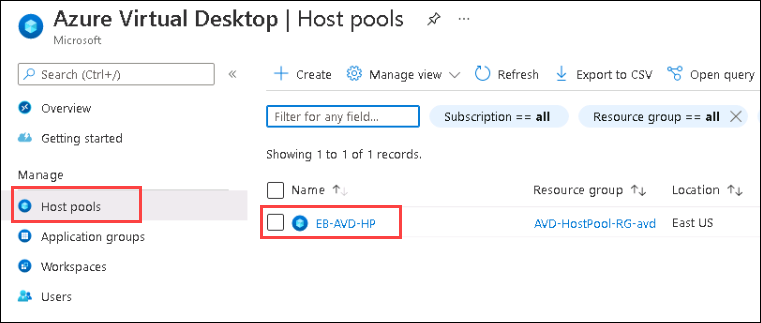
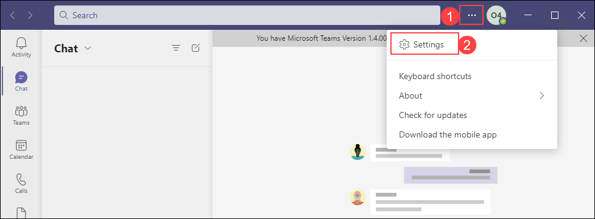

# Lab 11: Multimedia redirection for Azure virtual desktop

## **Overview**

In this lab, We'll be implementing MS Teams for AVD. Microsoft Teams on Azure Virtual Desktop supports chat and collaboration. With media optimizations, it also supports calling and meeting functionality. With media optimization for Microsoft Teams, the Remote Desktop client handles audio and video locally for Teams calls and meetings.

## Exercise 1: Multimedia redirection for Azure virtual desktop

1. Navigate to the Azure portal, then search for Azure Virtual Desktop in the search bar and select Azure Virtual Desktop from the suggestions.

   
   
1. Select **Host pools** from the side blade and select **EB-AVD-HP**.

   
   
1. Under Settings, Select **RDP Properties** (1) and select **Device redirection** (2). Select the following options.
   
   - Microphone redirection: Select **Enable audio capture from the local devices and redirection to an audio application in the remote session** (3) from the dropdown.
   - Audio output location: Select **Play sounds on the remote computer** (4) from the dropdown
   - Camera redirection: Select **Redirect cameras** (5) from the dropdown.
   - Leave the rest properties as **defaults**.
   - click on **Save** (6).

   
   
1. Select **Application groups** from the side blade. You will see two application groups, Select the **AVD-AG-01** application group.

   
   
1. Under Manage, select **Applications** and select **Add**.

   
   
1. In the **Add Application** tab, select the following options and click on **Save**.
   
   - **Application Source**: Start menu.
   - **Application**: Search for **Microsoft Teams** and select the same from dropdown.
   - **Display name**: Microsoft Teams.
   - **Leave** the other options as **defaults**.
   
   

1. On your PC search for **Remote desktop** and open the remote desktop application with the exact icon as shown below.

   
   

1. The AVD dashboard will launch, then double-click on the Teams application to access it.

   
   
1. A window saying *Starting your app*, will appear. Wait for a few seconds, then enter your password to access the Application.

    - Password: **<inject key="AzureAdUserPassword" />**
   
    
    
1. Teams application will start loading.

   
   
1. After the Teams application is launched, click on the **three dots** (1) then **About** (2) and click on **Version** (3).

   

1. Now we will get a message on top of the Teams application saying **The Teams Version 1.x.x.. is WVD Media Optimised**.

   
   
   >**Note**: If you see a message saying **AVD Media not connected**. Please skip the step and continue with the lab.
   
1. Again click on the **three dots** (1) on the top and select **Settings** (2).

   
   
1. Now under Settings, click on **Devices** and explore the media devices connected to your local desktop.

   
   
   >**Note**: If you are not able to select other audio devices. Please skip the step and continue with the lab.
   
1. Now, Close the settings tab and go to **calendar** (1) which is located in the side blade. Select **Meet now** (2).

   
   
1. Leave the **Meeting name** as default and click on **Start meeting**.

   
   
1. Make sure both Video (1), and Audio (2) are enabled. Click on **Join now** (3).

   
   
   >**Note**: If the audio is not working. Please skip the step and continue with the lab as this is an expected issue.
   
1. Click on **Allow access** on the Windows Security alert prompt.

   
   
   >**NOTE**: If the **Invite others** prompt appears, Close the tab and continue.
  
1. Now, You should be able to see yourself as the video is On.

   

1. Click on the Next button present in the bottom-right corner of this lab guide.
