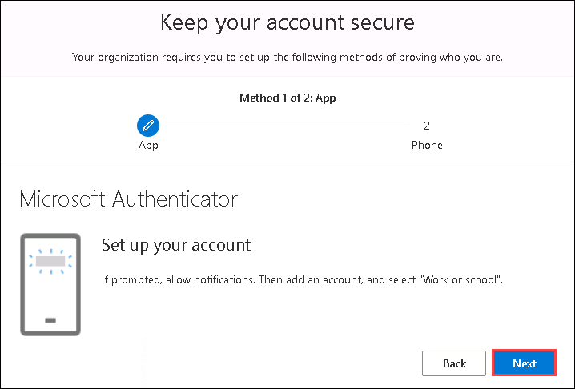
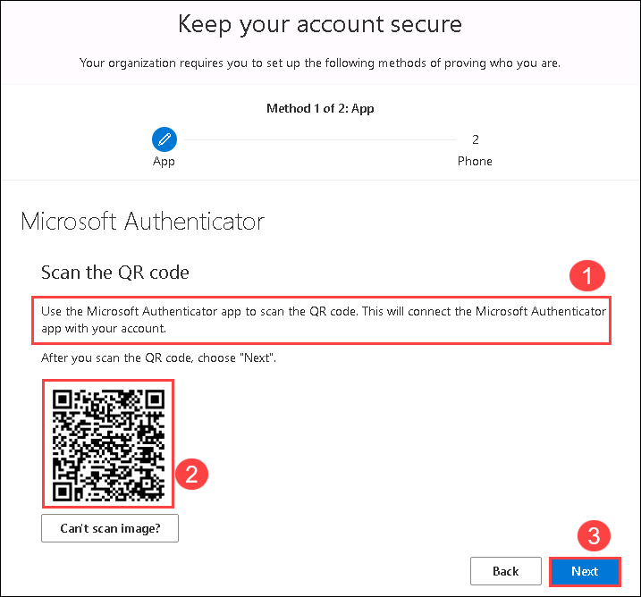
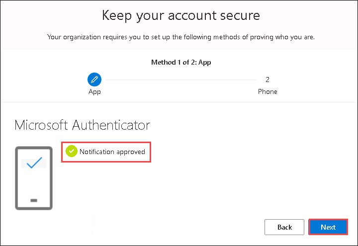
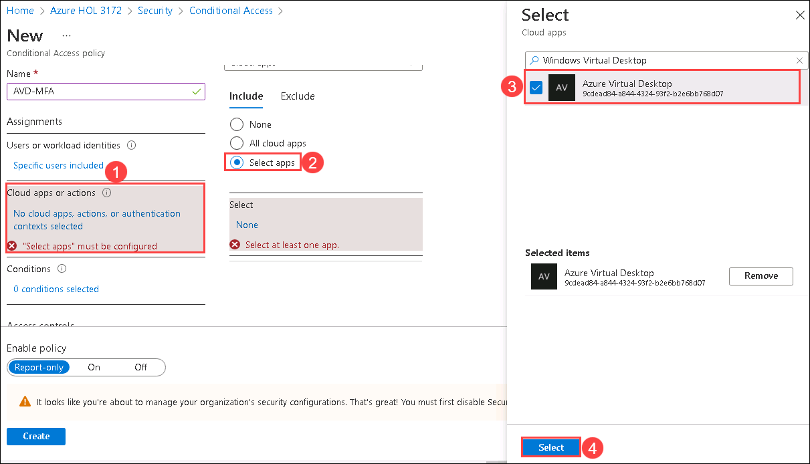
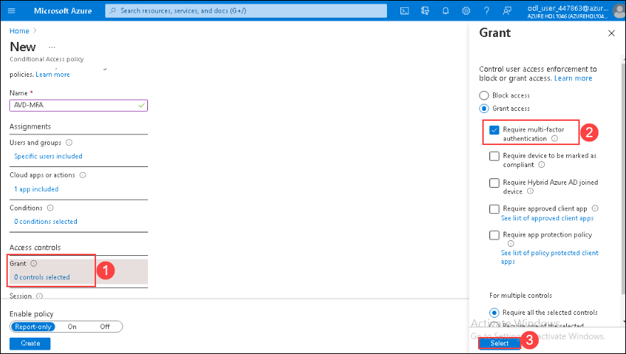
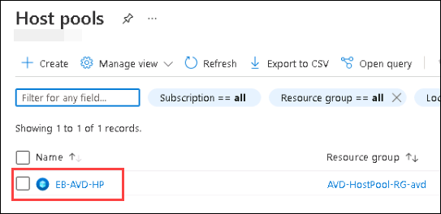
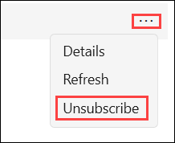
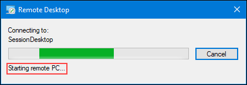

# Lab 11: Security Modules

## **Scenario**

Contoso wants their resources to be secure and protected from any kind of unethical activities. So Contoso wants to enable Multi factor authentication (MFA) for session login. You will guide Contoso to set up MFA for sign-ins.

## **Overview**

In this lab, We'll be enabling Multi-Factor authentication, Multi-factor authentication is a process where a user is prompted during the sign-in process for an additional form of identification which increases the level of security.

### Exercise 1: Setup Multi-Factor Authentication (MFA)

1. In your JumpVM launch browser and visit `https://AKA.ms/proofup` and if asked to log in then log in using the following credentials:

   - Username: **<inject key="AzureAdUserEmail" />**
   - Password: **<inject key="AzureAdUserPassword" />**
  
2. On a prompt saying "Help us protect your account" click on **Next**.

   

3. Download the **Microsoft Authenticator** app on your Mobile from App Store. After installing the app, select **Next**.

   
   
4. In the Microsoft Authenticator app, set up your account by adding a work or school account. After adding an account select **Next**.

   
   
5. To connect the Microsoft Authenticator app with your account, **Scan the QR code** and select **Next**.

   
   
6. A Notification to Approve will pop-up on your mobile. Approve that and select **Next**.

   
   
7. Enter the details required to set up MFA.

   - Country Code: Select the country code of your mobile number (1)
   - Mobile Number: Enter the number which you want to use for the MFA (2)
   - Method: Select the preferred method of authentication (3)
   - Click on **Next**.

   

8. Authenticate the login according to the authentication method you have chosen in the previous step to complete the verification.

   
  
9. Now after a few seconds the status will change to **Verification Success**, click on **Done** to finish the MFA registration.

   
  
### Exercise 2: Creating Conditional Access Policy

1. In Azure Portal search for *Azure Active Directory* and click on the search result.

   

2. From the left-hand side blade, click on **Properties** (1) under Manage and scroll down to select **Manage Security Defaults** (2) at the bottom of the page.

   
   
3. In **Enable Security defaults** pane, for **Enable Security defaults** select to **No** (1) and check the box for **My organization is using Conditional Access** (2). Then select **Save** (3).

   

4. From the left-hand side blade, click on **Security** under Manage.

   
  
5. In **Security** page select **Conditional Access** under Protect.

   
  
6. Under the Policies page click on **+ New Policy**. Select **Create new policy**.

   

7. Configure the Conditional Access Policy with the following details:

   - Name: **AVD-MFA** (1)
   - **Assignments**:
   - Click on **Users or workload identities** (2)
   - A new window will slide in, there click on **Select users and Groups** (3) and then select the check box saying **Users and groups** (4)
   - Now a *Select* window will open, here search for ODL user and Select it (5)
   - Click on **Select** (6) button
   
   
   
   - Click on **Cloud apps or actions** (1)
   - Click on **Select apps** (2)
   - Search for **Windows Virtual Desktop** and click on the **check box** of **Azure Virtual Desktop** (3) next to the search result
   - Now Click on **Select** (4) button.

   
  
   - Click on **Conditions** (1)
   - Then select **Client apps** (2)
   - Now in the Client Apps blade toggle the *Configure* switch to **Yes** (3) and make sure that all the checkboxes below are selected.
   - Then click on **Done** (4)

   
  
   - **Access Control**
   - Click on **Grant** (1)
   - Select the Check Box saying **Require multi-factor authentication** (2)
   - Then click on **Select** (3)

   
   
8. Toggle the **Enable Policy** switch to **On** and click on **Create**.

   
  
9. Now, Open the following URL in a new browser tab in the JumpVM. This URL will lead us to the Remote Desktop Web Client.

   ``` 
   aka.ms/wvdarmweb 
   ``` 

   >**Note:** If you are already logged in through your user, then jump to step 3 else continue with the next step i.e., Step 2.

10. Now to login, enter the lab credentials as mentioned below:

   - Username: *Paste your username* **<inject key="AzureAdUserEmail" />** *and then click on **Next**.*
   
     

   - Password: *Paste the password* **<inject key="AzureAdUserPassword" />** *and click on **Sign in**.*

     
   
11. You'll see a dialog box to authenticate your login which is the indication of MFA implementation. Authenticate the login according to the authentication menthod you have chosen in exercise 1, step 7 to complete the verification.

     

    >**Note:** If there's a dialog box saying ***Help us protect your account***, then select the **Skip for now** option.

     
   
12. The AVD dashboard will be launched. 

     
    
13. Click on the **Next** button present in the bottom-right corner of this lab guide.


## Exercise 3 : Screen Capture Protection


1. Return to the Azure portal in your browser inside the **JumpVM**, search for *host pools* and click on **Host pool** from the suggestion to open it.

   
   
1. Now click on **EB-AVD-HP** host pool to access it.

   
   
1. Under Settings blade, click on **Properties**.

   
   
1. On Properties page, select **Yes** for **Validation environment** under Configuration tab and click on **Save**.

   
   
1. Navigate to **Your Own PC/computer/workstation**, go to **Start** and search for **Remote desktop** and open the application with the exact icon as shown below.

   
   
1. Click on the *ellipses* and select **Unsubscribe**. Click on **Yes** for any warning.

   

   >**Note:** We need to unsubscribe from the feed because in Exercise 4 we subscribed to the AVD feed using a different user.

1. Click on the **Subscribe** button.

   

1. Enter the user credentials to access the workspace.

    - Username: *Paste your username* **<inject key="AzureAdUserEmail" />** *and then click on **Next**.*
   
      

    - Password: *Paste the password* **<inject key="AzureAdUserPassword" />** *and click on **Sign in**.*

      
   
    >**Note:** If there's a popup entitled **Help us protect your account** click **Skip for now (14 days until this is required)**

     

1. Make sure to **uncheck** *Allow my organization to manage my device* and click on **No, sign in to this app only**.

   
   
1. The AVD dashboard will launch, then double click on the **Session Desktop** application to access it.

   
   
1. A window saying *Connecting to: Session Desktop* will appear. Wait for a few seconds, then enter your password to access the Desktop.

   - Password: **<inject key="AzureAdUserPassword" />**
   
   
   
   >**Note:** If there's a dialog box saying ***Help us protect your account***, then select the **Skip for now** option.
   
   

1. While the Session Desktop is connecting, we can see a message saying **Starting remote PC**.

   
   
1. From the Session desktop, open **Microsoft edge**

   
   
1. Download the **Azure Virtual Desktop policy templates file** (AVDGPTemplate.cab) using below mentioned URL and extract the contents of the cab file and zip archive.

   ```
   https://aka.ms/avdgpo
   ```
   
1. Navigate to the path **C:\Users\ODL_User628391\Documents\AVDGPTemplate** and copy the **terminalserver-avd.admx** file to **%windir%\PolicyDefinitions** folder.

1. If you get any pop-out stating that the **Destination Folder Access Denied**, click on **Continue**.

   
   
1. Navigate back to the path **C:\Users\ODL_User628391\Documents\AVDGPTemplate\en-us** and copy **terminalserver-avd.adml** file to **%windir%\PolicyDefinitions\en-us** folder.

1. If you get any pop-out stating that the **Destination Folder Access Denied**, click on **Continue**.

   
   
1. From the Start menu, search for **group policy** and select **Edit group policy**.

   
   
1. On the Local group policy editor pane, navigate to the path **Computer Configuration -> Administrative Templates -> Windows Components -> Remote Desktop Services -> Remote Desktop Session Host -> Azure Virtual Desktop**.

1. On the Azure Virtual Desktop tab, right click on the **Enable Screen Capture Protection (1)** and click on **Edit (2)**.

    
    
1. On **Enable Screen Capture Protection** tab, follow the below instructions:
 
    - Check the box next to **Enabled (1)**
    - Click on **Apply (2)**
    - Click on **Ok (3)**

     
    
1. From the Start menu, search for **Registry Editor** and select it.

    
    
1. Navigate to the path **HKLM\SOFTWARE\Policies\Microsoft\Windows NT\Terminal Services**.

1. Right click on the Terminal Services workspace, select **New (1)** and click on **DWORD (32-bit) value (2)**.

    
    
1. Enter the **Value name** as **fEnableScreenCaptureProtection**.

1. Now right click on the newly created register key *fEnableScreenCaptureProtection* and click on **Modify**.

    
    
1. On **Edit DWORD (32-bit) value** dialog box, follow the below instructions:

    - Value data : Enter **1 (1)**
    - Select **Decimal (2)** under **Base**
    - Click on **Ok (3)**

     
     
1. Restore down the session host and take screenshot using Snipping tool from your Local desktop.

1. You will get the blacked out screenshot as it is mentioned in the below screenshot.

   
   
1. Now you have successfully enabled the Screen Capture Protection in your Session host.


## Exercise 3 : App Locker

1. Within the same Session Desktop, from the Start menu search for **Services** and select it.

   
   
1. On the **Services** tab, right click on **Application Identity (1)** and click on **Start (2)**.

   
   
1. Minimize the Services tab and search for **Local Security Policy** from Start menu and select it.

    
    
1. Navigate to **Application Control Policy** -> **App Locker**.

1. Right click on **App Locker (1)** and click on **Properties (2)**.

    
    
1. On **App Locker Properties** tab, check the box next to **Configured** for **Exercutable runs (1)**, **Windows Installer Rules (2)**, **Script Rules (3)**, **Packaged app Rules (4)** and click on **Apply (5)** then select **Ok (6)**.

     
     
1. Now right click on **Executable Rules (1)** under App Locker and click on **Create New Rule (2)**.

    
    
1. On **Create New Rules** tab, follow the below instructions:

    - Leave everything default under **Before You Begin** and click on **Next**.

      
      
    - On **Permissions (1)** tab, click on **Deny (2)** under Action and select **Next (3)**.

      
      
    - On **Conditions (1)** tab, observe the default options and click on **Next (2)**.

       
       
    - On **Publisher (1)** tab, click on **Browse (2)** and navigate to the path **C:\Windows\System32\mshta (3)** and select vesion `*` **(4)** then click on **Next (5)**.

       
       
    - On **Expectations (1)** tab, leave everything as default and click on **Create (2)**.

      
