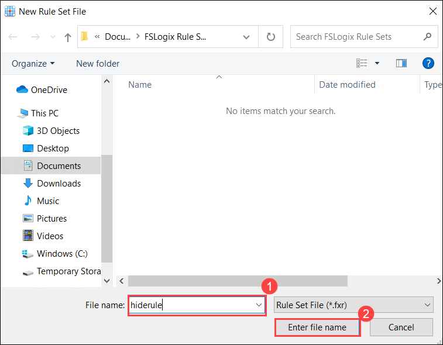
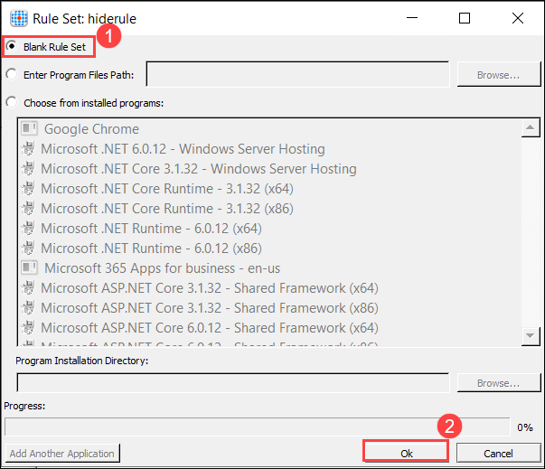
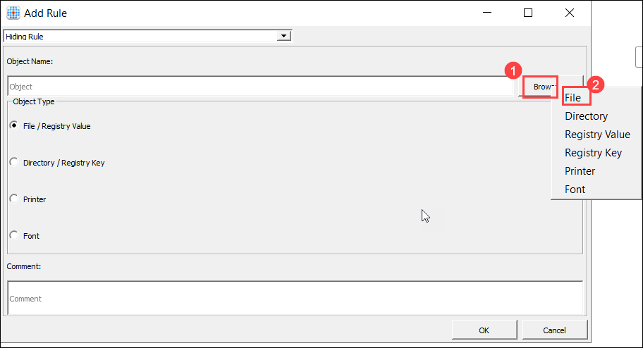
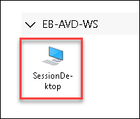
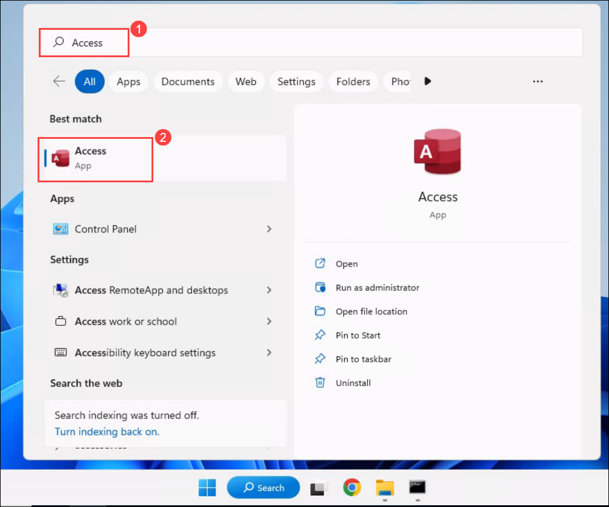

# Lab 13: App Masking (Optional)


### Overview

Application Masking is used to manage user access to installed components. Application Masking may be used in both physical and virtual environments. Application Masking is most often applied to manage non-persistent, virtual environments, such as Virtual Desktops.

##  Exercise 1: Create Rule Set using FSLogix Apps RuleEditor (Read-Only)

In this exercise, you go through the steps to create rule set in **FSLogix Apps RuleEditor** to disable the access to the application in the session hosts.


1. In your JumpVM,  go to Start and search for **FSLogix Apps RuleEditor** and open the FSLogix Apps RuleEditor application from the search results

    
    
2. On the FSLogix Apps RuleEditor application, click on **New**.

    

3. Provide a name for the Rule Set as **hiderule (1)** and click on **Enter file name (2)**.

    

1. On the **Rule Set : hiderule** window, choose **Blank Rule Set (1)** and click on **Ok (2)**.

   
   
1. On **FSLogix Apps RuleEditor**, click on **+ New Rule**.

    
    
1. Click on **Browse (1)** and select **File (2)**.

    
    
1. Navigate to the path **C:\Program Files\Microsoft Office\root\Office16 (1)**, select **MSAccess (2)** and click on **Open (3)**

   
   
1. After selecting the application, click on **Ok**.

   
   
  > **Note :** The rule sets are already created as part of pre-requists.


##  Exercise 2: App Masking

In this task, you will downlaod the pre-created rule sets into session host using a PowerShell script.

1. In your Azure portal search for Virtual machines in the search bar and click on Virtual Machines from the suggestions.

   

2. Click on AVD-HP01-SH-0.

   
   
3. Then click on Run command under Operations.

   

4. Now select RunPowerShellScript.
 
   

5.	A similar window as that of the below image will appear.

   

6.	Copy the script given below and paste it by using Ctrl + V in the Powershell window.

   ```
   $WebClient = New-Object System.Net.WebClient
   $WebClient.DownloadFile("https://raw.githubusercontent.com/CloudLabsAI-Azure/AIW-Azure-Virtual-Desktop/Azure-Virtual-Desktop-v3/LabFiles/hiderule.fxa","C:\Program Files\FSLogix\Apps\Rules\hiderule.fxa")

  $WebClient = New-Object System.Net.WebClient
  $WebClient.DownloadFile("https://raw.githubusercontent.com/CloudLabsAI-Azure/AIW-Azure-Virtual-Desktop/Azure-Virtual-Desktop-v3/LabFiles/hiderule.fxr","C:\Program Files\FSLogix\Apps\Rules\hiderule.fxr")
  Start-Process -Wait -FilePath "C:\LabFiles\fslogix\x64\Release\FSLogixAppsRuleEditorSetup.exe" -ArgumentList "/S" -PassThru
  Start-Process -Wait -FilePath "C:\LabFiles\fslogix\x64\Release\FSLogixAppsSetup.exe" -ArgumentList "/S" -PassThru

  #Display script completion in the console
   Write-Host "Script Executed successfully"
  ```

  
  
7.	Then click on **Run** to execute the script.


8.	Wait for some time for the script to execute. Once done, it will show an output saying **Script Executed successfully**.

   

   Note: It will take around 1-2 minutes for the script to execute.
   
9. Navigate to virtual machines and click on **AVD-HP01-SH-1**.

    

10. Click on **Run command (1)** under Operations. Then select **RunPowerShellScript (2)**.

    

11. Copy the script given below and paste it by using Ctrl + V in the Powershell window.

  

   ```
   $WebClient = New-Object System.Net.WebClient
   $WebClient.DownloadFile("https://raw.githubusercontent.com/CloudLabsAI-Azure/AIW-Azure-Virtual-Desktop/Azure-Virtual-Desktop-v3/LabFiles/hiderule.fxa","C:\Program Files\FSLogix\Apps\Rules\hiderule.fxa")

   $WebClient = New-Object System.Net.WebClient
   $WebClient.DownloadFile("https://raw.githubusercontent.com/CloudLabsAI-Azure/AIW-Azure-Virtual-Desktop/Azure-Virtual-Desktop-v3/LabFiles/hiderule.fxr","C:\Program Files\FSLogix\Apps\Rules\hiderule.fxr")
   Start-Process -Wait -FilePath "C:\LabFiles\fslogix\x64\Release\FSLogixAppsRuleEditorSetup.exe" -ArgumentList "/S" -PassThru
   Start-Process -Wait -FilePath "C:\LabFiles\fslogix\x64\Release\FSLogixAppsSetup.exe" -ArgumentList "/S" -PassThru

   #Display script completion in the console
   Write-Host "Script Executed successfully"
   ```


12. Then click on Run to execute the script.

13. Wait for some time for the script to execute. Once done, it will show an output saying Script Executed successfully.

   

   > **Note:** It will take around 1-2 minutes for the script to execute.

14. Paste the below-mentioned link in your browser in the **JumpVM** and enter your **credentials** to log in. 

     ```
     aka.ms/wvdarmweb
     ```

   - Username: *Enter the username*  **<inject key="Avd User 01" />** then click on **Next**.
   
     

   - Password: *Paste the password*  **<inject key="AVD User Password" />** *and click on* **Sign in**.

     

     >**Note:** If there's a dialog box saying ***Help us protect your account***, then select the **Skip for now** option.

      

15. Now in the AVD dashboard, click on the **Session Desktop** to access it. 

    

16. Select **Allow** on the prompt asking permission to *Access local resources*.

    

17. Enter your **credentials** to access the application and click on **Submit**.

   - Username: *Paste the username*  **<inject key="Avd User 01" />** then click on **Next**.
   
   - Password: *Paste the password*  **<inject key="AVD User Password" />** *and click on* **Sign in**.
   
     
     
18. Within the session desktop, go to Start and search for **Acess (1)** and double click on **Access (2)** to open the application. Here you will not be able to open the app due to the hiding rule applied to your session desktop through JumpVM. 

     

19. You have successfully added the hiding rule through App Masking for both the JumpVM and Session host.

20. Click on the **Next** button present in the bottom-right corner of this lab guide.  


