# Lab 13: MSIX App Attach

1. Search for **Storage accounts** in the search bar and select the **<inject key="Storage Account Name" />** account which was created in **Exercise 5: Setup FSLogix**.

1. In the right pane, click on **File shares** present under *Data Storage* blade.

    
 
1. Enter the following name for your file share.
    
    - Name: **msixfile**   
    - Tier: **Transaction Optimized**
    - Click on **Create**, this will create the file share.
    
    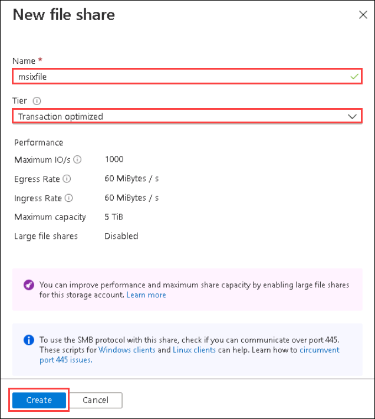
    
1. Go to **msixfile** file share and select **upload**.

   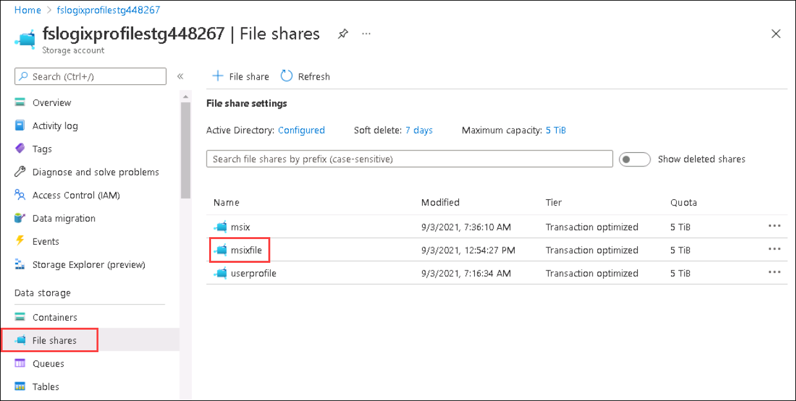
   
   
   
1. Browse the files go to ``C:\LabFiles``. Select **7-Zip.vhd**, **msix.cer** files and Click on **Open**.

   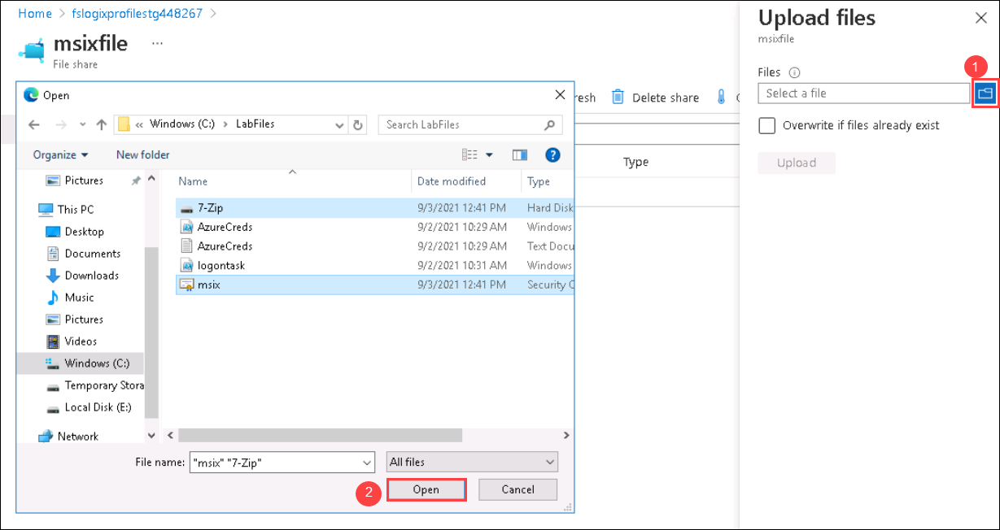
   
1. Select **Access Control(IAM)** from the side blade. Click on **Add** and select **Add Role Assignment**.

   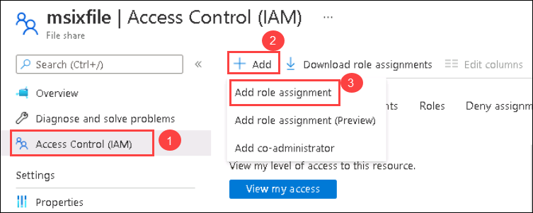
   
1. Select the following options and click **Save**

   -Role: Search and select **Storage File Data SMB share Contributor** role.
   -Assign access to: **User, groups, or service principal**.
   -Select: Search and select **<inject key="AzureAdUserEmail" />** user.
   
   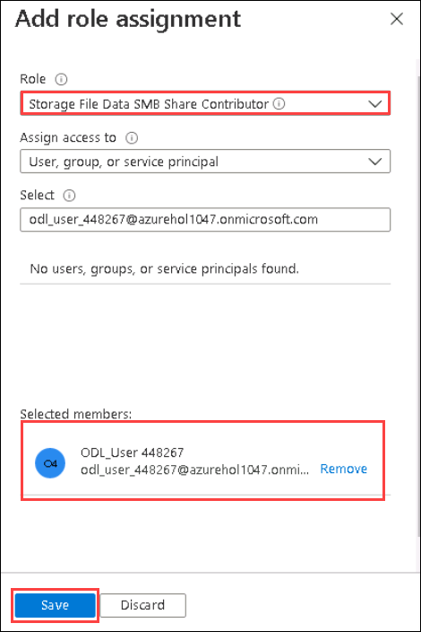
   
1. Search for **Stoarage accounts** in the search bar and select the **<inject key="Storage Account Name" />** account.

   
 
1. Go to **msixfile** file share and click on **Connect**.

   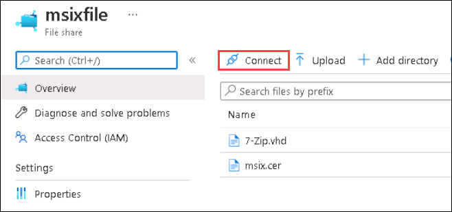
   
1. Under **Windows** tab. Select **Storage account key** and **copy** the code from the window.

   
   
1. Go to the home page, Search for **virtual machine** in the search bar. Select **AVD-HP01-SH-0**.

   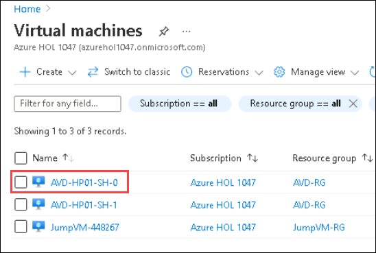
   
1. Under **Operations** blade, Select Run Command. Select **RunPowerShellScript**.
    
   
  
1. **Paste** the **code** which you copied earlier into the window and select **Run**. Once the execution is completed, Output will be displayed as mentioned in the screenshot below.

   
   
   >**NOTE**: **This step is required for this lab only**. In the production environment, this is not required. You will use Azure active directory and Access control(IAM) to control access to the MSIX VHD file. For more information refer to `` https://docs.microsoft.com/en-us/azure/virtual-desktop/app-attach-azure-portal ``.
   
1. Go to the home page, Search for **virtual machine** in the search bar. Select **AVD-HP01-SH-1** VM.

   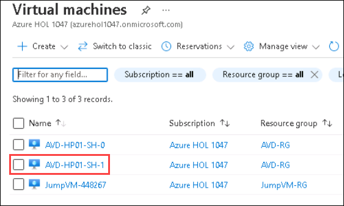
   
1. Under **Operations** blade, Select Run Command. Select **RunPowerShellScript**.
    
   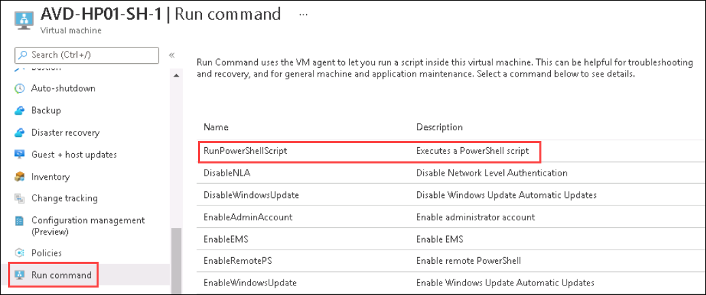
  
1. **Paste** the **code** which you copied earlier into the window and select **Run**. Once the execution is completed, Output will be displayed as mentioned in the screenshot below.

   
   
# ADD STEPS TO INSTALL CERTIFICATE INTO THE SESSION VM.

1. Go to **msixfile** file share and select the **7-Zip** file. **Copy** the **URL**.

   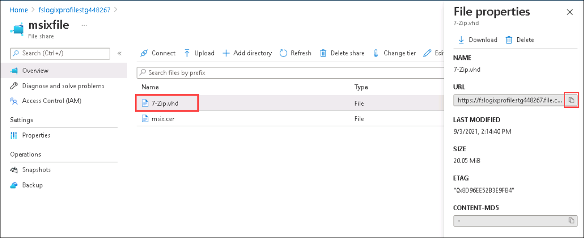

1. Navigate to the Azure portal, then search for *Azure Virtual Desktop* in the search bar and select **Azure Virtual Desktop** from the suggestions.

   

1. You will be directed towards the Azure Virtual Desktop management window.  

   

1. Under **Manage** blade, Select the **MSIX** tab and click on **Add**.

   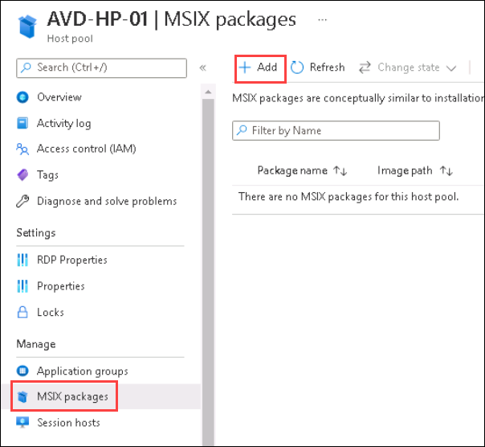
   
1. Paste the **URL** and follow the below mentioned steps to create **UNC** path.

   - **Remove** ``https://`` from the URL. Add ``\\`` to the starting of the link.
   - **Replace** all the ``/`` (front slash) with ``\`` (back slash0. 
   - The final UNC path should look like this ``\\fslogixprofilestg448267.file.core.windows.net\msixfile\7-Zip.vhd``.

   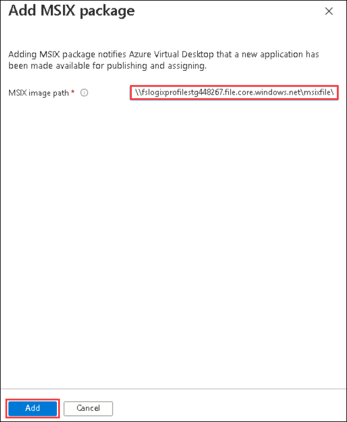

   Click on **Add**.
   
1. For **Display name**, provide **7-Zip** as the value and enable state as **active**. Click on **Add**.

   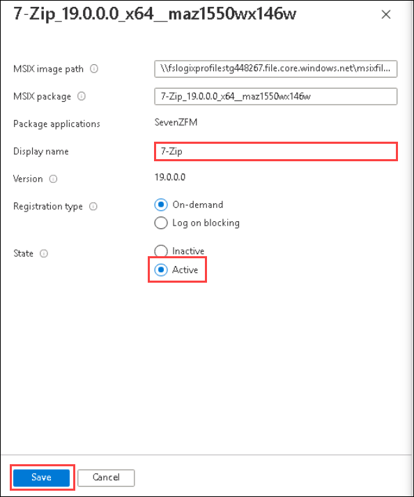
   
1. Under **Manage** blade, Select the **Application groups** tab and click on **AVD-AG-01**.

   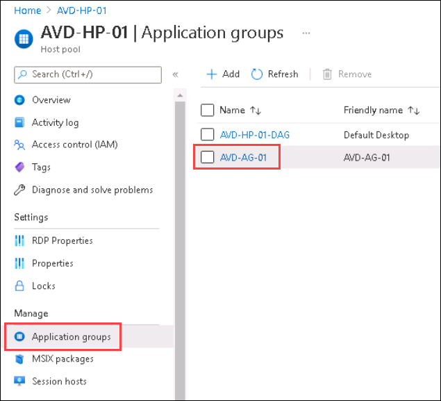

1. Under **Manage** blade, Select the **Applications* tab and click on **Add**.

   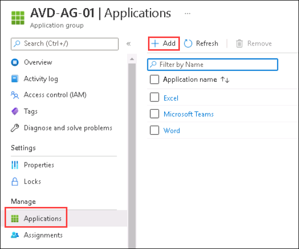
   
1. In **Add Application** tab, 

   - For **Application Source**, select **MSIX Package** from the drop-down. 
   - For **Application name**, provide **7-Zip** as the value.
   - CLick on **save**.

   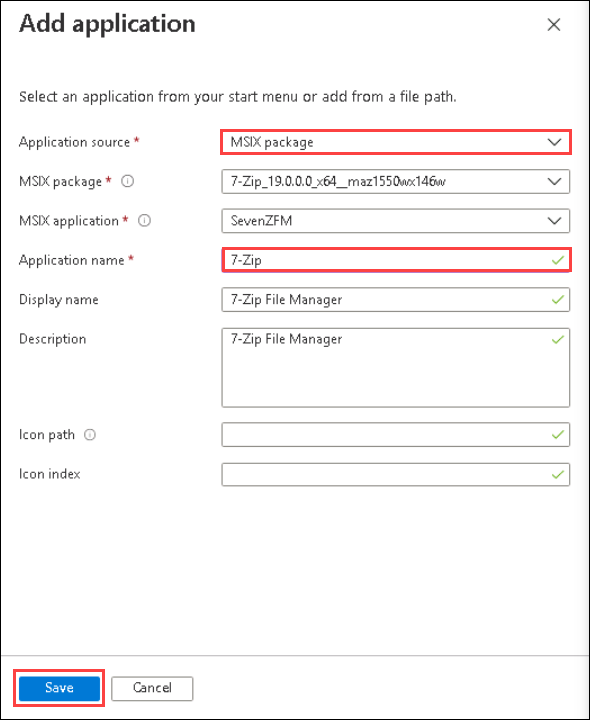
    
1. In your PC go to **Start** and search for **Remote desktop** and open the remote desktop application with the exact icon as shown below.

   
   
1. Once the application opens, click on **Subscribe**.

   
  
1. Enter your **credentials** to access the workspace.

   - Username: *Paste your username* **<inject key="AzureAdUserEmail" />** *and then click on **Next**.*
   
   

   - Password: *Paste the password* **<inject key="AzureAdUserPassword" />** *and click on **Sign in**.*

   
   
   >**Note:** If there's a popup entitled **Help us protect your account** click **Skip for now (14 days until this is required)**

   

1. Make sure to **uncheck** *Allow my organization to manage my device* and click on **No, sign in to this app only**.

   
      
1. The WVD dashboard will launch, then double click on **7-Zip File Manager** application to access it.

   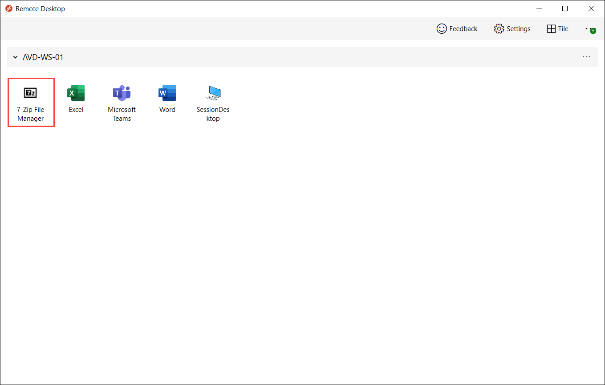
   
1. You should be able to see the file manager opened. 

   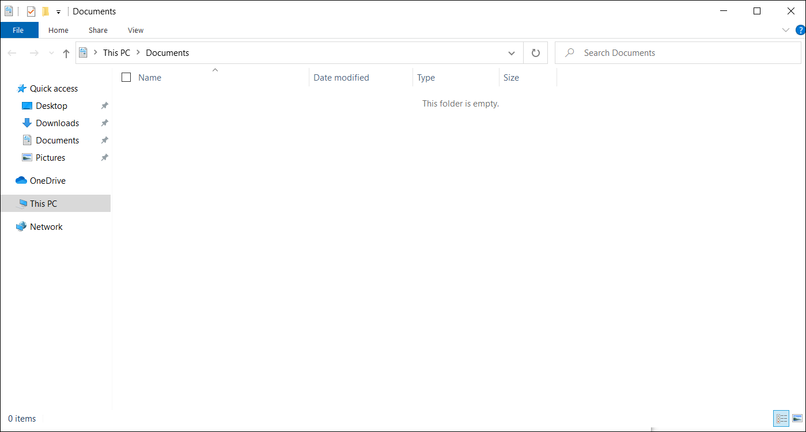    
    
