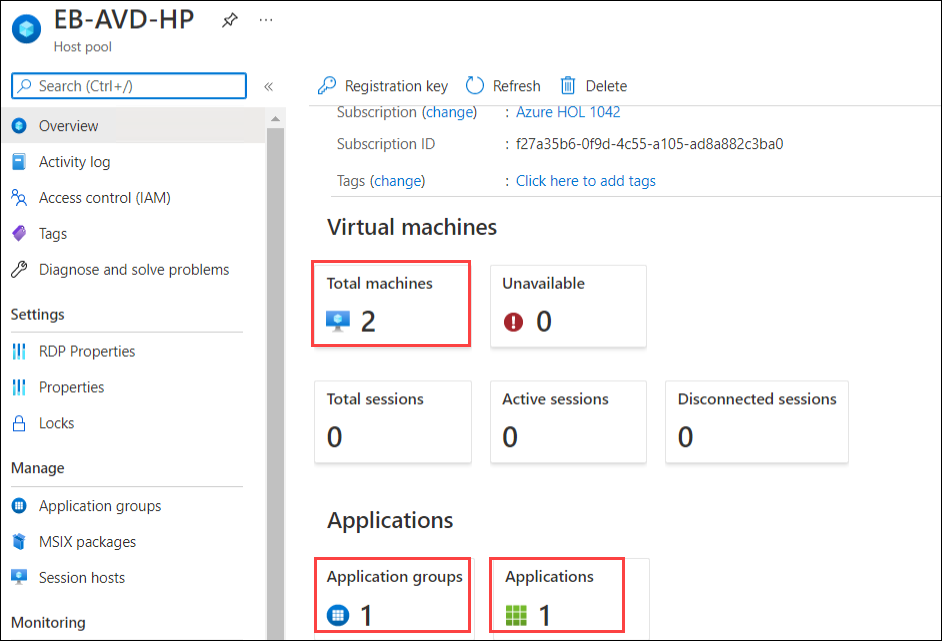

# Lab 15 : Azure Active Directory Domain Join (Read Only) 

## **Scenario**

 Contoso is planning to set up its infrastructure on Azure. As a first step, Contoso needs you to provision a host pool which is the main component of AVD. Creation of host pool also includes session hosts domain joined through Azure Active directory, default application group, and a workspace.

## **Overview**

 A Host Pool is a collection of Azure virtual machines that register to Azure Virtual Desktop as session hosts when you run the Azure Virtual Desktop agent. All session host virtual machines in a host pool should be sourced from the same image for a consistent user experience. To start with, we will login to the Azure portal.
 
## Exercise 1: Create Host Pool using Getting Started Wizard

In this exercise, We'll be creating the Host pool using **Getting Started Wizard** using minimum efforts and information.

1. On the **Azure portal** search for **Azure Virtual Desktop** in the **search bar** **(1)** and select **Azure Virtual Desktop** **(2)** from the suggestions.

   
   
2.	On the AVD **Overview page (1)**, click on Create a host pool **(2)**.

   

3.	On the **Basics** tab, provide the following information and click **Next: Virtual machines >**

 A. **Project Details:**
    - Subscription: Select the **default (1)**
    - Resource group: Enter **AVD-HostPool-RG (2)**
    - Host pool name: **EB-AVD-AADJ-HP (3)**
    - Location: **East US (4)**
    - Validation environment: **Yes (5)**
        
   B. **Host pool type:**
    
      - Host pool type: **Pooled (6)**
      - Load balancing algorithm: **Breadth-first (7)**
      - Max session limit: **5** **(8)**

   
        
   
4.	On the **Virtual Machines** tab, provide the following information :

   A. **General:**
    
      - Add Azure virtual machines: **Yes (1)**
      - Resource group: **AVD-HostPool-RG (2)**
      - Name prefix: **AVD-AADJ-SH (3)**
      - Virtual machine location: **East US (4)**
      - Availability options: **No infrastructure redundancy required (5)**
      - Security type: **Standard (6)**
      - Image type: **Gallery (7)**
      - Image: Select **Windows 10 Enterprise multi-session, version 21H2 + Microsoft 365 Apps - Gen2 (8)** from dropdown
      - Virtual machine size: **Standard D4s v4 (9)**
      - Number of VMs: **2 (10)**
      - OS disk type: **Standard SSD (11)**

   
       
   B. **Network and security**
  
      - Virtual network: Select **aadds-vnet (1)** from drop-down
      - Network security group: **Basic (2)**
      - Public inbound ports: **No (3)**

   
       
   C. **Domain to join**
    
      - Select which directory you would like to join: **Azure Active Directory (1)**
      - Enroll VM with Intune: **No (2)**

   

   D. **Virtual Machine Administrator account**
    
      - Username: Enter **demouser** **(1)**
      - Password: **Password.1!!** **(2)**
      - Confirm password: **Password.1!!** **(3)**
      - Click on **Next : Workspace > (4)**

   

5.	On the Workspace tab, provide the following information and click **Review + create (3)**:

   - Register desktop app group: **Yes (1)**
   - To this workspace: **EB-AVD-WS (2)**

     

6.	Verify the information and click **Create**.

   

   > **NOTE:** Usually it takes 20 mins to get deployed successfully. Sometimes it might take up to 90 minutes.

7.	Once the deployment is successful, click on **Go to resource**.

   

8.	It will take you to the Host pool. The following resources were created:

     - Host Pool: 1 (EB-AVD-AADJ-HP)
     - Session Host: 2 (AVD-AADJ-SH-0, AVD-AADJ-SH-1)
     - Application Group: 1 (EB-AVD-AADJ-HP-DAG)
     - Application: 1 (SessionDesktop)
     - Workspace: 1 (EB-AVD-WS)
     
     

   
1. Click on the **Next** button present in the bottom-right corner of this lab guide.  
   
