# Lab 10: MS Teams Optimized Experience

## **Scenario**

Contoso is an IT-based consulting service company. One of the major challenges faced by employees who are working from home is communication. Contoso wants to implement Azure Virtual Desktop's Optimized Audio Video Experience for their Teams Users. AVD's Teams Optimized experience ensures better QoS of the Audio/Video while attending Teams Online meetings. You will help Contoso to configure and set up Microsoft Teams for Azure virtual desktop.

## **Overview**

In this lab, We'll be implementing MS Teams for AVD. Microsoft Teams on Azure Virtual Desktop supports chat and collaboration. With media optimizations, it also supports calling and meeting functionality. With media optimization for Microsoft Teams, the Remote Desktop client handles audio and video locally for Teams calls and meetings.

## Exercise 1: Configuring Session host for implementing MS Teams

#### NOTE: Make sure that both the session hosts are running. If not, Please start the Session hosts.

1. In your Azure portal search for *Public IP Addresses* in the search bar and click on **Public IP Addresses** from the suggestions.

   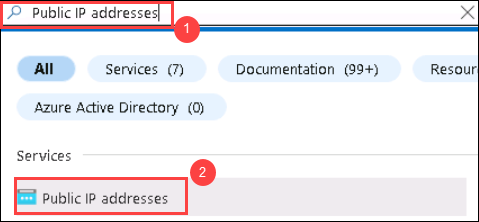
   
1. Click on **Create** *(1)* and provide the following deatils.

   - **IP Version**: ***IPv4*** *(2)*
   - **SKU**: ***Standard*** *(3)*
   - **Tier**: ***Regional*** *(4)*

   
   
   In **IPv4 IP Address Configuration**,
   
   - **Name**: ***SH-0-IP*** *(1)*
   - **Routing preference**: ***Microsoft network*** *(2)*
   - **Idle timeout (minutes)**: Leave it to ***default***
   - **DNS name label**: Leave it to ***default***
   - **subscripton**: Select the ***default Subscription***. *(3)*
   - **Resource group**: ***AVD-RG*** *(choose from dropdown)* *(4)*
   - **Location**: This should be same as the region of your ***AVD-RG*** resource group *(5)*
   - **Availiability Zone**: Select ***No Zone*** *(choose from dropdown)* *(6)*
   - Click on ***Create*** *(7)*

   
   
1. Similarly create another Public IP address, 1. Click on **Create** *(1)* and provide the following deatils.

   - **IP Version**: IPv4 *(2)*
   - **SKU**: Standard *(3)*
   - **Tier**: Regional *(4)*

   
   
   In **IPv4 IP Address Configuration**,
   
   - **Name**: ***SH-1-IP*** *(1)*
   - **Routing preference**: ***Microsoft network*** *(2)*
   - **Idle timeout (minutes)**: Leave it to ***default***
   - **DNS name label**: Leave it to ***default***
   - **subscripton**: Select the ***default Subscription***. *(3)*
   - **Resource group**: ***AVD-RG*** *(choose from dropdown)* *(4)*
   - **Location**: This should be same as the region of your ***AVD-RG*** resource group *(5)*
   - **Availiability Zone**: Select ***No Zone*** *(choose from dropdown)* *(6)*
   - Click on ***Create*** *(7)*

   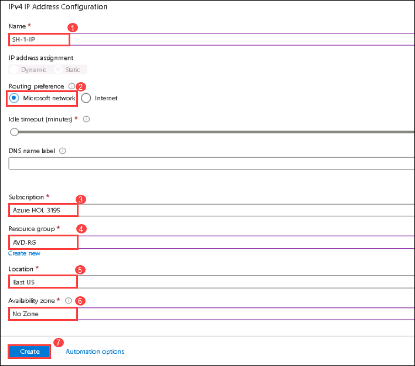
   
1. Select the **SH-0-IP** *(1)*, Click on **Associate** *(2)* and provide the fololowing details.

   - **Resource Type**: ***Network Interface***. *(3)*
   - **Network Interface**: ***AVD-HP01-SH-0-nic*** *(4)*
   - Click on ***Ok*** *(5)*
   
   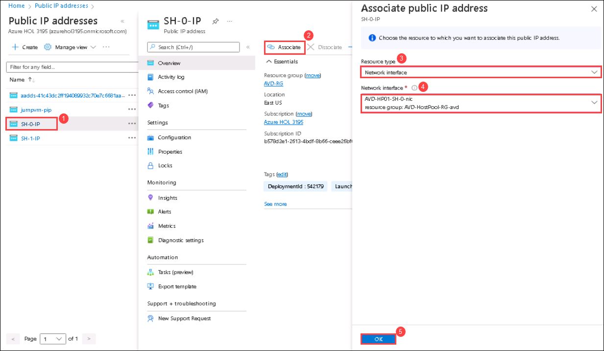
   
1. Select the **SH-1-IP** *(1)*, Click on **Associate** *(2)* and provide the fololowing details.

   - **Resource Type**: ***Network Interface***. *(3)*
   - **Network Interface**: ***AVD-HP01-SH-01-nic*** *(4)*
   - Click on ***Ok*** *(5)*
   
   

1. In your Azure portal search for *Virtual machines* in the search bar and click on **Virtual Machines** from the suggestions.

   
      
1. Click on **AVD-HP01-SH-0**.

   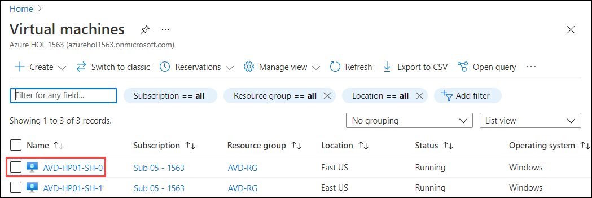
   
1. Make sure that the **Status** of the virtual machine is in **Running** state.

   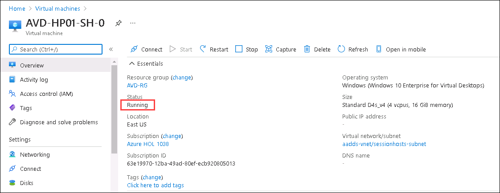
   
1. Select **Networking** *(1)* from the side blade and click on **Add Inbound port rule** *(2)*

   
   
1. In Add Inbound Security rule page, Provide the following details.

   - **Destination port range**: Paste ***3389*** *(1)*
   - **Name**: ***Port_3389*** *(2)*
   - Click on ***Add*** *(3)*

   
   
1. On the Overview page, Click on **Connect** *(1)* and select **RDP** *(2)*

   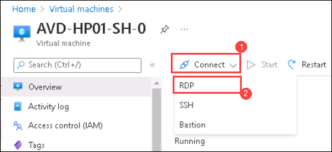
   
1. Click on **Download** to download the RDP file.
 
   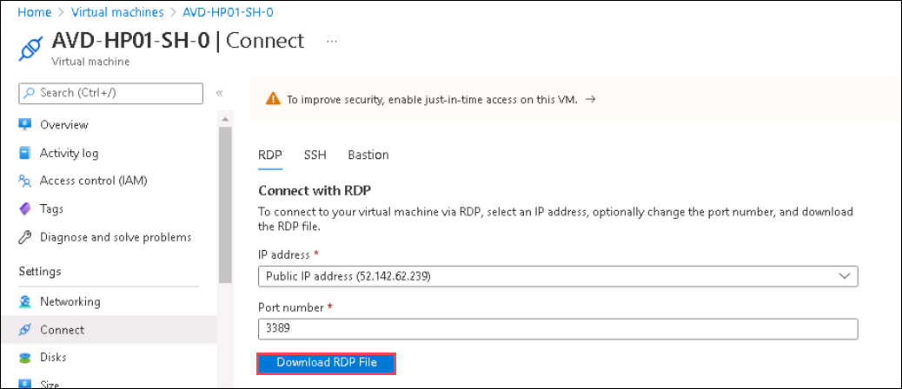
   
1. Open the downloaded **RDP** file and click on **Connect**.

   
   
1. Use **<inject key="AzureAdUserEmail" />** for ***Username*** and **<inject key="AzureAdUserPassword" />** for ***Password***. Click on **Ok**.
   
   
   
1. Click on **yes** on Remote Desktop Connection pop-up.

   
   
1. Once logged into the virtual machine, In **Search bar** , Search for **Windows PowerShell** *(1)*. Select the application *(2)* and click **Run as Administrator** *(3)*.

   
  
   >**Note**: Click on ***Yes*** if ***Do you want allow this app to make changes to your device*** prompt pop-up. Please close the ***Microsoft Teams*** application if it is running.
   
1. Paste the following commands into the Powershell script window and execute the the commands. Once the execution is completed, **The script is executed successfully** message will be displayed as the output

   >**NOTE**: The below-mentioned script uninstalls the Remote Desktop webRTC Redirector service and Teams Machine-Wide Installer version which doesn't support our lab and   downloads the supporting version of the WebRTC and MS Teams and install them.

   ```
   
   reg add "HKLM\SOFTWARE\Microsoft\Teams" /v IsWVDEnvironment /t REG_DWORD /d 1 /f

   # Remove Teams Machine-Wide Installer
   Write-Host "Removing Teams Machine-wide Installer" -ForegroundColor Yellow

   $MachineWide = Get-WmiObject -Class Win32_Product | Where-Object{$_.Name -eq "Teams Machine-Wide Installer"}
   $MachineWide.Uninstall()

   # Remote Desktop WebRTC Redirector Service
   Write-Host "Removing Teams Machine-wide Installer" -ForegroundColor Yellow

   $MachineWide = Get-WmiObject -Class Win32_Product | Where-Object{$_.Name -eq "Remote Desktop WebRTC Redirector Service"}
   $MachineWide.Uninstall()

   $WebClient = New-Object System.Net.WebClient
   $WebClient.DownloadFile("https://github.com/CloudLabsAI-Azure/AIW-Azure-Virtual-Desktop/raw/Azure-Virtual-Desktop-v2/LabFiles/RTC.msi","C:\LabFiles\RTC.msi")

   msiexec /i C:\RTC.msi /qn

   $WebClient = New-Object System.Net.WebClient
   
   $WebClient.DownloadFile("https://teams.microsoft.com/downloads/desktopurl?env=production&plat=windows&arch=x64&managedInstaller=true&download=true","C:\LabFiles\Teams_windows_x64.msi")

   msiexec /i "C:\LabFiles\Teams_windows_x64.msi" ALLUSER=1

   Write-Output "The script is executed successfully"
   
   ```
   
   
   >**NOTE**: Wait Untill the execution completes  and **DO NOT CLOSE** PowerShell application.

1. Once the execution is completed. Close the PowerShell application and close the Remote Desktop Connection.

   

1. Similarly, Navigate to virtual machines and click on **AVD-HP01-SH-1**.

    
    
1. Make sure that the **Status** of the virtual machine is in **Running** state.

   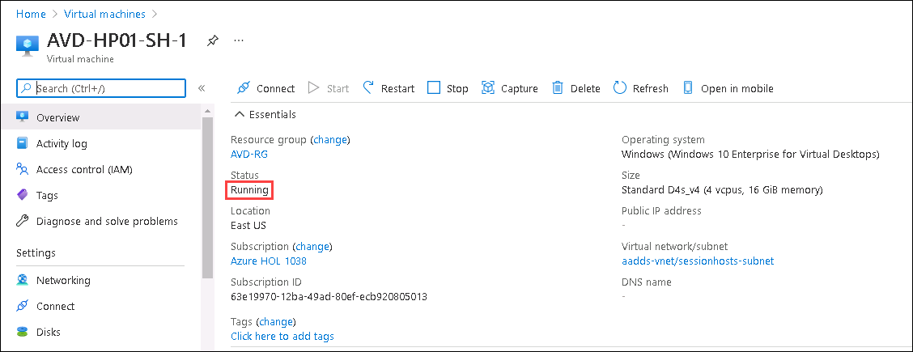
   
1. Select **Networking** *(1)* from the side blade. In **Inbounds port rules** *(2)*, If you see a rule named **Port_3389** *(3)*. Please skip step 22 to step 23.

   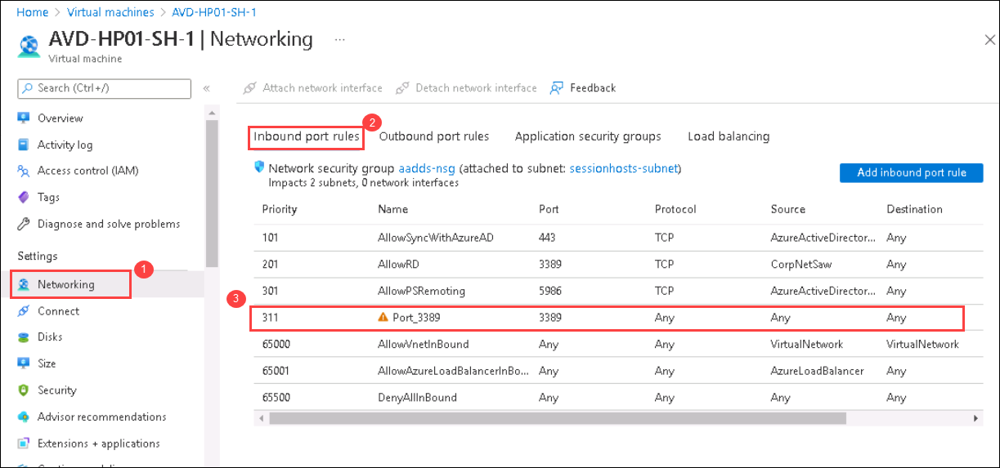
   
1. Select **Add inbound port rules** from the networking slide blade. 

   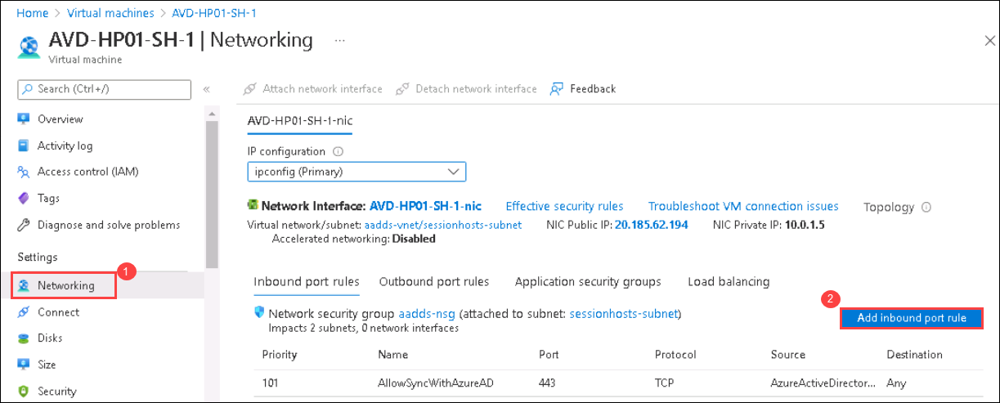
   
1. In Add Inbound Security rule page, Provide the following details.

   - **Destination port range**: Paste ***3389*** *(1)*
   - **Name**: ***Port_3389*** *(2)*
   - Click on ***Add*** *(3)*

   
   
1. On the Overview page, Click on **Connect** *(1)* and select **RDP** *(2)*

   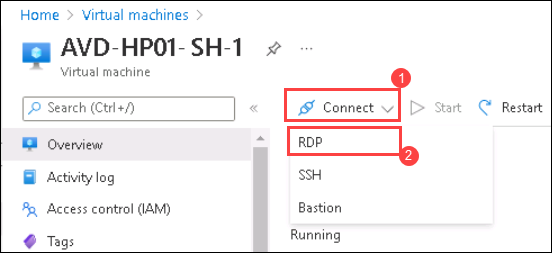
   
1. Click on **Download** to download the RDP file.
 
   
   
1. Open the downloaded **RDP** file and click on **Connect**.

   
   
1. Use **<inject key="AzureAdUserEmail" />** for ***Username*** and **<inject key="AzureAdUserPassword" />** for ***Password***. Click on **Ok**.
   
   
   
1. Click on **yes** on Remote Desktop Connection pop-up.

   
   
1. Once logged into the virtual machine, In **Search bar** , Search for **Windows PowerShell** *(1)*. Select the application *(2)* and click **Run as Administrator** *(3)*.

   
  
   >**Note**: Click on ***Yes*** if ***Do you want allow this app to make changes to your device*** prompt pop-up. Please close the ***Microsoft Teams*** application if it is running.
   
1. Paste the following commands into the Powershell script window and execute the the commands. Once the execution is completed, **The script is executed successfully** message will be displayed as the output

   >**NOTE**: The below-mentioned script uninstalls the Remote Desktop webRTC Redirector service and Teams Machine-Wide Installer version which doesn't support our lab and   downloads the supporting version of the WebRTC and MS Teams and install them.

   ```
   
   reg add "HKLM\SOFTWARE\Microsoft\Teams" /v IsWVDEnvironment /t REG_DWORD /d 1 /f

   # Remove Teams Machine-Wide Installer
   Write-Host "Removing Teams Machine-wide Installer" -ForegroundColor Yellow

   $MachineWide = Get-WmiObject -Class Win32_Product | Where-Object{$_.Name -eq "Teams Machine-Wide Installer"}
   $MachineWide.Uninstall()

   # Remote Desktop WebRTC Redirector Service
   Write-Host "Removing Teams Machine-wide Installer" -ForegroundColor Yellow

   $MachineWide = Get-WmiObject -Class Win32_Product | Where-Object{$_.Name -eq "Remote Desktop WebRTC Redirector Service"}
   $MachineWide.Uninstall()

   $WebClient = New-Object System.Net.WebClient
   $WebClient.DownloadFile("https://github.com/CloudLabsAI-Azure/AIW-Azure-Virtual-Desktop/raw/Azure-Virtual-Desktop-v2/LabFiles/RTC.msi","C:\LabFiles\RTC.msi")

   msiexec /i C:\RTC.msi /qn

   $WebClient = New-Object System.Net.WebClient
   
   $WebClient.DownloadFile("https://teams.microsoft.com/downloads/desktopurl?env=production&plat=windows&arch=x64&managedInstaller=true&download=true","C:\LabFiles\Teams_windows_x64.msi")

   msiexec /i "C:\LabFiles\Teams_windows_x64.msi" ALLUSER=1

   Write-Output "The script is executed successfully"
   
   ```
   
   
   >**NOTE**: Wait Untill the execution completes  and **DO NOT CLOSE** PowerShell application.

1. Once the execution is completed. Close the PowerShell application and close the Remote Desktop Connection.

   
   
1. In your Azure portal search for *Virtual machines* in the search bar and click on **Virtual Machines** from the suggestions.

   
   
1. Select **AVD-HP01-SH-0** and **AVD-HP01-SH-1** and click on **Restart**.

   

1. Navigate to the Azure portal, then search for Azure Virtual Desktop in the search bar and select Azure Virtual Desktop from the suggestions.

   
   
1. Select **Host pools** from the side blade and select **EB-AVD-HP**.

   
   
1. Under Settings, Select **RDP Properties** (1) and select **Device redirection** (2). Select the following options.
   
   - Microphone redirection: Select **Enable audio capture from the local devices and redirection to an audio application in the remote session** (3) from the dropdown.
   - Audio output location: Select **Play sounds on the remote computer** (4) from the dropdown
   - Camera redirection: Select **Redirect cameras** (5) from the dropdown.
   - Leave the rest properties as **defaults**.
   - click on **Save** (6).

   
   
1. Select **Application groups** from the side blade. You will see two application groups, Select the **AVD-AG-01** application group.

   
   
1. Under Manage, select **Applications** and select **Add**.

   
   
1. In the **Add Application** tab, select the following options and click on **Save**.
   
   - **Application Source**: Start menu.
   - **Application**: Search for **Microsoft Teams** and select the same from dropdown.
   - **Display name**: Microsoft Teams.
   - **Leave** the other options as **defaults**.
   
   
   
## Exercise 2: Accessing MS Teams using Remote Desktop Application

1. On your PC go to **Start** and search for **Remote desktop** and open the remote desktop application with the exact icon as shown below.

   
   
1. Once the application opens, click on **Subscribe**.

   
  
1. Enter your **credentials** to access the workspace.

   - Username: *Paste your username* **<inject key="AzureAdUserEmail" />** *and then click on **Next**.*
   
   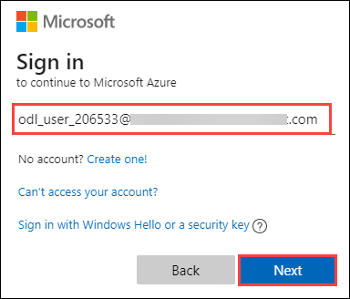

   - Password: *Paste the password* **<inject key="AzureAdUserPassword" />** *and click on **Sign in**.*

   
   
1. You'll see a dialog box to authenticate your login which is the indication of MFA implementation. Answer the call, you will be asked to press the "#" key to complete the verification.

   
   
   >**Note:** If there's a popup entitled **Help us protect your account** click **Skip for now (14 days until this is required)**

   

1. Make sure to **uncheck** *Allow my organization to manage my device* and click on **No, sign in to this app only**.

   
  
1. The AVD dashboard will launch, then double click on the Teams application to access it.

   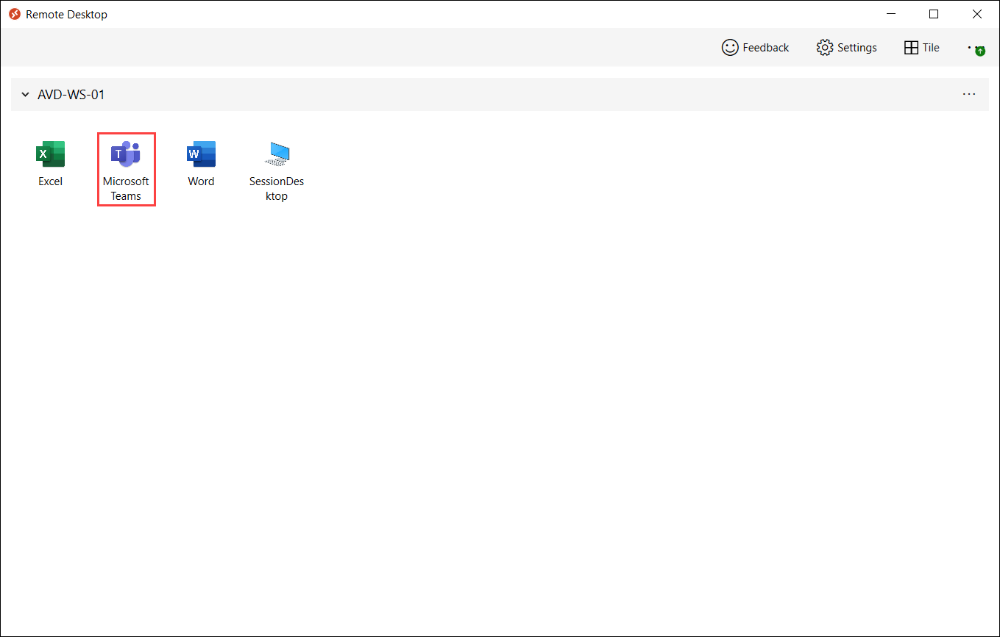
   
1. A window saying *Starting your app*, will appear. Wait for a few seconds, then enter your password to access the Application.

    - Password: **<inject key="AzureAdUserPassword" />**
   
    
    
1. Teams application will start loading.

   
   
1. After the Teams application is launched, click on the **three dots** (1) then **About** (2) and click on **Version** (3).

   

1. Now we will get a message on top of the Teams application saying **The Teams Version 1.x.x.. is WVD Media Optimised**.

   
   
1. Again click on the **three dots** (1) on the top and select **Settings** (2).

   
   
1. Now under Settings, click on **Devices** and explore the media devices connected to your local desktop.

   
   
1. Now, Close the settings tab and go to **calendar** (1) which is located in the side blade. Select **Meet now** (2).

   
   
1. Leave the **Meeting name** as default and click on **Start meeting**.

   
   
1. Make sure both Video (1), and Audio (2) are enabled. Click on **Join now** (3).

   
   
1. Click on **Allow access** on the Windows Security alert prompt.

   
   
   >**NOTE**: If the **Invite others** prompt appears, Close the tab and continue.
  
1. Now, You should be able to see yourself as the video is On.

1. Click on the Next button present in the bottom-right corner of this lab guide.
