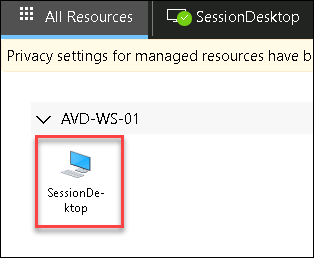
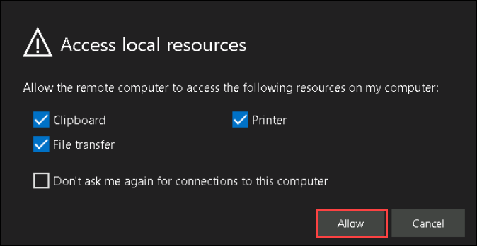
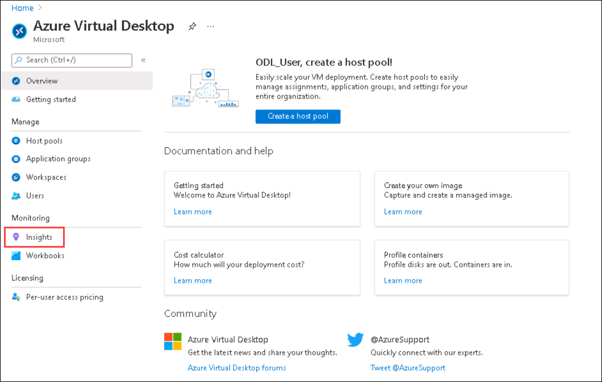

# Lab 2: Monitoring using Azure Monitor for AVD(Part 2)

1. Paste the below mentioned link in your browser in the **JumpVM** and enter your **credentials** to login. 

   ```
   aka.ms/wvdarmweb
   ```

   - Username: *Paste the username*  **<inject key="Avd User 01" />** then click on **Next**.*
   
   

   - Password: *Paste the password*  **<inject key="AVD User Password" />** *and click on* **Sign in**.

   

   >**Note:** If there's a dialog box saying ***Help us protect your account***, then select **Skip for now** option.

   

1. Now in the AVD dashboard, click on the **Session Desktop** to access it. 

   

1. Select **Allow** on the prompt asking permission to *Access local resources*.

   

1. Enter your **credentials** to access the application and click on **Submit**.

   - Username: *Paste the username*  **<inject key="Avd User 01" />** then click on **Next**.*
   
   - Password: *Paste the password*  **<inject key="AVD User Password" />** *and click on* **Sign in**.
   
   

1. The virtual Desktop will launch as shown below. 

   
   
   >**NOTE**: **DO NOT** close the session or the AVD web client. Keep it running.
   
1. Navigate to **Your Own PC/computer/workstation**, go to **Start** and search for **Remote desktop** and open the application with the exact icon as shown below.

   
   
1. Click on the *ellipses* and select **Unsubscribe**. Click on **Yes** for any warning.

   

   >**Note:** We need to unsubscribe from the feed, because in Exercise 4 we subscribed to AVD feed using a different user.

1. Click on **Subscribe** button.

   

1. Enter the user credentials to access the workspace.

   - Username: *Paste the username*  **<inject key="Avd User 02" />** *then click on* **Next**.
   
   - Password: *Paste the password*  **<inject key="AVD User Password" />** *and click on* **Sign in**.

   

   >**Note:** If there's a dialog box saying ***Help us protect your account***, then select **Skip for now** option.

   
    
1. Make sure to **uncheck** *Allow my organization to manage my device* and click on **No, sign in to this app only**.

   

1. In AVD client, double click on the **Session Desktop** to access it. 

   

1. Enter your **credentials** to access the application and click on **Submit**.

   - Username: *Paste the username*  **<inject key="Avd User 02" />** then click on **Next**.*
   - Password: *Paste the* **<inject key="AVD User Password" />** *and click on* **OK**.* 
   
   
  
1. The virtual Desktop will launch as shown below. 

   

1. The virtual Desktop will launch as shown below. 

   
   
   >**NOTE**: **DO NOT** close the session or the AVD Remote client. Keep it running.
   
1. Now, Navigate to Azure Virtusl Desktop and select **Insights** under **Monitoring** blade in the Azure Portal.

   
