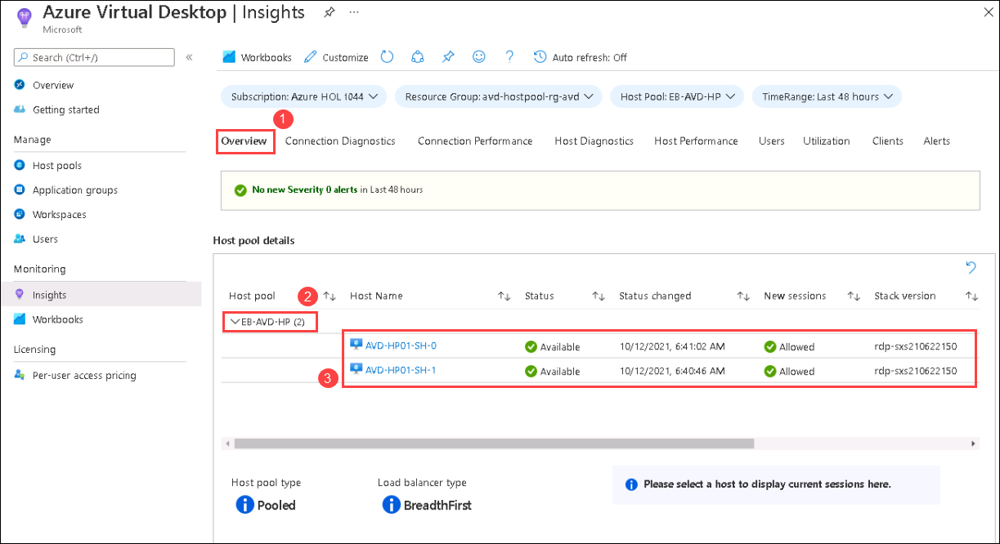

# Lab 2(B): Monitoring using Azure Monitor for AVD

## **Overview**

In this exercise, We'll be reviewing monitoring data of the AVD environment using Azure Insights which you had configured in part A of Exercise 2.

## Exercise : Exploring Insights for AVD

### Task 1: Exploring Insights data

>**NOTE**: While performing this exercise, you might see that data is not loaded as expected. In such a scenario, Please refresh the **Insights** page until the data is loaded.
   
1. Now, Navigate to Azure Virtual Desktop and select **Insights** under **Monitoring** blade in the Azure Portal.

   
   
1. In **Insights** page, **Click** on **Overview** tab *(1)*. Here **expand** *(2)* the **EB-AVD-HP** host pool. You'll be able to monitor the status and health of the session hosts (3).

   
   
1. **Click** on **Users** *(1)* tab, In **UPN to search for** blank paste **<inject key="Avd User 01" />** *(2)* and wait for the data to load. This tab gives an overview of the user's usage. Scroll down and explore different information loaded.

   
   
1. **Click** on **Utilization** tab, This tab gives information about sessions summary, cores info, and more information about the utilization of resources.

   
   
1. **Click** on **Clients** *(1)* tab, Here you'll be able to monitor the number of users connected to AVD using the browser and remote client application.

   
   
1. Spend some time on the page to explore different monitoring abilities offered by Azure Insights.

