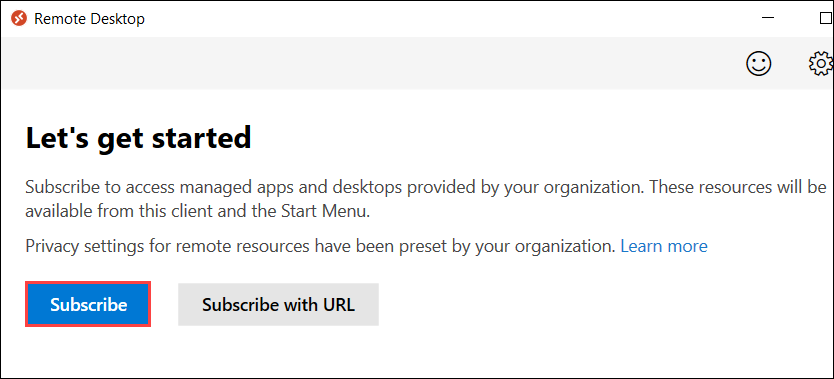
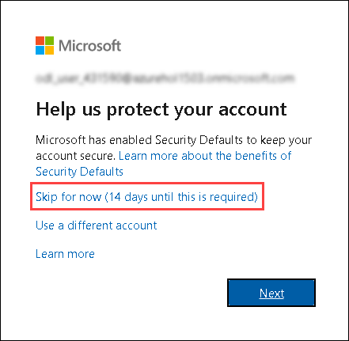
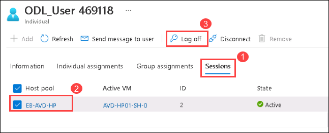
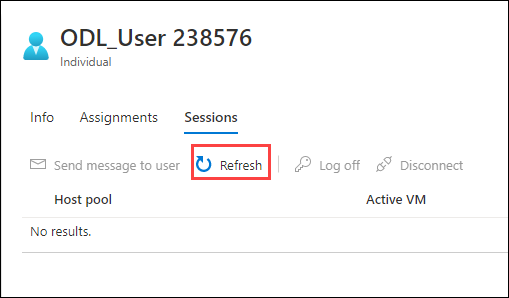

# Lab 5: Access the Published Applications and Desktop using AVD Desktop Client

## **Scenario**

Contoso wants their AVD environment to be flexible interms of accessing the sessions by their employees. You will help contoso to test the access to AVD session using AVD Client application using your local computer.

## **Overview**

In this exercise, we will access the Desktop and RemoteApps assigned to us in the previous exercise using the AVD Desktop client.

>#### **Note:** You have to perform this exercise in **Your Own PC/computer/workstation.** Do not perform this exercise within the JumpVM.

## Exercise 1: Access the Published Applications

1. Open a browser in **Your Own PC/computer/workstation** (not within the JumpVM), copy and paste the following URL in that browser tab.

   ```
   https://docs.microsoft.com/en-us/azure/virtual-desktop/connect-windows-7-10#install-the-windows-desktop-client
   ```

   > **Note:** To download *AVD Mac Client* on **macOS**, use the link given below:
   >
   > ```
   > https://docs.microsoft.com/en-us/azure/virtual-desktop/connect-macos
   > ```

2. Under *Install the Windows Desktop Client*, click on **Windows 64-bit**. This will download the **Remote Desktop Client** on **Your Own PC/computer/workstation**.
   
   
      
3. After the download completes, open the setup to run it. Then on the Welcome page of setup click on **Next**.

4. Check the agreement box and click on **Next**.

5. On the **Installation scope** window select **Install just for you** and then click on **Install**.

   

6. After installation, in your PC go to **Start** and search for **Remote desktop** and open the remote desktop application with the exact icon as shown below.

   
   
7. Once the application opens, click on **Subscribe**.

   
  
8. Enter your **credentials** to access the workspace.

   - Username: *Paste your username* **<inject key="AzureAdUserEmail" />** *and then click on **Next**.*
   
   

   - Password: *Paste the password* **<inject key="AzureAdUserPassword" />** *and click on **Sign in**.*

   
   
   >**Note:** If there's a popup entitled **Help us protect your account** click **Skip for now (14 days until this is required)**

   

9. Make sure to **uncheck** *Allow my organization to manage my device* and click on **No, sign in to this app only**.

   
      
10. The AVD dashboard will launch, then double click on the **Excel** application to access it.

    
   
11. A window saying *Starting your app*, will appear. Wait for a few seconds, then enter your password to access the Application.

    - Password: **<inject key="AzureAdUserPassword" />**
   
    

12. Wait for the Application to connect.

    
   
13. The Excel application will launch and look similar to the screenshot below.

     
    
14. You can exit from the window of Excel Application by clicking on **X *i.e., the close button***.

    

15. Return back to the Azure Portal, search for *Azure virtual desktop* in the search bar, and select **Azure Virtual Desktop** from the suggestions.

    

16. Click on **User** under *Manage* blade, then paste **<inject key="AzureAdUserEmail" />** in the search bar and click on your user to open it.

    

17. Click on the **Sessions** tab, select both Host pools by clicking on the checkbox and then click on the **Log off** button.

    

18. Click on **OK** to *Log off user from VMs*.

    

19. Click on the **Refresh** button and make sure *No results* is displayed under Host pool.

    
   
## Exercise 2: Access the Virtual Desktop

1. Return to AVD client application. On the AVD dashboard, click on the tile named **Session Desktop** to launch the desktop.

   
   
2. A window saying *Connecting to: Session Desktop* will appear. Wait for a few seconds, then enter your password to access the Desktop.

   - Password: **<inject key="AzureAdUserPassword" />**
   
   
   
   >**Note:** If there's a dialog box saying ***Help us protect your account***, then select the **Skip for now** option.
   
   

3. Wait for the Session Desktop to connect.

   

4. Your virtual desktop will launch and look similar to the screenshot below. You can exit from the window by clicking on **X *i.e., the close button***. 
        
      
     
5. Click on the **Next** button present in the bottom-right corner of this lab guide. 
