# Lab 7: Load Balancing methods


## **Scenario**

Contoso's AVD environment set up is working smoothly. But Contoso is confused about which load balancing to be used in order to run the sessions efficiently. You will guide Contoso to explore about different types of load balancing offered by Azure.

## **Overview**

Azure Virtual Desktop supports two load-balancing methods. Each method determines which session host will host a user's session when they connect to a resource in a host pool.
While configuring a host pool, we can select load balancing methods as per the needs.

The following load-balancing methods are available in Azure Virtual Desktop:

 **1. Breadth-first**: Breadth-first load balancing, distributes new user sessions across all available session hosts in the host pool. 

 **2. Depth-first**:  Depth-first load balancing, distributes new user sessions to an available session host with the highest number of connections but has not reached its maximum session limit threshold.


## Exercise 1: Add new users to Azure Active Directory

1. In Azure Portal, click on the **Show portals menu (1)** button and select **Azure Active Directory (2)**.

   

1. Click on **Users** under *Manage* blade.

   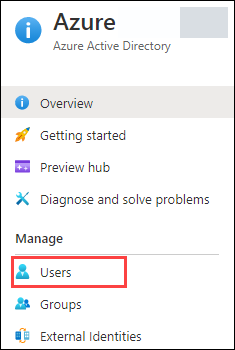

1. Click on **+ New user (1)** and select **Create new user (2)** from drop-down to add a new user.

   

1. Add the following configurations and leave rest to default:

   - User name: **AVDUser01**
   - Name: **AVDUser01**
   - Click on **Create**.

   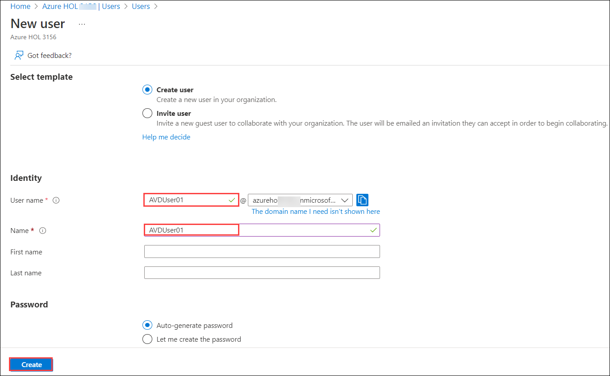

1. Click on **+ New user** and select **Create new user** to add one more user, then add the following configurations and leave the rest to default.

   - User name: **AVDUser02**
   - Name: **AVDUser02**
   - Click on **Create**
   
   

1. Both the newly created users will show up similarly as shown below. Copy the **user principal name** of both users and paste it into a text editor so that we can use it further.

   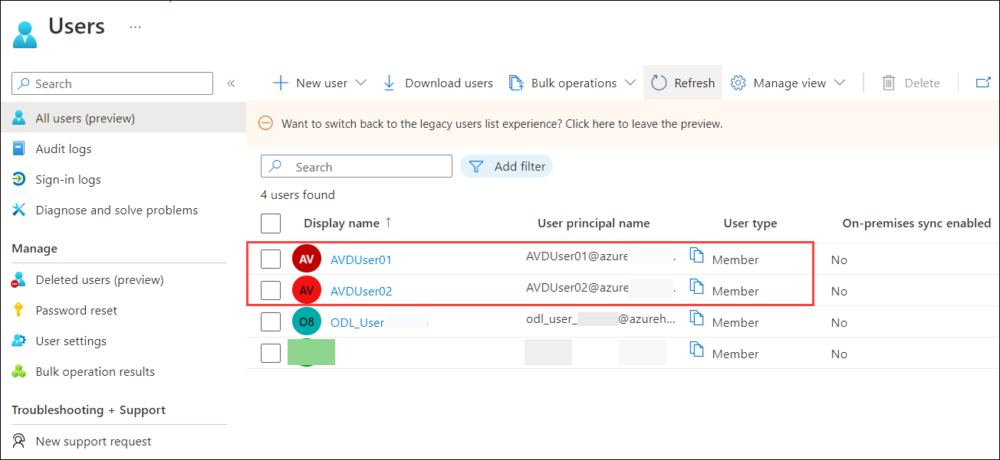

1. Click on **AVDUser01** to open it. Then click on **Groups** **(1)** under *Manage* blade and select **+ Add memberships** **(2)**.

   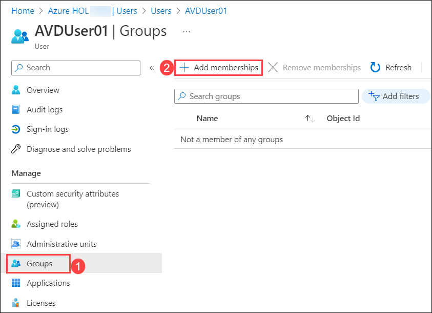

1. Click on the **permission - fslogixcontainer (1)** group and then click on **Select (2)**.

   

1. Click on **AVDUser02** to open it. Then click on **Groups** **(1)** under *Manage* blade and select **+ Add memberships** **(2)**.

   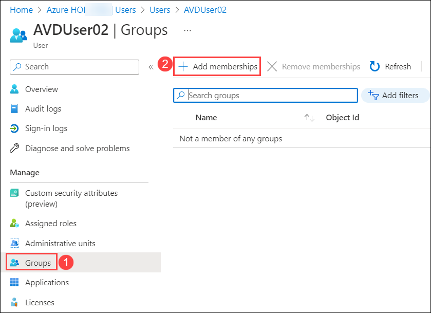

1. Click on the **permission - fslogixcontainer (1)** group and then click on **Select (2)**.

   

1. Navigate to the host pool *GS-AVD-HP* and open **Application groups** present under *Manage* blade. Two application groups will be listed there.

    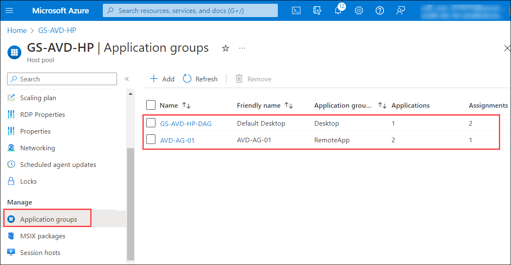

1. Open application group **GS-AVD-HP-DAG** and click on **Assignments** under *Manage* blade.

    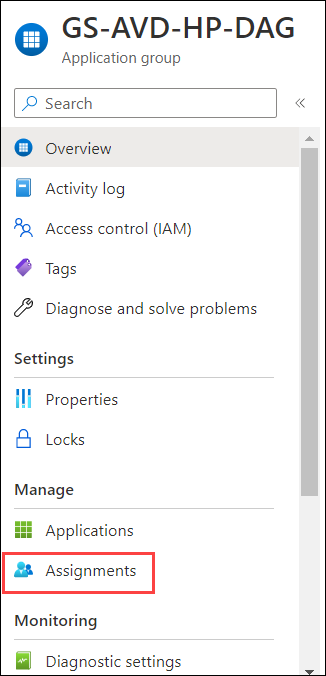
   
1. Click on **+ Add (1)**, then in the search bar, type **AVDUser (2)** and select both **AVDUser01 (3)** & **AVDUser02 (4)** that we created earlier. At last, click on the **Select (5)** button.

    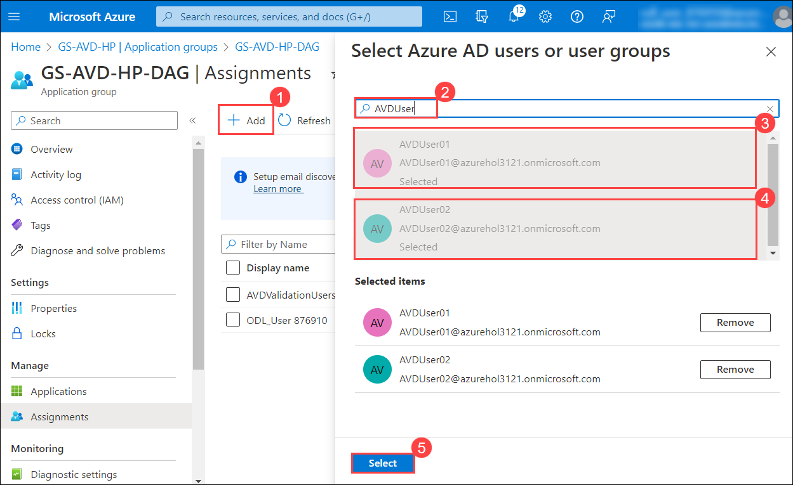

1. Once done, the users assigned to the Application group will look similar to the image given below.

    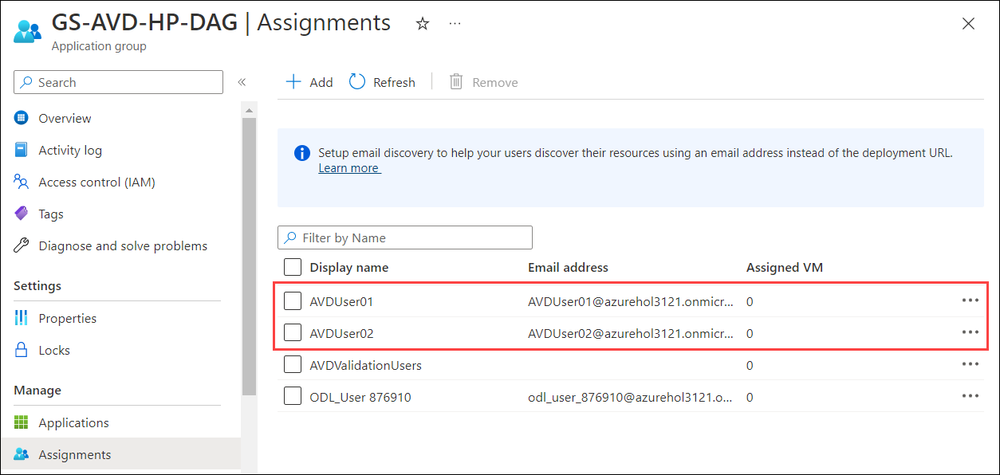
     
## Exercise 2: Update Passwords for the new users

Here, we will use powershell to run a script that will change the passwords for the users created, as the user needs to reset the password after registering to AADDS. 

1. Inside the Jump VM, click on the windows button and look for **PowerShell (1)** and click on **Windows PowerShell (2)**.
   
   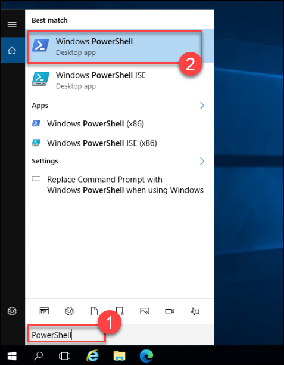
   
2. Run the following command in your terminal to set up your Azure account permissions locally.

   ```
   Connect-AzureAD
   ```
3. Your browser window will open and you will be prompted to authenticate to your Azure.

4. Login to Azure with the username **<inject key="AzureAdUserEmail" />** and click on **Next**.
    
    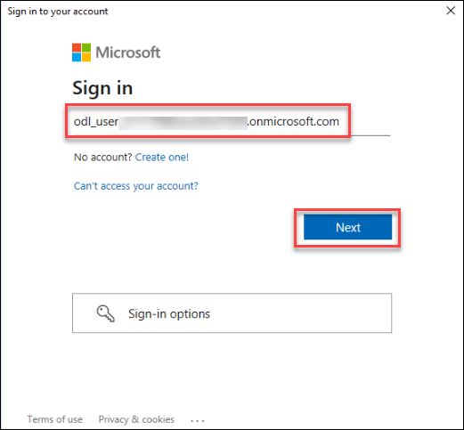
    
5. Enter your password **<inject key="AzureAdUserPassword" />** and click on **Sign in**.
    
    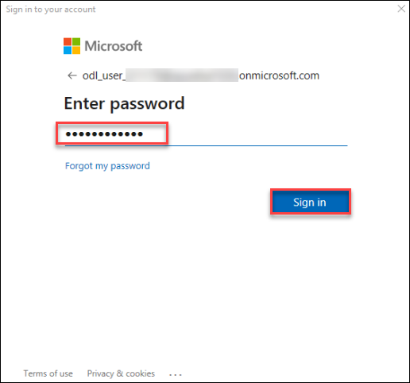

6. Copy and paste the following script and hit **Enter**.

   ```
   Get-AzureADDOmain
   $domain = Get-AzureADDOmain
   $domain = $domain.Name
   $PasswordProfile = @{
   Password = 'Azure1234567'
   ForceChangePasswordNextSignIn = $False
   }
   $users = @("AVDUser01@$domain","AVDUser02@$domain")
   $users
   $users | foreach{
   Update-AzADUser -UserPrincipalName $_ -PasswordPolicy DisablePasswordExpiration -PasswordProfile $PasswordProfile
   }
   ```
 
7. Output of the script will be similar to the one shown below. The password for both **AVDUser01** and **AVDUser02** is reset to **Azure1234567**.

   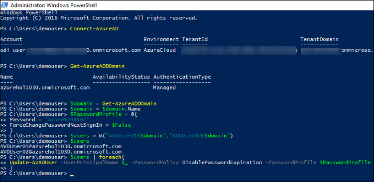

   >**Note**: ***Username*** and ***Password*** for ***AVDUser01*** and ***AVDUser02*** is present in Environment Details tab.

## Exercise 3: Change and experience Load Balancing methods

**A**. **Breadth-first**
   
While creating the EB-AVD-HP host pool, we selected the load balancing method as *Breadth-first*. Now, we are going to log in to the Desktop App created on EB-AVD-HP with both users simultaneously and see the user distribution.

1. Paste the below-mentioned link in your browser in the **JumpVM** and enter your **credentials** to login. 

   ```
   aka.ms/wvdarmweb
   ```

   - Username: *Paste the username*  **<inject key="Avd User 01" />** then click on **Next**.*
   
   

   - Password: *Paste the password*  **<inject key="AVD User Password" />** *and click on* **Sign in**.

   

   >**Note:** If there's a dialog box saying ***Help us protect your account***, then select the **Skip for now** option.

   

1. Now in the AVD dashboard, click on the **Session Desktop** to access it. 

   

1. Select **Allow** on the prompt asking permission to *Access local resources*.

   

1. Enter your **credentials** to access the application and click on **Submit**.

   - Username: *Paste the username*  **<inject key="Avd User 01" />** then click on **Next**.*
   
   - Password: *Paste the password*  **<inject key="AVD User Password" />** *and click on* **Sign in**.
   
   

1. The virtual Desktop will launch as shown below. 

   
   
1. Navigate to **Your Own PC/computer/workstation**, go to **Start** and search for **Remote desktop** and open the application with the exact icon as shown below.

   
   
1. Click on the *ellipses* and select **Unsubscribe**. Click on **Yes** for any warning.

   

   >**Note:** We need to unsubscribe from the feed because in Exercise 4 we subscribed to the AVD feed using a different user.

1. Click on the **Subscribe** button.

   

1. Enter the user credentials to access the workspace.

   - Username: *Paste the username*  **<inject key="Avd User 02" />** *then click on* **Next**.
   
   - Password: *Paste the password*  **<inject key="AVD User Password" />** *and click on* **Sign in**.

   

   >**Note:** If there's a dialog box saying ***Help us protect your account***, then select the **Skip for now** option.

   
    
1. Make sure to **uncheck** *Allow my organization to manage my device* and click on **No, sign in to this app only**.

   

1. In the AVD client, double click on the **Session Desktop** to access it. 

   

1. Enter your **credentials** to access the application and click on **Submit**.

   - Username: *Paste the username*  **<inject key="Avd User 02" />** then click on **Next**.*
   - Password: *Paste the* **<inject key="AVD User Password" />** *and click on* **OK**.* 
   
   
  
1. The virtual Desktop will launch as shown below. 

    

1. Return to the Azure portal in your browser inside the **JumpVM**, search for *host pools* and click on **Host pool** from the suggestion to open it.

   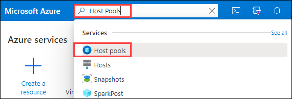
   
1. Now click on **GS-AVD-HP** host pool to access it.

   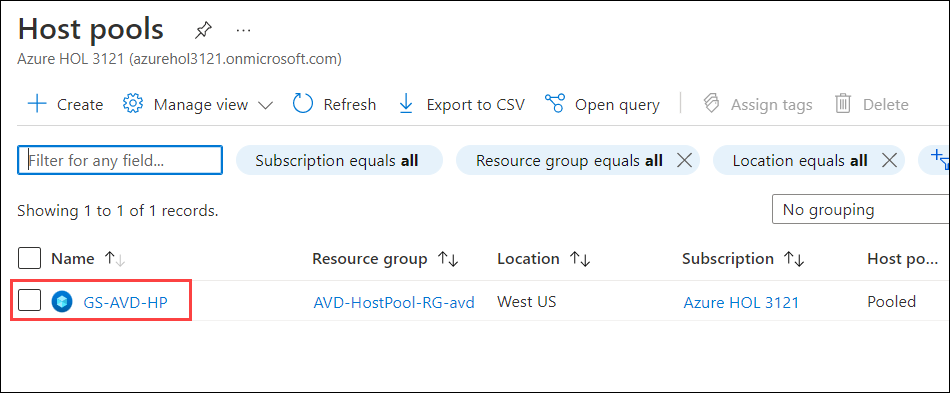
 
1. Under Manage blade, click on **Session hosts**.

   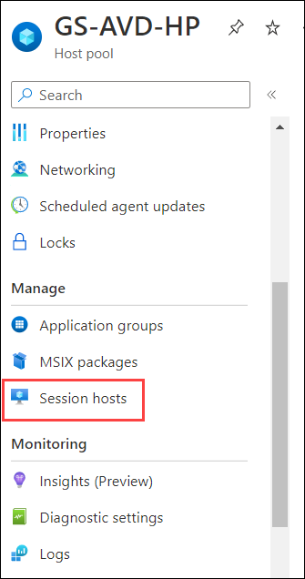
   
1. You can see that both session hosts have one Active session each.

   
   
   >**Note:** This shows how users are distributed among different session hosts, under *Breadth-first load balancing method*. The breadth-first method first queries session hosts that allow new connections. The method then selects a session host randomly from half the set of session hosts with the least number of sessions. 
   > 
   >Please follow [Breadth-first Load-Balancing Method](https://docs.microsoft.com/en-us/azure/virtual-desktop/host-pool-load-balancing#breadth-first-load-balancing-method) to learn more about it.

1. Open **AVD-HP01-SH-0** session host and click on **Users (1)**, there you can see the user logged in to that session host. Now select the user and click on the **Log off users (2)** button and select **Log off (3)** to the prompt asking *This will logoff selected users from session host AVD-HP01-SH-0*.

   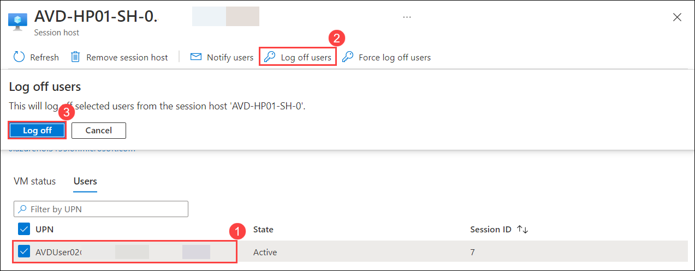

1. Navigate back to *Session hosts* and open **AVD-HP01-SH-1** session host, click on **Users (1)** and you can see the user logged in to that session host. Now select the user and click on the **Log off users (2)** button and select **Log off (3)** to the prompt asking *This will logoff selected users from session host AVD-HP01-SH-1*.

   

   >**Note:** We need to log off the users from session hosts so that when users log in again, the connection is made based on the *Depth-first load balancing method*.
  
**B**. **Depth-first**
   
   Here, we will change the load balancing method of *EB-AVD-HP* host pool to *Depth-first* and see how user distribution changes in the Host pool.

   >**Note:** If the previous session is closed, visit `aka.ms/wvdarmweb`, then click on *Default Desktop* and login with *AVDUser01* credentials.

1. In *GS-AVD-HP* host pool, click on **Properties** under *Settings* blade.

   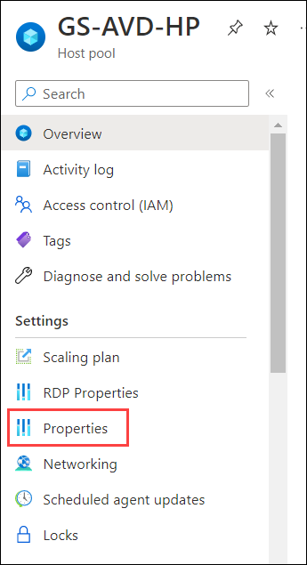
   
1. From Properties in left-menu, change the load balancing algorithm to **Depth-first (1)** then click on **Save icon (2)**.

   
   
1. Paste the below-mentioned link in your browser, in the **JumpVM** and enter your **credentials** to login. 

   ```
   aka.ms/wvdarmweb
   ```
   
   >**NOTE**: If the session desktop is disconnected, close the tab and perform the next step.
   
1. In the AVD dashboard, click on the **Session Desktop** to access it. 

   

1. Select **Allow** on the prompt asking permission to *Access local resources*.

   

1. Enter your **credentials** to access the application and click on **Submit**.

   - Username: *Paste the username*  **<inject key="Avd User 01" />** then click on **Next**.*
   
   - Password: *Paste the password* **<inject key="AVD User Password" />**.
   
   

1. The virtual Desktop will launch as shown below. 

   
    
1. Navigate to **Your Own PC/computer/workstation**, go to **Start** and search for **Remote desktop** and open the application with the exact icon as shown below.

   

1. In the AVD client, double click on the **Session Desktop** to access it. 

   

1. Enter your **credentials** to access the application and click on **Submit**.

   - Username: *Paste the username*  **<inject key="Avd User 02" />** *then click on **Next**.*
   - Password: *Paste the* **<inject key="AVD User Password" />** *and click on **OK**.* 
   
   
  
1. The virtual Desktop will launch as shown below. 

    

1. Return back to the Azure portal in the **JumpVM**, navigate to **EB-AVD-HP** host pool and open **Session Hosts** present under *Manage* blade.

   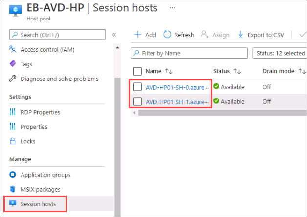
   
1. Here one of the session hosts, either *AVD-HP01-SH-0* or *AVD-HP01-SH-1* will have 2 Active sessions. Click on that session host to open it.

   
   
   >**Note:** The depth-first method first queries session hosts that allow new connections and haven't gone over their maximum session limit. The method then selects the session host with the highest number of sessions. If there's a tie, the method selects the first session host in the query.
   >
   >Please follow [Depth-first Load-Balancing Method](https://docs.microsoft.com/en-us/azure/virtual-desktop/host-pool-load-balancing#depth-first-load-balancing-method) to learn more about it.
   
1. Click on **Users** and verify that both users have been assigned to the particular session host. 

   

1. Click on the **Next** button present in the bottom-right corner of this lab guide.
