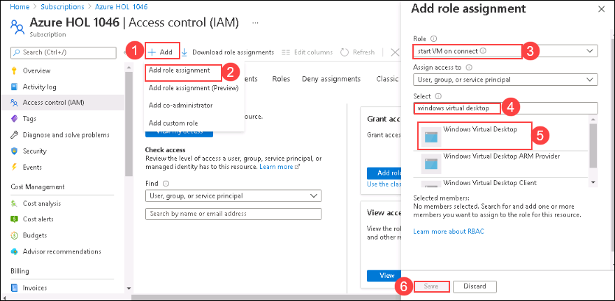
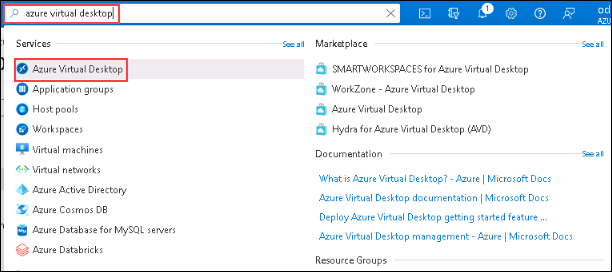
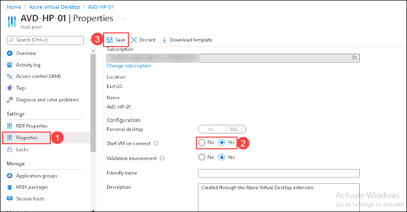

# **Lab 9: Cost Optimizations**

## **Exercise 1: Enable Start Virtual Machine on Connect**

### **Task 1: Create a custom role for Start VM on Connect**

1. In your JumpVM launch browser and go to Aure Portal (https://portal.azure.com).

2. Now in Aure portal search for **SUbscription* and click on the search result.

  

3. On the Subscription page click on the name of your subscription.

  
  
4. Now from the left hand side blade Click on **Access Control (IAM)** then click on **+ Add** and select **Add custom role**.

  

5. On the create a custom role page provide *Custom role name* as **start VM on connect** *(1)* and click on **Next** *(2)*.

  

6. Under Permissions tab click on **+ Add Permissions**.

  

7. In Add Permissions search for **Virtual Machines** *(1)* and select **Microsoft Compute** from the search results *(2)*.

  

8. From the list of permissions search for **Microsoft.Compute/virtualMachines** then select **Read : Get Virtual MAchine** *(1)* and **Other : Start Virtual Machine** *(2)* and click on **Add** *(3)*.

  
  
9. Now click on **Review + Create** to publish the roles.

  
  
6. Review the configuration and click on **Create**.

  
  
  
### **Task 2: Assign the role to grant access to Azure Virtual Desktop**

1. In **Access Control (IAM)** click on **+ Add** *(1)* and select **Add role assignment** *(2)*.

  
  
   - Under Role, search and select **start VM on connect** *(3)*.
   - Under Select, search for **Windows Virtual desktop** **(4)** and select it *(5)*
   - Click on **Save** *(6)*.

## **Exercise 2: Configure the Start VM on Connect feature**

### **Task 1: Configuring Host pool Properties**

1. In Azure portal search for **Azure Virtual Desktop** and click on it.

  
  
2. On the left hand side blade click on **Host pools** *(1)* and select the **host pool** *(2)* we want to configure.

  
  
3. On left hand side blade of the Host pool page. click on **Properties** *(1)*

  
  
   - Toggle Start VM on connect to **Yes** *(2)*.
   - Click on **Save** *(3)*.

## **Exercise 2: Experience VM start on connect**

** Task 1: Stop the Session host VMs**

1. In Azure Portal search for **Virtual Machines** and click on it.

  
