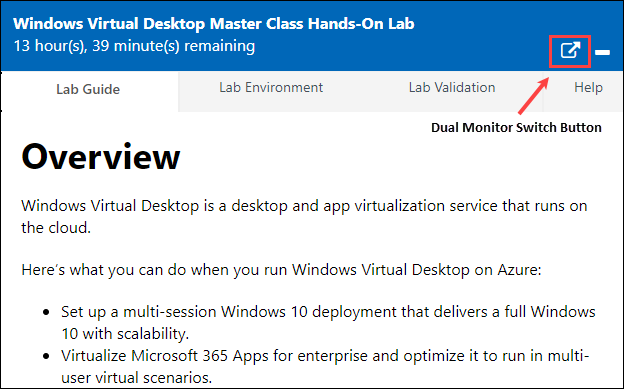
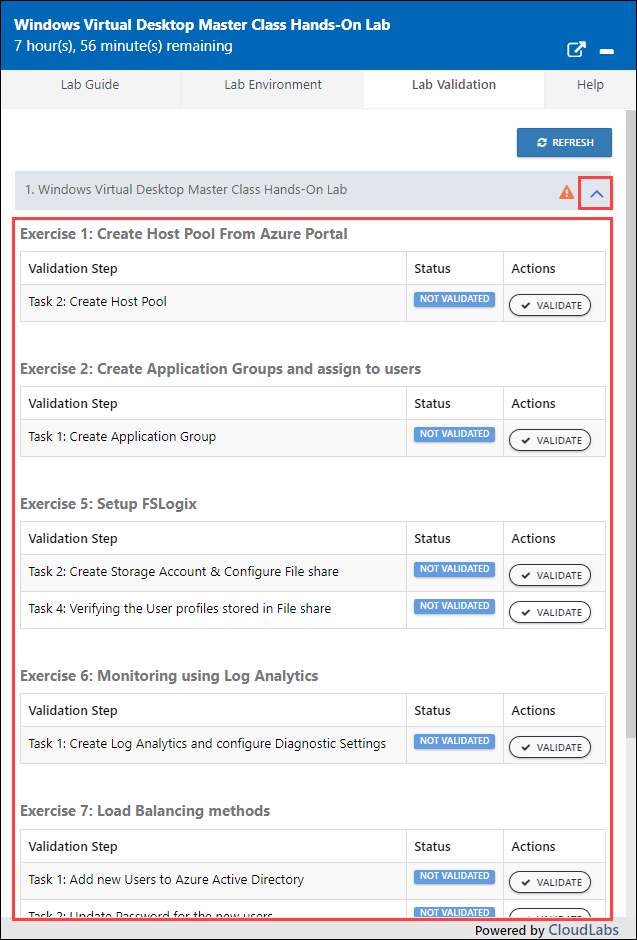
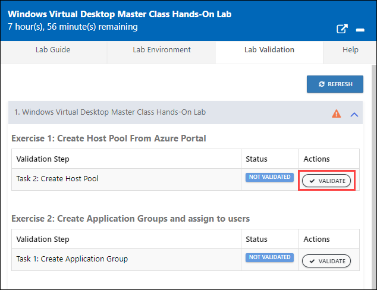
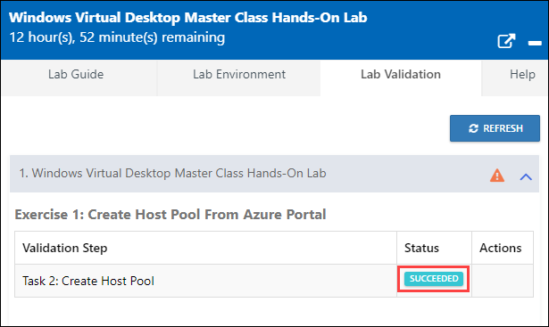
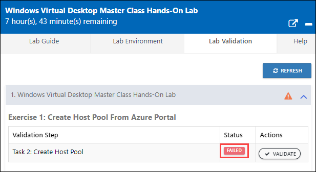
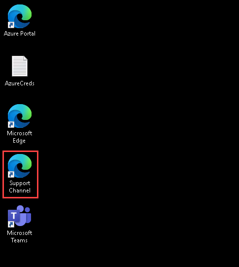

# Lab Instructions

Below instructions will take you through the lab experience and the essentials you need to know while performing the lab, including how to contact the help-desk.

## 1. Lab Virtual Machine with Azure Credentials and Browser

Once we launch the lab by clicking on launch lab button, we will get the VM on the left-hand side & Lab guide, environment details on right-hand side. The environment will be as shown below:

   

   1. **Lab Virtual Machine:** On the left, we have the virtual machine in which we will perform the lab.
   2. **Lab Guide:** On the right, we have the step-by-step lab guide for users to follow and perform the lab. 
   3. **Azure Credentials:** We have provided a text document that will have User's credentials of their respective Azure account.
   4. **Browser:** Microsoft Edge browser is provided, where direct link is given to open the Azure Portal.

   

## 2. Environment Details Tab

The Environment Details Tab has two sections -  **Azure Credentials** & **Environment Details:**

   1. **Azure Credentials:** Here we will have the Username and Password of the user, using this user will connect to the Azure Portal.
   2. **Environment Details:** This section will have the values needed throughout the lab.

   

## 3. Navigate through the lab exercises

To navigate through the lab, we have two buttons in the bottom of the Lab Guide.

   1. **Next:** Clicking on this button will take you the next page in the guide.
   2. **Previous:** Clicking on this button will take you to the previous page.

   
   
## 4. Dual Monitor Service

1. Dual monitor will split the VM and the lab guide into two separate windows.

2. If you want to use the dual monitor, you can pop-out the lab instructions by clicking on arrow icon on top.

   
   
##  5. Validate Lab Progress

Once you complete the exercise, you can use this feature to validate and make sure exercise is performed correctly.

1. **Lab Validation:** This tab will have all the exercises listed for the validation.

   

2. **Expand/collapse lab validation details:** Click on the drop down to view the modules listed.

   
   
3. **Validate exercise progress:** Click on **Validate** button to begin the validation of a task specified just in front of the Validate button. 

   
   
4. **Validation Result:** Result of validation will take few seconds to show up. There will be two states of validation - **Succeed** & **Failed**. 

   - **Succeed:** This means the task of an exercise is performed correctly.
   
   
   
   - **Failed:** This means that the task is not performed correctly. To check the error message behind the validation failure, hover the cursor over Failed tag. This will show the error message as shown in the below screenshot.
   
   

   

## 6. Contact Supprt

1. MS Teamslive Support Link for the event – https://aka.ms/wvdmasterclass-hol-support

2. Users have to click on **Join anonymously** to connect to the support channel.

   
   
3. Attendees can use this link to ask questions & for the help in case of any issue.

   

4. We have also added a shortcut of this Support link on the desktop of Lab VM.

   

----------------------------------------------------------------------------------------------------------------------------------------
Click on the **Next** button present in the bottom-right corner of this lab guide.

