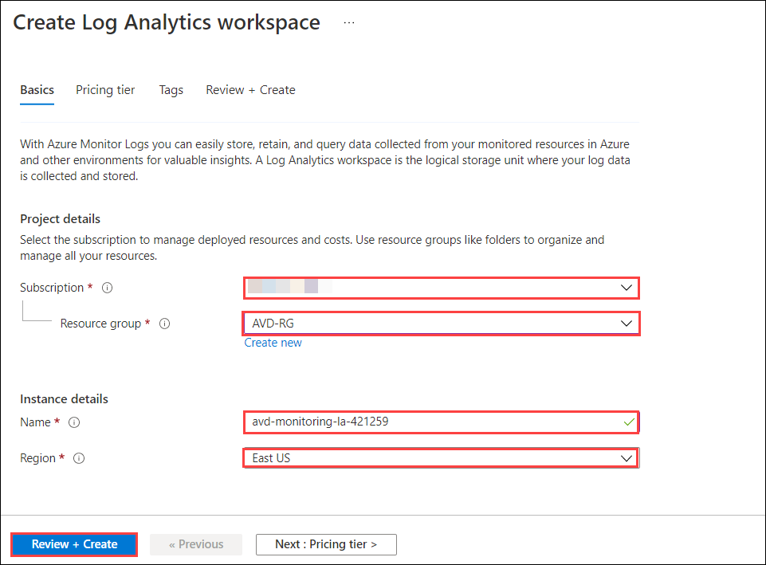

> **Note:** This section doesn’t cover the Azure Monitor for Azure Virtual Desktop announcement from today. 

Azure Virtual Desktop uses Azure Monitor for monitoring and alerts like many other Azure services. This lets admins identify issues through a single interface. The service creates activity logs for both user and administrative actions.

### **Task 1: Create Log Analytics**

1. On the Azure portal, click on **Create a resource** given under *Azure services*.

   

2. Type *Log Analytics Workspace* in the search bar and click on **Log Analytics Workspace** from the suggestions.

   

3. On the Log Analytics Workspace page, click on **Create**.

   

4. Now add the following configurations:

   - Subscription: *Choose the default subscription.*
  
   - Resource group: *Select **AVD-RG** from the drop down.*
  
   - Name: **<inject key="Log Analytics Workspace Name	" />**
  
   - Region: **East US**, *basically this should be same as the region of your resource group.*
  
   - Click on **Review + Create**

   

5. The last window helps us to verify if the parameters we filled are correct. Wait for validation to pass, then click on **Create** to initiate the deployment.

   

6. Once the deployment gets succeeded, it will look similar to the image shown below.

   
   
   ### **Task 2: Enable diagnostics for Workspace**
 
1. Navigate back to Azure Virtual Desktop and open **Workspaces**.

   
   
2. Click on **AVD-WS-01**. Then select **Diagnostic settings** present under *Monitoring* blade and click on **+Add diagnostic setting**.    
   
   
 
3. Add the following configurations:

   - Diagnostic settings name: **WorkspaceMonitoring**
   - Category details: *Check all the boxes present under logs i.e.,* **Checkpoint, Error, Management and Feed.** 
   - Destination details: *Check the box for* **Send to Log Analytics**
   - Subscription: *Choose the default subscription.*
   - Log Analytics Workspace: *Select the log analytics workpsace from the drop down, that we just created.*
   - At last, click on **Save**.  
   
   

4. Once saved, it will look similar to the image shown below.

   
