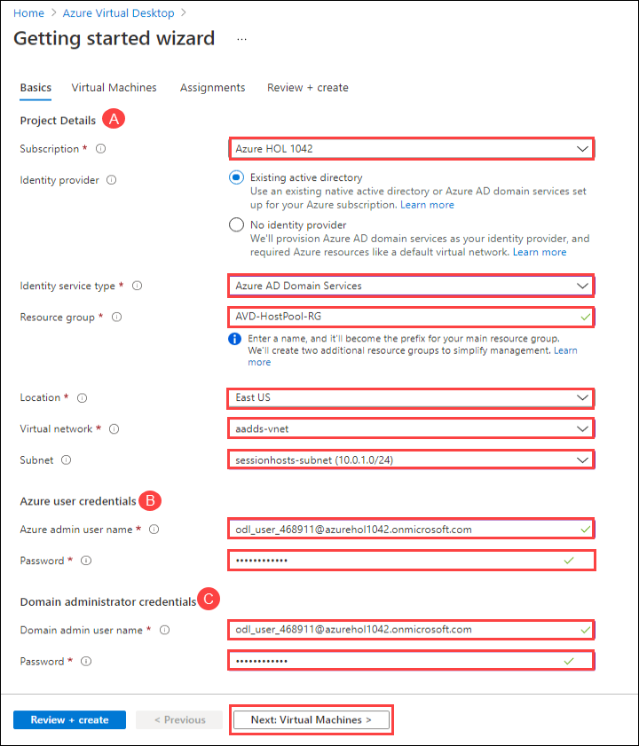
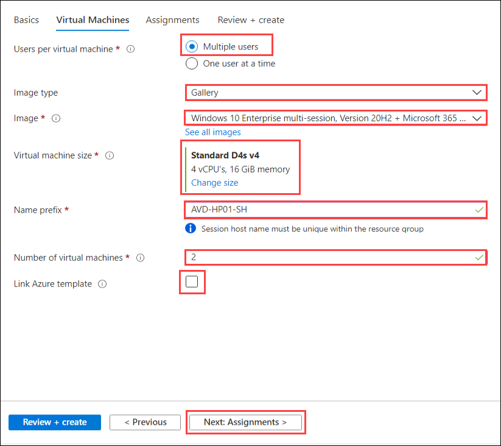
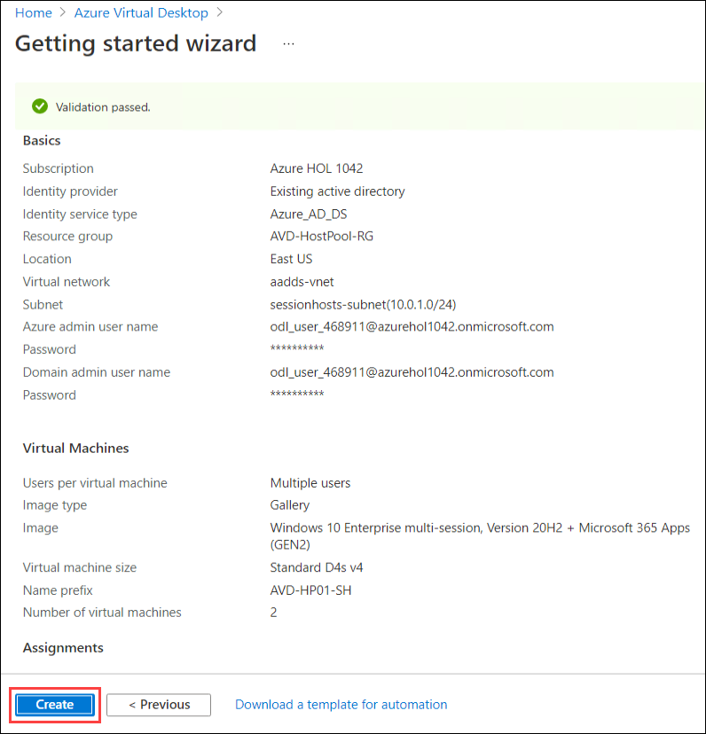

# Getting Started Wizard:

Configuring AVD enviornment has become easy with Getting started wizard. In the lab, We'll be creating the whole AVD environment using minimum efforts and information.

1. On the **Azure portal** search for **Azure Virtual Desktop** in the search bar (1) and select **Azure Virtual Desktop** (2) from the suggestions.

   
   
1. On the AVD page, **Click** on the **Getting Started**(1) from the side blade and click on **Start**(2).

   
   
1. On **Getting Started Wizard** page, **Provide** the information as mentioned below,

   **A**.Project Details:

   - Subscription: Select the ***default***
   - Identity provider: Select ***Existing active directory***
   - Identity Service Provider: Select ***Azure AD Doamin Services*** from the drop-down
   - Resource Group: ***AVD-HostPool-RG***
   - Region: **East US**, *basically this should be same as the region of your resource group*
   - Virtual Network: **aadds-vnet** *(choose from dropdown)*
   - Subnet: **sessionhosts-subnet(10.0.1.0/24)** *(choose from dropdown)*
   
   **B**. Domain administrator credentials:
   
   - Azure admin user name: *Paste your username* **<inject key="AzureAdUserEmail" />**
   - Password: *Paste the password* **<inject key="AzureAdUserPassword" />**

   **C**. Domain administrator credentials:
   
   - Domain admin user name: *Paste your username* **<inject key="AzureAdUserEmail" />**
   - Password: *Paste the password* **<inject key="AzureAdUserPassword" />**

   
   
   **Click** on **Virtual Machines**.
   
   In **Virtual Machines** tab, **Provide** the information as mentioned below,
   
   - Users per virtual machine: Select ***Multiple users***
   - Image type: ***Gallery***
   - mage: **Windows 10 Enterprise multi-session, version 20H2 + Microsoft 365 Apps (GEN2)** *(choose from dropdown)*
   - Virtual machine size: **Standard D4s v4**. *Click on **Change Size**, then select **D4s_v4** and click on **Select** as shown below*

   
   
   - Name prefix: **AVD-HP01-SH**
   - Number of VIrtual Machines: **2**
   - Link Azure template: **Unselect** the option

   

   **Click** on **Assignments**.
   
   In **Assignments** page, **Provide** the information as mentioned below, 
   
   - Create test user account: **Unselect** the option
   - Assign existing users or groups: **Select** the option

   
   
   click on **Review and Create**.
   
1. Verify the options and **click** on **Create**.

   
   
   **NOTE**: It takes 20 mins to get deployed successfully.
   
1. Once the deployment is successful, **Click** on **Go to resource**.

   
   
1. It will take you the created **Host pool** page. Here make sure that 2 VMs, 1 Application group, and 1 Appliccation is created.

   
   
